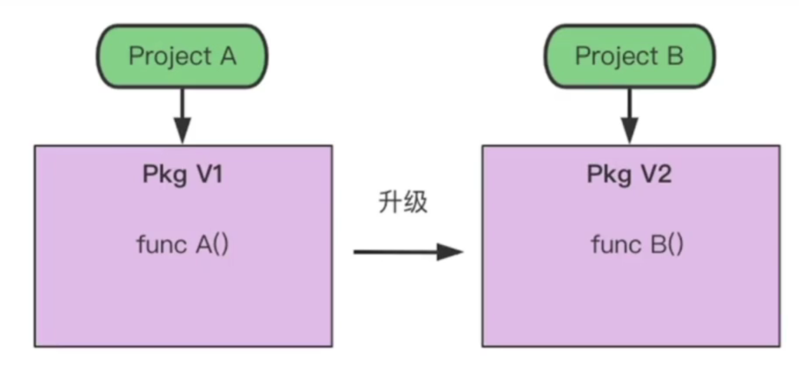
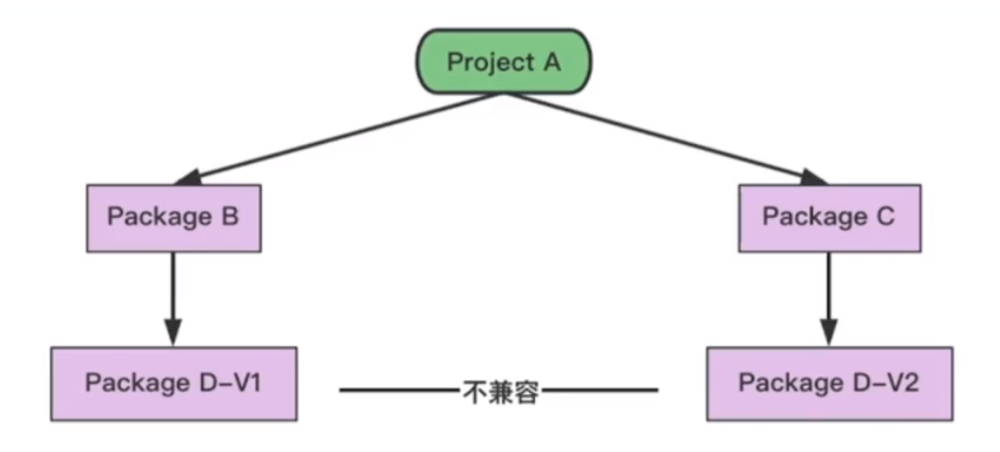
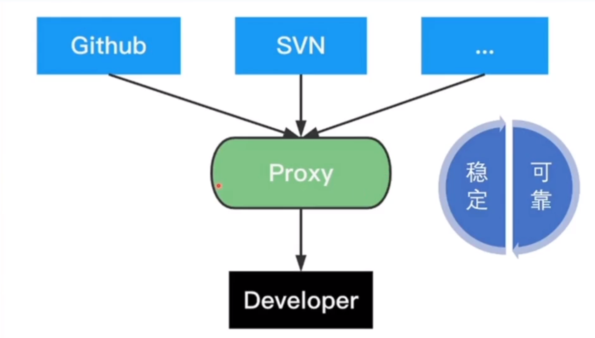
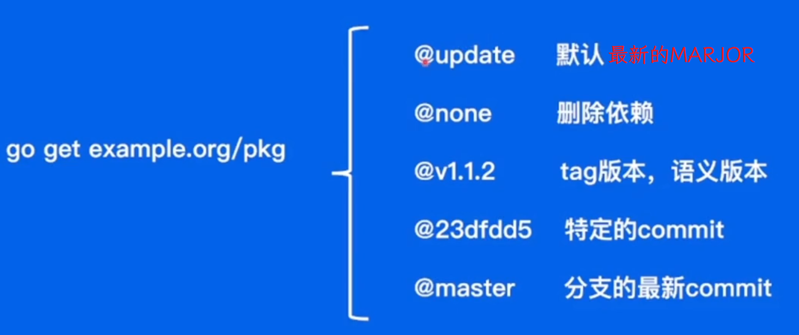

马上就退役了，要为下一步做点准备了。先速通一下 GO 语言基础，本文章参考了 GO TOUR 和字节的青训营课程，通过列出一些代码来快速上手 GO 语言。

阅读可能要需要具有其他语言的编程经验

## 语法

### hello,world

```go
package main

import "fmt"

func main() {
    fmt.Println("hello, world")
}
```

程序总是从 main 包下的 main 函数开始执行

import 语句可以导入包，除了使用 `import` 语言单个单个导入外，还可以使用分组导入

```go
import (
    "fmt"
    "math"
)
```

### 函数

```go
func add(x int, y int) int {
	return x + y
}
// 缩写
func minus(x, y int) int {
    return x - y
}

// 多值返回
func swap(x, y string) (string, string) {
    return y, x
}
// 具名返回
func split10(sum int) (x, y int) {
    x = sum / 10
    y = sum % 10
	return
}

```

### 变量

基本类型有

- `bool`
- `string`
- `int` `int8` `int16` `int32` `int64`
- `uint` `uint8` `uint16` `uint32` `uint64` `uintptr`
- `byte` (`uint8` 的别名)
- `rune` （`int32` 的别名，表示一个 Unicode 码点）
- `float32` `float64`
- `complex64` `complex128`

`int`, `uint` 和 `uintptr` 在 32 位系统上通常为 32 位宽，在 64 位系统上则为 64 位宽

```go
package mainjj
import "math"
func main(){
    var value int
    var pi float64
    // 声明并赋值
    e := 2.71828 
    
    sqrt2 := math.Sqrt(float64(sqrt()))
    
    var g complex64 = 3 + 2i;
}
```

### 常量

```go
const (
    Big = 1 << 100
    Small = Big >> 9
)
func main(){
    const Pi = 3.14
}
```

### 控制流

#### 判断

```go
package main
func main(){
    
    if x > 10 {}
    
    if x > 10 {}
    else {}
    
    if x > 10 {} 
    else if x < 10 {}
    else {}

	// 使用简短语句
    if v:= LoadSth(); v > 10 {
        
    }
}
```

#### 分支 

```go
package main
func main(){
    value := 10
    switch 30 {
    case value :
        DoSth()
    case value + 1:
        DoSth()
    default:
        DoNothing()
    }
}
```

不带条件的 switch

```go
package main
func main(){
    value := 10
    switch {
    case value > 10:
        DoSth()
    case value < 10:
        DoSth()
    }
}
```


#### 循环

```go
package main
import "fmt"
func main(){
    for i:= 0; i < 10; i++ {
        fmt.Println(i)
    }
    // 相当于 C/C++ 中的 while
    for false {
        fmt.Println("Unreachable")
    }
    
    // 相当于 C/C++ 中的 while true
    for {
        fmt.Println("Unstopable")
    }
}
```

#### 推迟

使用  `defer` 会将后面的语句放在当前作用域结束时执行

执行顺序如栈，总是先进后执行

```go
package main
import "fmt"
func main(){
    defer fmt.Println("1")
    defer fmt.Println("2")
    defer fmt.Println("3")
}
```

> `输出信息`
>
> 3
>
> 2
>
> 1

### 指针

```go
package main
import "fmt"
func main(){
    var p *int // 指向 int 的指针 *int
    
    num := 42
    ptr := &num // 通过 & 计算地址
    
    fmt.Println(*ptr)
}
```

### 结构体

```go
type Vertex struct {
	X int
	Y int
}

var (
    v1 = Vertex{1, 2}
    
    p = &Vertex{1, 2} // 这是一个指针
)
```

### 数组

```go
var a [10] int
```

### 切片

```go
var a [10]int
var s []int = a[1:4] //行为像 python 中的切片

r := []bool{true, false, true, true, false, true}
s := []struct {
		i int
		b bool
	}{
		{2, true},
		{3, false},
		{5, true},
		{7, true},
		{11, false},
		{13, true},
	}
```

#### 容量与长度

切片的长度就是它所包含的元素个数。

切片的容量是从它的第一个元素开始数，到其底层数组元素末尾的个数。

切片 `s` 的长度和容量可通过表达式 `len(s)` 和 `cap(s)` 来获取。

切片的零值是 `nil`。

nil 切片的长度和容量为 0 且没有底层数组

#### 用 make 创建切片

切片可以用内建函数 `make` 来创建，这也是你创建动态数组的方式。

`make` 函数会分配一个元素为零值的数组并返回一个引用了它的切片：

```go
a := make([]int, 5)  // len(a)=5
```

要指定它的容量，需向 `make` 传入第三个参数：

```go
b := make([]int, 0, 5) // len(b)=0, cap(b)=5

b = b[:cap(b)]         // len(b)=5, cap(b)=5
b = b[1:]              // len(b)=4, cap(b)=4
```

#### 操作

##### append

```go
func append(s []T, vs ...T) []T
```

##### range

```go
for i, v := range pow {
        fmt.Printf("index %d value %d", i, v)
}
// 忽略下标
for _, v := range pow {
        fmt.Printf("value %d", v)
}
```

### 映射

```go
var m map[string]Vertex

var m = map[string]Vertex{
	"Bell Labs": Vertex{
		40.68433, -74.39967,
	},
	"Google": { // 若顶级类型只是一个类型名，你可以在文法的元素中省略它
		37.42202, -122.08408,
	},
}

```

删除元素：

```go
delete(m, key)
```

通过双赋值检测某个键是否存在：

若 `key` 在 `m` 中，`ok` 为 `true` ；否则，`ok` 为 `false`。

```go
elem, ok = m[key]
```

### 方法

```go
type Vertex struct {
	X, Y float64
}

func (v Vertex) Abs() float64 {
	return math.Sqrt(v.X*v.X + v.Y*v.Y)
}
```

指针接收者的方法可以修改接收者指向的值（就像 `Scale` 在这做的）。由于方法经常需要修改它的接收者，指针接收者比值接收者更常用。

```go
func (v *Vertex) Scale(f float64) {
	v.X = v.X * f
	v.Y = v.Y * f
}
```

### 接口

```go
type Abser interface {
	Abs() float64
}
```

类型通过实现一个接口的所有方法来实现该接口。既然无需专门显式声明，也就没有“implements”关键字。

隐式接口从接口的实现中解耦了定义，这样接口的实现可以出现在任何包中，无需提前准备。

#### 空接口

指定了零个方法的接口值被称为 *空接口：*

```go
interface{}
```

空接口可保存任何类型的值。（因为每个类型都至少实现了零个方法。）

空接口被用来处理未知类型的值。

#### 类型断言

类型断言提供了访问接口值底层具体值的方式。

```
t := i.(T)
```

若 `i` 并未保存 `T` 类型的值，该语句就会触发一个恐慌。

为了判断一个接口值是否保存了一个特定的类型，类型断言可返回两个值：其底层值以及一个报告断言是否成功的布尔值。

```
t, ok := i.(T)
```

若 `i` 保存了一个 `T`，那么 `t` 将会是其底层值，而 `ok` 为 `true`。

#### 类型选择

```go
switch v := i.(type) {
case T:
    // v 的类型为 T
case S:
    // v 的类型为 S
default:
    // 没有匹配，v 与 i 的类型相同
}
```

#### Stringer

同 ToString()

```go
type Stringer interface {
    String() string
}
```

#### error

```go
type error interface {
    Error() string
}
```


## 并发

### 启动协程

```go
package main
import "fmt"
func print(){
    for i := 0; i < 100; i++{
        fmt.Println(i)
    }
}
func main(){
    for i := 0; i < 10; i++{
        go print
    }
}
```

### Channel

Channel 本身是并发安全的

```go
package main
func main(){
    ch = make(chan int)
    go func(){
        x <- ch
    }()
    x <- 3
}
```

#### 带缓冲

如果 Channel 没用缓冲，那么在 Channel 放入数据后，下一次读取线，放入数据是堵塞的 

```go
package main
func main(){
    ch = make(chan int, 5)
    ch <- 1
    ch <- 2
    go func(){
        x <- ch
    }()
}
```

#### close

发送者可通过 `close` 关闭一个信道来表示没有需要发送的值了。接收者可以通过为接收表达式分配第二个参数来测试信道是否被关闭：若没有值可以接收且信道已被关闭，那么在执行完

```
v, ok := <-ch
```

之后 `ok` 会被设置为 `false`。


只有发送者才能关闭 Channel，关闭后将不可再发送数据。Channel 一般情况下不需要关闭

#### range

循环 `for i := range c` 会不断从信道接收值，直到它被关闭。

### select

`select` 语句使一个 Go 程可以等待多个通信操作。

`select` 会阻塞到某个分支可以继续执行为止，这时就会执行该分支。当多个分支都准备好时会随机选择一个执行。

当 `select` 中的其它分支都没有准备好时，`default` 分支就会执行。为了在尝试发送或者接收时不发生阻塞，可使用 `default` 分支：

```go
func fibonacci(c, quit chan int) {
	x, y := 0, 1
	for {
		select {
		case c <- x:
			x, y = y, x+y
		case <-quit:
			fmt.Println("quit")
			return
		}
	}
}
```

### Mutex

Go 标准库中提供了 [`sync.Mutex`](https://go-zh.org/pkg/sync/#Mutex) 互斥锁类型及其两个方法：

- `Lock`
- `Unlock`

### WaitGroup

WaitGroup 可以通过`Add(int)` 的方式添加任务，在所有任务调用 `Done()`之前，调用 `Wait()` 函数都会导致堵塞


## 依赖管理

目标：不同环境项目的依赖库版本不同，需要控制依赖库的版本

### $GOPATH （过时）

即环境变量 `$GOPATH`。 在该情况下项目将直接依赖 `$GOPATH/src` 下的代码

在该 `PATH` 下的文件结构如下：


其中项目代码和项目依赖代代码都将存放在 `$GOPATH/src` 目录下

通过 `go get` 可以将最新版本的依赖代码下载到 `src` 下

#### 缺点

无法实现多版本控制，即出现项目A和项目B分别依赖Pkg的不同版本时无法进行控制，即使这两个项目毫无关系



### Vendor （过时）

在项目目录下增加 `vendor` 文件夹，所有的依赖包以`源码`副本的形式存储在 `vendor`下。通过为每个项目引入一份依赖的副本，解决了多个项目需要同一个 package 不同版本依赖的冲突问题

编译器在 solve deps 时会首先寻找 `vendor` 目录，在不存在的情况下再去查找 `$GOPATH`

#### 缺点

由于本质上仍是依赖源码，在存储源码副本时如果项目依赖同一个包的不同的版本号，仍然可能会导致编译出错



### Go Module

自 1.16 版本开始默认开启

- 通过 `go.mod` 文件管理依赖包

- 通过 `go get/go mod` 指令工具管理依赖包

`go.mod` 文件并不是在项目中唯一。如果一个包需要被单独引用，它就应该创建一个  `go.mod` 文件。其内容如下

```go-mod
module example/project/app 

go 1.16

require(
    example/lib1 v1.0.2
    example/lib2 v1.0.0 // indirect

    example/lib/lib3/v3 v3.0.2
    example/lib/lib4 v3.0.2+incompatible
)
```

对于 require 中的内容应该包含包路径和版本号

如果版本号的 MARJOR 大于等于2，那么路径中应该增加`/vN`后缀

如果没有 `go.mod` 文件且 MARJOR 大于等于2，则需要标记为 `+incompatible`

#### 版本号

版本号可以有两种填写方式

- 语义化版本： **\${MARJOR}.\${MINOR}\.${PATCH}**

- 基于 commit ：**vx.0.0-yyyymmddhhmmss-c38fb59326b7**

基与 commit 的版本号在每次提交时都会自动生成版本号

#### 直接依赖/间接依赖

如果不是直接依赖的包，GO 语言会通过 `// indirect` 标记为间接依赖

#### 依赖选择规则

GO 语言会选择满足项目要求的最低的兼容版本


如图，最终编译时选择的 C 版本将为 1.4。以为 C1.3和C1.4的MARJOR版本相同，认为这两个版本兼容

#### 依赖分发

GO 语言的依赖并不是从 GitHub 等站点直接下载，而是采用了一种类似适配器模式的设计



对 Proxy 的选择可以设置 `GOPROXY` 环境变量，本质是URL列表，以逗号分隔。其中 `direct` 表示源站（Github,SVN 等）

```bash
export GOPROXY="https://proxy1.cn, https://proxy2.cn, proxy"
```

在查找时会依次从第一项开始查询

#### go mod 工具




## 单元测试

测试文件以 `_test.go` 结尾，函数声明类似 `func TestABC(*testing.T)`。对于所有测试的资源初始化和释放放在 `TestMain` 中

```go
import "githhub.com/stretchr/testify/assert"

func TestMain(m *testing.M){
    // load resource
    code := m.Run()
    // release resource
    os.Exit(code)
}

func TestFeatureA(t *testing.T){
    t.Errorf("Expected %s dot not match actual %s", expectOutput, output)
    // 或者使用一些开源 assert 库
    assert.Equal(t, expectOutput, output)
}
```

通过 `go test [flag] [package]` 可以执行所有单元测试

覆盖率可通过提供 `--cover` flag 计算

```bash
$ go test
```

## 基准测试

```go
func BenchmarkSelect(b *testing.B){
    // load resource
    b.ResetTimer() // 重置定时器重新计时（因为加载资源可能会消耗时间）
    for i:= 0; i < b.N; i++{
        Select()
    }
}

// 并行基准测试
func BenchmarkSelectParallel(b *testing.B){
    b.ResetTimer()
    b.RunParallel(func(pb *testing.PB) {
        for pb.Next() {
            Select()
        }
    })
}
```

运行方式

```bash
$ go test -bench=.
```
