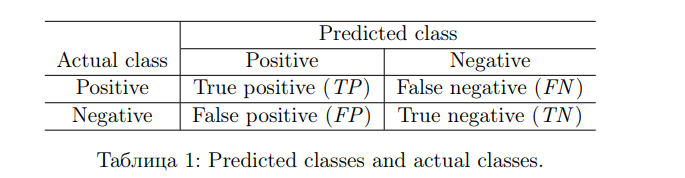

[The 2020 ICPC Asia Shenyang Regional Programming Contest - Codeforces Gym](https://codeforces.com/gym/103202)

# B - Whispers of the Old Gods

> 给出一个正则表达式 `pattern` 和字符串 `str`，要求对字符串中的数字进行尽可能少的插入，删除，替换操作。输出最小的操作次数。

~~做老题结果发现专业对口这件事~~

首先根据题目给出的 BNF 写出正则的解析器，然后用 Thompson's Construction 构造和 `pattern` 对应的 NFA，
重合 NFA 的起点和 `str` 的开始符，向后匹配到 NFA 的结束状态即可。当 `str` 的下一个字符使得 NFA 没有对应转移时，
修改 `str` 的下一个字符，其实也就相当于一个 01-最短路。

有关 Thompson's Construction 构造可以参考 Comp412 课件。


> - You will be tempted to take shortcuts, such as leaving out some of the $\epsilon$ transitions
> - Do not do it. Memorize these four patterns. They will keep you out of trouble.

如果预先将题目中的 BNF 处理成 LL(1) 类型的文法，可以进一步优化速度，但是训练的时候推了一下，没写。
附当时的推导结果:

$$
\begin{align}
\textbf{\<regex\>} ::&= \text{\<atomic-regex\>} \\\\
&| \text{\<regex-op\>}\\\\
&| \text{\<regexs\>}\\\\
\textbf{\<regex-op\>} ::&= \text{ "|" \<regex\>} \\\\
 &| \text{ "+" \<regex\>} \\\\
\textbf{\<regexs\>} ::&= \text{\<atomic-regex\> \<regex\>} \\\\
&| \epsilon \\\\
\textbf{\<atomic-regex\> } ::&= \text{\<digit\>} \\\\
&| \text{ "[" \<digit-sequence\> "]"} \\\\
&| \text{ "(" \<regex\> ")"}
\end{align}
$$

```cpp

#include<bits/stdc++.h>

const int INF = std::numeric_limits<int>::max();

using PII = std::pair<int, int>; // pair of <int,int>
using State = std::vector<std::pair<int, int>>;

const int epsilonEdge = 0;

#pragma clang diagnostic push
#pragma ide diagnostic ignored "UnreachableCallsOfFunction"
class Nfa : public std::vector<State> {
    const std::string &pat;
    int cur = 0;

    /// 构建状态，并加入默认 epsilon 转换
    /// 加入队尾
    /// \return
    int createState() {
        int root = size();
        push_back(State());
        return root;
    }

    /// 构建原子公式
    /// \return 末状态
    PII parseAtom() {
        if (std::isdigit(pat[cur])) {
            int begin = createState();
            int end = createState();
            at(begin).emplace_back((int) pat[cur], end);
            cur++;
            return {begin, end};
        } else if (pat[cur] == '[') {
            cur++;
            int begin = createState();
            int end = createState();
            std::set<int> chs;
            while (cur < pat.length() && std::isdigit(pat[cur])) {
                chs.insert((int) pat[cur++]);
            }
            assert(pat[cur++] == ']'); // 输入错误, Expected token!
            for (int ch: chs) at(begin).emplace_back(ch, end);
            return {begin, end};
        } else {
            assert(pat[cur++] == '(');
            auto node = parseAlt(); // TODO
            assert(pat[cur++] == ')');
            return node;
        }
    }

    /// S-expand
    /// \return
    PII parseReg() {
        int begin = createState();
        int end = begin;
        auto peek2PlusOp = [&]() {
            while (cur < pat.length() && pat[cur] == '+') cur++;
        };
        while (cur < pat.length() && (std::isdigit(pat[cur]) || pat[cur] == '[' || pat[cur] == '(')) {
            auto next = parseAtom();
            if (cur < pat.length() && pat[cur] == '+') {
                peek2PlusOp();
                at(end).emplace_back(epsilonEdge, next.first);
                at(next.second).emplace_back(epsilonEdge, next.first);
                end = next.second;
            } else {
                at(end).emplace_back(epsilonEdge, next.first);
                end = next.second;
            }
        }
        return {begin, end};
    }

    /// Alter-combine
    /// \return
    PII parseAlt(){
        int begin = createState();
        auto next = parseReg();
        at(begin).emplace_back(epsilonEdge, next.first);
        std::vector<int> subEnd {next.second};
        while(cur < pat.length() && pat[cur] == '|'){
            cur++;
            auto next = parseReg();
            at(begin).emplace_back(epsilonEdge, next.first);
            subEnd.push_back(next.second);
        }
        int end = createState();
        for(auto& state: subEnd){
            at(state).emplace_back(epsilonEdge, end);
        }
        return {begin, end};
    }

public:
    explicit Nfa(const std::string& pat) : pat(pat){
        parseAlt();
    }
};
#pragma clang diagnostic pop

int main(){
    std::ios::sync_with_stdio(false);
    std::cin.tie(nullptr);
    std::cout.tie(nullptr);
    std::string pattern, str;
    std::cin >> pattern >> str;

    Nfa nfa{pattern};
    int nfaSize = nfa.size();
    int strSize = str.length();
    auto dis = std::vector<std::vector<int>>(nfaSize, std::vector<int>(strSize + 1, INF));
    std::deque<PII> deq;
    dis[0][0] = 0;
    deq.emplace_back(0,0);

    const auto m = str.length();
    while(!deq.empty()){
        auto cur = deq.front();
        int ddis = dis[cur.first][cur.second];
        deq.pop_front();

        auto releaseFront = [&](int u, int v){
            if(dis[u][v] > ddis ){
                dis[u][v] = ddis;
                deq.emplace_front(u, v);
            }
        };
        auto releaseBack = [&](int u, int v){
            if(dis[u][v] > ddis + 1){
                dis[u][v] = ddis + 1;
                deq.emplace_back(u, v);
            }
        };
        if(cur.second < m){
            releaseBack(cur.first, cur.second+ 1);
        }
        for(auto &[ch, next] : nfa[cur.first]){
            if(ch == epsilonEdge){
                releaseFront(next, cur.second);
            }else{
                // do matching operation
                if(cur.second < m){
                    if(ch == str[cur.second]){
                        releaseFront(next, cur.second + 1);
                    }if(m) {
                        // fail
                        // panic mode for back
                        releaseBack(next, cur.second + 1);
                    }
                }
            }
            releaseBack(next, cur.second);
        }
    }
    std::cout << dis[nfaSize - 1][m];

    return 0;
}
```

# D - Journey to Un'Goro

> 路线中仅包含红蓝两种颜色。输入一个整数，构造一个这样的路线，使的从 $i$ 出发到达$j$经过的红色数量为奇数的路径的数量最大。
>
> $1 \le i \le j \le n$
>
> 输出满足要求的$(i,j)$的最大数量和这些路线。当路线数量大于100个时，仅输出字典序小的前100个。

赛时没做出来

在此介绍一篇神答案 [打表+找规律](https://blog.csdn.net/dyy7777777/article/details/119083417)

将 `r` 设为 $1$，`b` 设为 $0$。那么子串中 $r$ 的数量就是前缀和之差。

考虑什么时候 $r$ 的数量为奇数：显而易见，当前缀和数组中两个元素的奇偶性不同时，其表示的区间才是奇数。记奇数的个数为 $O$，偶数的个数为 $E$。那么在这段区间中，
可以选择任何一个前缀和为奇数的元素和一个前缀和为偶数的元素来构成一个其区间为奇数的子区间。显而易见，这种符合条件的子区间的个数应该是 $O\times E$ 个。

根据高中学的某个忘掉名字的不等式，当 $O = E$时，$O\times E$取最大值，也就是 $O$ 和 $E$ 各取一半的时候。
此时 $O = \lceil \frac{n+1}{2} \rceil$，$E=\lfloor \frac{n+1}{2} \rfloor$（加一是为了考虑前缀和要留出 $i$ = 0 的空间）

根据上述内容，我们一顿爆搜就可以了，当$\max(O,E) \gt \lceil \frac{n+1}{2} \rceil$ 时直接剪掉即可。

在实际搜索中，我们没必要记录前缀和，只需要维护当前的奇偶状态即可。

```cpp
// clang-format off
#include <bits/stdc++.h>
using ll = long long; using ul = unsigned long long; using ld = long double;
template <typename T> inline typename std::enable_if<std::is_integral<T>::value>::type read(T &x){ char c;T f=1; while(!isdigit(c=getchar())) if(c=='-')f=-1; x=(c&15); while(isdigit(c=getchar())) x= (x<<1) + (x<<3) + (c&15); x*=f; } template <typename T, typename... A> inline void read(T &value, A &..._t) { read(value), read(_t...); }
void solve(const std::size_t testcase);
#define rep(NAME, MAX) for(decltype(MAX) NAME = 0; NAME < MAX; NAME++)
#define rep1(NAME, MAX) for(decltype(MAX) NAME = 1; NAME <= MAX; NAME++)
#define repv0(NAME, START) for(decltype(START) NAME = START; NAME >= 0; NAME--)
#define repv1(NAME, START) for(decltype(START) NAME = START; NAME >= 1; NAME--)
int main() {
  std::size_t t = 1;
  // read(t);
  // std::ios::sync_with_stdio(false); std::cin.tie(nullptr); std::cout.tie(nullptr);
  rep1(i, t) solve(t);
  return 0;
}
template <class A, class B> std::ostream &operator<<(std::ostream &s, std::pair<A, B> const &a) { return s << "(" << std::get<0>(a) << ", " << std::get<1>(a) << ")"; } template <size_t n, typename... T> typename std::enable_if<(n >= sizeof...(T))>::type print_tuple(std::ostream &, const std::tuple<T...> &) {} template <size_t n, typename... T> typename std::enable_if<(n < sizeof...(T))>::type print_tuple(std::ostream &os, const std::tuple<T...> &tup) { if (n != 0) os << ", "; os << std::get<n>(tup); print_tuple<n + 1>(os, tup); } template <typename... T> std::ostream &operator<<(std::ostream &os, const std::tuple<T...> &tup) { os << "("; print_tuple<0>(os, tup); return os << ")"; } template <class T> std::ostream &print_collection(std::ostream &s, T const &a) { s << '['; for (auto it = std::begin(a); it != std::end(a); ++it) { s << *it; if (it != std::prev(end(a))) s << ", "; } return s << ']'; } template <class T, class U> std::ostream &operator<<(std::ostream &s, std::map<T, U> const &a) { return print_collection(s, a); } template <class T> std::ostream &operator<<(std::ostream &s, std::set<T> const &a) { return print_collection(s, a); } template <class T> std::ostream &operator<<(std::ostream &s, std::vector<T> const &a) { return print_collection(s, a); } void __debug_out() { std::cerr << std::endl; } template <typename T, class = typename std::enable_if<std::is_pointer<T>::value>::type> void __debug_out(T beg, T end) { std::cerr << '['; for (auto it = beg; it != end; it++) { std::cerr << *it; if (it != std::prev(end)) { std::cerr << ", "; } } std::cerr << ']' << std::endl; } template <typename H, typename... Tail> void __debug_out(H h, Tail... T) { std::cerr << " " << h; __debug_out(T...); }
#ifndef ONLINE_JUDGE
#define debug_do if(true)
#else
#define debug_do if(false)
#endif
#define debug(...) debug_do std::cerr << "[" << #__VA_ARGS__ << "]:", __debug_out(__VA_ARGS__)
// clang-format on
#define int ll

const ll maxn = 1e5 + 17;
ll n;
ll O, E;
char s[maxn];

int ans_counter = 0;

void dfs(int pos, int cnt_odd, int cnt_even, bool cur_odd) {
  if (std::max(cnt_odd, cnt_even) > O)
    return;
  if (pos == n) {
    s[n] = 0;
    std::cout << s << std::endl;
    if (++ans_counter >= 100) {
      std::exit(0);
    }
    return;
  }

  s[pos] = 'b';
  if (cur_odd) {
    dfs(pos + 1, cnt_odd + 1, cnt_even, cur_odd);
  } else {
    dfs(pos + 1, cnt_odd, cnt_even + 1, cur_odd);
  }
  s[pos] = 'r';
  if (cur_odd) {
    dfs(pos + 1, cnt_odd, cnt_even + 1, !cur_odd);
  } else {
    dfs(pos + 1, cnt_odd + 1, cnt_even, !cur_odd);
  }
}

void solve(const std::size_t testcase) {
  read(n);
  O = std::ceil((1.0l * n + 1) / 2);
  E = std::floor((1.0l * n + 1) / 2);

  assert(O==(n+2)/2);
  std::cout << (O * E) << "\n";

  dfs(0, 0, 1, false);
}
```

# F - Kobolds and Catacombs

> 给你一段序列，将其划分为尽可能多的段，要求每段再重新排序再拼接起来后为非下降序列。

求原序列和排序之后的序列的前缀和，当前缀和元素相等的时候就代表这个位置被分割排序后可以形成非下降序列，此时 $ans++$

时间复杂度 $O(n\log n)$，瓶颈在排序

~~能卡着时间过~~


```cpp
#include<bits/stdc++.h>
using ll = long long;
int main() {
    ll n;
    std::cin >> n;
    std::vector<ll> seq(n);
    std::vector<ll> ord(n);
    for (int i = 0; i < n; i++) {
        std::cin >> seq[i];
        ord[i]= seq[i];
    }
    std::sort(ord.begin(), ord.end());
    ll pre1=0, pre2=0;
    ll ans = 0;
    for(int i = 0; i < n; i++){
        pre1 += seq[i];
        pre2 += ord[i];
        if(pre1 == pre2) ans++;
    }
    std::cout << ans << "\n";
    return 0;
}
```

# G - The Witchwood

> 现在有 $n$ 个甜点，每个甜点能带来 $a_i$的愉悦度，Bob 能吃 $k$ 个甜点。输出 Bob的最大愉悦度是多少。

~~想必这个就是大名鼎鼎的签到题了~~

```cpp
#include <algorithm>
#include <iostream>
#define ull unsigned long long

const int maxn = 1011;
ull a[maxn];
ull cmp(ull s1, ull s2) { return s1 > s2; }
int main() {
  ull n, k;
  std::cin >> n >> k;
  for (int i = 1; i <= n; i++) {
    std::cin >> a[i];
  }
  std::sort(a + 1, a + 1 + n, cmp);
  ull ans = 0;
  for (int i = 1; i <= k; i++) {
    ans += a[i];
  }
  std::cout << ans;
  return 0;
}
```

# H - The Boomsday Project

> 某共享单车公司推出了“骑行劵”折扣活动。原本一次骑行需要花费 $r$ 元,一张折扣卷可以在其有效期限的 $d$ 天内免费骑行 $k$ 次。在 $t$ 天购买的折扣劵将在 $t+d-1$天过期。
> 折扣劵之间可存在覆盖关系，购买新的骑行劵时，旧的骑行劵作废。
>
> 现在有 $n$ 种不同的骑行劵。每种骑行劵需要花费 $c_i$ 元购买，在$d_i$天内享有$k_i$次免费骑行。一个人可以无限次购买同一种骑行劵。
>
> 给出 Aloha 的骑行记录，输出最小花费。

~~训练时又没做出来~~

我愿称其为玄学dp。


```cpp
// clang-format off
#include <bits/stdc++.h>
#include <limits>
using ll = long long; using ul = unsigned long long; using ld = long double;
template <typename T> inline typename std::enable_if<std::is_integral<T>::value>::type read(T &x){ char c;T f=1; while(!isdigit(c=getchar())) if(c=='-')f=-1; x=(c&15); while(isdigit(c=getchar())) x= (x<<1) + (x<<3) + (c&15); x*=f; } template <typename T, typename... A> inline void read(T &value, A &..._t) { read(value), read(_t...); }
void solve(const std::size_t testcase);
#define rep(NAME, MAX) for(decltype(MAX) NAME = 0; NAME < MAX; NAME++)
#define rep1(NAME, MAX) for(decltype(MAX) NAME = 1; NAME <= MAX; NAME++)
#define repv0(NAME, START) for(decltype(START) NAME = START; NAME >= 0; NAME--)
#define repv1(NAME, START) for(decltype(START) NAME = START; NAME >= 1; NAME--)
int main() {
  std::size_t t = 1;
  // read(t);
  // std::ios::sync_with_stdio(false); std::cin.tie(nullptr); std::cout.tie(nullptr);
  rep1(i, t) solve(t);
  return 0;
}
// clang-format on
#define int ll

const int M = 3e5 + 5;
const int N = 500 + 5;
const int INF = std::numeric_limits<int>::max();
ll n, m, r;

struct DiscountCard {
  int d, k, c;
} ca[N];
struct RideRec {
  int p, q;
} re[M];
int a[M], b[M];
int tot;
int dp[M];

void solve(const std::size_t testcase) {
  read(n, m, r);
  rep1(i, n) { read(ca[i].d, ca[i].k, ca[i].c); }

  rep1(i, m) {
    read(re[i].p, re[i].q);
    dp[i] = INF;
    rep1(j, re[i].q) { a[++tot] = re[i].p; }
  }
  std::sort(a + 1, a + 1 + tot);
  for (int i = 1; i <= tot; i++)
    dp[i] = INF;
  for (int i = 1; i <= n; i++)
    b[i] = 1;
  for (int i = 1; i <= tot; i++) {
    dp[i] = dp[i - 1] + r;         //  第 i 次骑行不用卡
    for (int j = 1; j <= n; j++) { // 搜索所有的骑行劵，编号记为 j
                                   // 找到第 j 种劵能影响到的左边界
      while (a[b[j]] + ca[j].d <= a[i] // 在第 b[j] 次租车的当天用第 j 个劵，在第 i 天刚好能用这个卷
             || b[j] + ca[j].k <= i    // 在而且次数也没过限制
      ) {
        b[j]++;
      }
      dp[i] = std::min(dp[i], dp[b[j] - 1] + ca[j].c);
    }
  }
  std::cout << dp[tot];
}
```

# I - Rise of Shadows

> 一个钟表，时钟转一圈有 $H$ 小时，分针转一圈有 $M$ 分钟。设 $\alpha = \frac{2\pi A}{HM}$。问一天中时钟和分针的夹角小于等于 $\alpha$的时刻有几次。

首先选取时针为参照物，每分钟时针运动角度 $\omega_{h\text{绝对}} = \frac{2\pi}{HM}$，分针运动角度 $\omega_{m\text{绝对} = \frac{2\pi}{M}}$
其分针相对速度为 $\omega_m = \omega_{m\text{绝对}} - \omega_{h\text{绝对}} = \frac{2\pi(H-1)}{HM}$

在 $T$ 分钟的时候，时针和分针的夹角为 $\theta =\omega_m T= \frac{2\pi(H-1)}{HM} T$

考虑到可能会有转一圈回来的情况，夹角应该是 $\theta = \frac{2\pi(H-1)T}{HM} \mod 2\pi$

另外时针和分针的能形成的角有两个，这两个角互补。我们应该选择小的角，即 $min(\theta, 2\pi - \theta)$

也就是求从 $T \in [0,HM]$ 这段时间中有多少个 $\frac{2\pi(H-1)T}{HM} \mod 2\pi \le \frac{2\pi A}{HM}$ 或$2\pi - \frac{2\pi(H-1)T}{HM} \mod 2\pi \le \frac{2\pi A}{HM}$ 成立

在这里，我们很容易发现一种特殊情况，即 $A=\frac{HM}{2}$时，显然每个时刻都满足题意，答案为 $HM$

当 $A\ne \frac{HM}{2}$ 时:

对于上式$\frac{2\pi(H-1)T}{HM} \mod 2\pi \le \frac{2\pi A}{HM}$ 中，我们可以将 $HM$ 看作 $2\pi$，将 (H-1) 每个时刻两个指针的变化量。

当存在 $T(H-1) mod HM \le A$ 时，一定不会有 $T(H-1) mod HM \ge HM - A$，两个部分不会同时存在重叠的答案，所以我们只需要将两部分的答案
加起来即可。

**先看第一个式子(其中 $[P]$ 表示艾弗森括号)**

$$
\sum^{HM}_{T=0} [T(H-1) \mod HM \le A]
$$

令 $G=\gcd(H-1, HM)$，当$G=1$时，由于 $T\in[0,HM]$，构成了一个模为 $HM$ 的完全剩余系。
根据其性质可知，$T(H-1)\mod HM$也是一个完全剩余系，即它一定取遍了 [0, HM-1] 的每一个数，此时不需要关心那个时刻满足答案，只需要知道范围内有多少
数小于等于 $A$ 即可。现在在 $[0,A]$ 的范围内总共有 $A+1$ 个数满足，答案为 $A+1$

当 $G \ne 1$时，利用同余性质 $ac \equiv bc (\mod b) \Leftrightarrow a \equiv b (\mod \frac{b}{(c,d)})$，式子看转化为
$\sum^{HM}_{T=0}[\frac{T(H-1)}{G} \mod \frac{HM}{G} \le \lfloor \frac{A}{G}\rfloor]$

也就是相当于把 $[0, HM)$ 平均分成 $G$ 段，每一段的 $T$ 都模一个 $\frac{HM}{G}$ 的完全剩余系，，
每一段的答案都是$\lfloor \frac{A}{G} \rfloor + 1$。即第一个式子的所有答案之和为 $G * (\lfloor \frac{A}{G} \rfloor + 1)$

同理，我们处理第二个式子，得到答案为 $G * (2\lfloor \frac{A}{G} \rfloor + 1)$

```cpp
#include<bits/stdc++.h>
using ll = long long;

int main(){
    ll H,M, A;
    std::cin >> H >> M >> A;
    if(A == H * M / 2){
        std::cout <<  H * M << "\n";
        return 0;
    }
    std::cout << std::__gcd(H-1, H * M)*(2*(A/std::__gcd(H-1, H * M))+1);
    return 0;
}
```

_~~吐槽一下我队友在计算过程中把向下取整掉了~~_

_~~不过这位现场百度5分钟内就把完全剩余系学会了，他就是我的神，tql~~_

# K - Scholomance Academ

阅读理解题，读懂题意就是小模拟

~~结果我比有深度学习经验的队友先读懂~~

**以下翻译的术语可能并不正确**

> 二元分类是一种对已有实例进行分类的算法，分类结果只能是 `positive(+)` 或 `negative(-)`。
>
> 典型的二元分类算法用一个函数 $S$ 和一个阈值 $\theta$ 进行，当实例的分数 $S(x)\ \ge \theta$ 时，实例x被分类为 `positive`，否则就是 `negative`
> 显然不同的阈值 $\theta$ 会产生不同的分类结果。
>
> 二元分类也存在误判。它可以将实际为 `positive` 的实例判定为 `negative`，这种情况称为 `false negative`；也可以将实际为 `negative` 的实例判断为 `positive`,这种情况称为 `false negative`
>
> 
>
> 现在题目给出一个数据集和一个分类器。定义 true positive rate(TPR) 和 false positive rate(FPR) 为以下内容
>
> $$TPR=\frac{\\#TP}{\\#TP + \\#FN}, FPR=\frac{\\#FP}{\\#TN + \\#FP}$$
>
> 你现在需要评估一个分类器的性能，这个分类器在不同的阈值 $\theta$ 下表现的 $TPR$ 与 $FPR$ 不同。记阈值为 $\theta$ 时 TPR 和 FPR 为 $TPR(\theta)$ 和 $FPR(\theta)$。那么 area under curve(AUC) 为
>
> $$AUC=\int^1_0 \max_{\theta \in R}\\{TPR(\theta)\mid FPR(\theta) \le r\\}dr$$
>
> 式子中被积函数称为 receiver operating characteristic(ROC)，意为当 $FPR(\theta) \le r$ 时 $TPR$的最大值。
>
> 例如现在有三个测试数据，当阈值取值为$\theta=30$时，有3个 TP, 2个 FP,2个TN，1个 FN。
> 因此，此时的 $TPR(30)=0.75$，$FPR(30)=0.5$。当 $\theta$变化时，我们能画出 ROC 曲线，并**直接计算出 AUC**。如图片1。
> 
>
> <hr/>
>
> **输入数据**
>
> 第一行一个整数 $n$ ($2 \le n \le 10^6$)，表示测试集中实例的数量。接下来 $n$ 行中，
> 每一行包含一个字符 $c \in \\{+,-\\}$ 表示实例的真实类型；一个整数 $s$ $(1\le s \le 10^9)$ 表示当前实例的分数
>
> **输出数据**
>
> 输出 $AUC$，精确到小数点后10位。

~~我第一反应是扫描线~~

首先我们需要明确他那个看着吓人的积分函数根本没有任何用处。

我们可以通过枚举 $\theta$，每次枚举算出 FPR 和 TPR ，并求出面积。这种方法道理上可行，但实际因为取值范围的问题，并不能用。

退而求其次，因为题目还给了当前实例的分数 $s$，这个$s$即可表示每次$theta$的取值。起始时记 $\theta$ 为最大值，此时所有的实例都会被预测为 `negative`。逐步降低 $\theta$，即可得到最后答案，通过预先根据 $s$ 进行排序，可实现逐步降低。

将 $+$ 排在 $−$ 之前可以便于计算。

```cpp
#include<bits/stdc++.h>
using ll = long long;
using ld = long double;

struct Rect{
    char pos_neg;
    ll value;

    bool operator<(const Rect& rhs)const {
        if(this->value == rhs.value){
            return this->pos_neg < rhs.pos_neg;
        }else{
            return this->value < rhs.value;
        }
    }
};

ll FalseNegative=0, TrueNegative=0;
ll TruePositive=0, FalsePositive=0;
ld ans = 0, LastX;

int main(){
    ll n;
    std::cin >> n;
    std::vector<Rect> seq(n);
    for(int i = 0; i < n; i++){
        std::cin >> seq[i].pos_neg >> seq[i].value;
        if(seq[i].pos_neg == '+'){
            FalseNegative++;
        }else{
            TrueNegative++;
        }
    }
    std::sort(seq.begin(), seq.end());

    for(int i = n-1; i >= 0; i--){
        if(seq[i].pos_neg == '+'){
            TruePositive++;
            FalseNegative--;
        }else{
            FalsePositive++;
            TrueNegative--;
        }
        ans += ld(TruePositive) / ld(TruePositive + FalseNegative) * (ld(FalsePositive) / (TrueNegative + FalsePositive) - LastX);
        LastX = ld(FalsePositive) / (TrueNegative + FalsePositive);
    }
    std::cout << std::setprecision(12) << std::fixed << ans;
}
```
