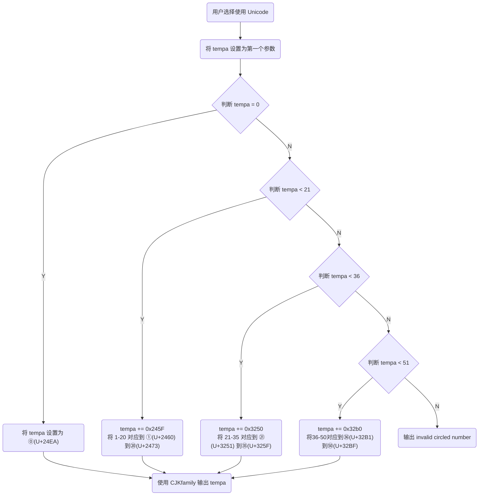
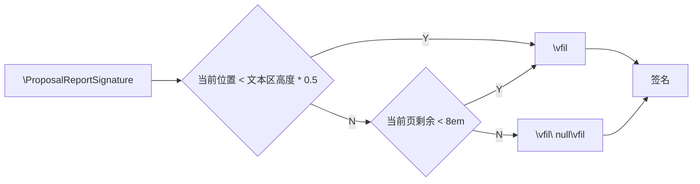

最近因为课程作业的原因，不得以提前准备毕业论文的 LaTeX 模板。作为一个仅使用过 LaTeX 而未制作过模板的人来说，这其实挑战还挺大的。不如从 WHU-Thesis[^1]（以下简称为whu） 开始魔改一份模板出来。

[^1]: [武汉大学毕业论文 LaTeX 模版 2024](https://github.com/whutug/whu-thesis)

那么，WHU-Thesis 做了什么?

## 创建 Logger

首先 whu 为 `\msg_new` 等函数创建了一个别名

```tex
%tag 简化-msg-模块的函数
\cs_new:Npn \__whu_msg_new:nn  { \msg_new:nnn      { whu-thesis } }
\cs_new:Npn \__whu_warning:n   { \msg_warning:nn   { whu-thesis } }
\cs_new:Npn \__whu_warning:nn  { \msg_warning:nnn  { whu-thesis } }
\cs_new:Npn \__whu_error:n     { \msg_error:nn     { whu-thesis } }
\cs_new:Npn \__whu_error:nn    { \msg_error:nnn    { whu-thesis } }
\cs_new:Npn \__whu_fatal:nx    { \msg_fatal:nnx    { whu-thesis } }
```

其中这里由于 LaTeX 顺序展开的原因，可以做到类似柯里化的机制。

对于 `\cs_new:Npn \__whu_msg_new:nn  { \msg_new:nnn      { whu-thesis } }` 来说，它的完整定义应该是这样

```tex
\cs_new:Npn \__whu_msg_new:nn #1#2  { \msg_new:nnn { whu-thesis } {#1} {#2} }
```

这代表着定义了一个新函数 `\__whu_msg_new:nn`，它接受两个参数，分别是消息的唯一名称和实际输出的消息。当调用此消息时将创建一个新的输出函数，该函数以 `whu-thesis` 为分类名进行输出

## 提供兼容方案

```tex
\cs_if_exist:NF \NewDocumentCommand
  { \RequirePackage { xparse } }
\RequirePackage { xtemplate, l3keys2e }
```

检查 `\NewDocumentCommand` 是否存在。如果它不存在，那么执行 `{ \RequirePackage { xparse } }`，即要求加载 `xparse` 包

```tex
\__whu_msg_new:nn { l3-too-old }
  {
    Package~ "#1"~ is~ too~ old. \\\\
    Please~ update~ an~ up-to-date~ version~ of~ the~ bundles \\
    "l3kernel"~ and~ "l3packages"~ using~ your~ TeX~ package \\
    manager~ or~ from~ CTAN.
  }
\clist_map_inline:nn { expl3, xtemplate, l3keys2e }
  {
    \@ifpackagelater {#1} { 2018/05/12 }
      { } { \__whu_error:nn { l3-too-old } {#1} }
  }
\sys_if_engine_xetex:F
  {
    \sys_if_engine_luatex:F
      {
        \__whu_fatal:nx { unsupported-engine }
          { \c_sys_engine_str }
      }
  }
\__whu_msg_new:nn { unsupported-engine }
  {
    The~ whu-thesis~ class~ requires~ either~ XeTeX~ or~ LuaTeX. \\\\
    "#1"~ is~ not~ supported~ at~ present.~ You~ must~ change \\
    your~ typesetting~ engine~ to~ "xelatex"~ or~ "lualatex".
  }
```

上述语句中分别通过 `\__whu_msg_new:nn` 创建两条输出属于 `unsupported-engine` 和 `l3-to-old`。接下来先检查 `expl3`, `xtemplate` 和 `l3keys2e` 的包发行时期是否在 `2018/05/12` 之前，如果在此之前则调用 `l3-to-old` 进行输出。同理，如果引擎不支持则调用 `unsupported-engine` 进行输出。

## 为用户提供初始化命令

```tex
%tag 用户设置命令接口
\NewDocumentCommand \whusetup { m }
  { \keys_set:nn { whu } {#1} }

%tag meta-key
\keys_define:nn { whu }
  {
    style .meta:nn = { whu / style } {#1},
    info  .meta:nn = { whu / info  } {#1}
  }
```

在下面的语句中定义了 `whu/style` 和 `whu/info` 两个元键值对。

这种写法基本相当于:

```tex
\keys_define:nn { whu }
  {
    style .code:n = { \keys_set:nn { whu/style } { #1 } } ,
    info .code:n = { \keys_set:nn { whu/info } { #1 } } ,
  }
```

感觉有点废话？但是实际上上面的代码是不能运行的。因为上面的代码缺少 `whu/style` 和 `whu/info` 的定义。但对于最初的代码来说则是可执行的，因为他的定义和赋值在同时发生

## 定义全局变量

```tex
%tag 定义全局变量
\clist_new:N \g__whu_to_ctexbook_clist   % 储存通过文档类选项传递给 ctexbook 的选项
\int_new:N \g__whu_thesis_type_int   % 论文类型：本、硕、博
\tl_new:N \g__whu_thesis_type_tl
\tl_new:N \g__whu_thesis_class_tl % 学术学位、专业学位
\bool_new:N \g__whu_draft_bool
\bool_new:N \g__whu_twoside_bool

%tag 临时变量
\box_new:N \l__whu_tmpa_box
\box_new:N \l__whu_tmpb_box
\clist_new:N \l__whu_tmpa_clist
\clist_new:N \l__whu_tmpb_clist
\tl_new:N \l__whu_tmpa_tl
\tl_new:N \l__whu_tmpb_tl
\dim_new:N \l__whu_tmpa_dim
\dim_new:N \l__whu_tmpb_dim
\dim_new:N \l__whu_tmpc_dim
```

不必多言

## ?

```tex
\hook_gset_rule:nnnn { begindocument/before } { . } { < } { xeCJK }
```

不知道在干什么

似乎是在文档开始前去调用 xeCJK

## 创建函数变体

```tex
\prg_generate_conditional_variant:Nnn \int_case:nn { Vn , xn } { T, F, TF }
\cs_generate_variant:Nn \int_case:nn { Vn, xn }
\cs_generate_variant:Nn \tl_map_inline:nn { xn }
\cs_generate_variant:Nn \dim_set:Nn { Nx }
\cs_generate_variant:Nn \str_case:nn { xn }
```

## 基本函数

### 空白页

```tex
%tag 空白页
\cs_new:Npn \__whu_new_blank_page:
  {
    \newpage \null \thispagestyle{empty} \newpage
  }
```

`__whu_new_blank_page` 创建一个新页面，并将页面为空白页样式。这意味着当前页面上不会显示页眉、页脚或页码，整个页面将是空白的

### 分散盒子

```tex
%tag 分散盒子
\cs_new_protected:Npn \__whu_spread_box:nn #1#2
  % #1: 宽度
  % #2: 内容
  {
    \mode_leave_vertical:
    \hbox_to_wd:nn {#1}
      { \tl_map_inline:xn {#2} { ##1 \hfil } \unskip }
  }
\cs_new_protected:Npn \__whu_spread_box_with_end_spaces:nn #1#2
  {
    \mode_leave_vertical:
    \hbox_to_wd:nn {#1}
      { \hspace{0.19cm} \tl_map_inline:xn {#2} { ##1 \hfil } \unskip \hspace{0.19cm}}
  }
```

`\__whu_spread_box` 创建分散盒子：先创建一个水平盒子，再对于 `#2` 中的内容的每两个元素之间添加一个弹性填空(`\hfil`)

`\__whu_spread_box_with_end_spaces` 同理，只是在最后重新添加了 `0.19cm` 的空白

### 带圈数字

```tex
\NewDocumentCommand \circlednumber { s m }
  {
    \IfBooleanTF {#1}
      { \__whu_tikz_circled_number:n {#2} }
      { \__whu_circled_number:n {#2} }
  }

```

为用户创建 `circlenumber` 命令，可创建带圈数字。如果第一个参数为 true 则使用 tikz 创建;否则使用 Unicode

```tex
\cs_new:Npn \__whu_circled_number:n #1
  {
    \int_set:Nn \l_tmpa_int {#1}
    \int_compare:nNnTF { \l_tmpa_int } = { 0 }
      { \int_set:Nn \l_tmpa_int { "24EA } }
      {
        \int_compare:nNnTF { \l_tmpa_int } < { 21 }
          { \int_add:Nn \l_tmpa_int { "245F } }
          {
            \int_compare:nNnTF { \l_tmpa_int } < { 36 }
              { \int_add:Nn \l_tmpa_int { "3250 } }
              {
                \int_compare:nNnTF { \l_tmpa_int } < { 51 }
                  { \int_add:Nn \l_tmpa_int { "32B0 } }
                  {
                    \msg_error:nnn { whu }
                      { invalid-circled-number } { \int_use:N \l_tmpa_int }
                  }
              }
          }
      }
    \group_begin:
      \CJKfamily+ { }
      \symbol { \l_tmpa_int }
    \group_end:
  }

\msg_new:nnn { whu } { invalid-circled-number }
  { Invalid~ circled~ number~ #1. }
```



```tex
%tag tikz-绘制带圈数字
\fp_new:N \l__whu_tikz_circled_number_xscale_fp   % 水平压缩系数
\fp_new:N \l__whu_tikz_circled_number_yscale_fp   % 垂直压缩系数
\dim_new:N \l__whu_tikz_circled_number_total_hegiht_dim   % 数字的总高度
\dim_new:N \l__whu_tikz_circled_number_radius_dim     % 半径

\cs_new:Npn \__whu_tikz_circled_number:n #1
  {
    % 根据数字大小设置压缩系数
    \fp_set:Nn \l__whu_tikz_circled_number_xscale_fp
      {
        \int_compare:nNnTF {#1} < { 10 }
          { 0.9 }
          {
            \int_compare:nNnTF {#1} < { 100 }
              { 0.7 }
              { 0.5 }
          }
      }
    \fp_set:Nn \l__whu_tikz_circled_number_yscale_fp
      {
        \int_compare:nNnTF {#1} < { 10 }
          { 0.9 }
          {
            \int_compare:nNnTF {#1} < { 100 }
              { 0.8 }
              { 0.6 }
          }
      }
    % 获取数字的高度
    \hbox_set:Nn \l_tmpa_box {#1}
    \dim_set:Nn \l__whu_tikz_circled_number_total_hegiht_dim
      { \box_ht:N \l_tmpa_box + \box_dp:N \l_tmpa_box  }
    % 设置圆的半径
    \dim_set:Nn \l__whu_tikz_circled_number_radius_dim
      { \dim_eval:n { \l__whu_tikz_circled_number_total_hegiht_dim / 2 + 0.34 ex } }
    % 绘制
    \tikz [ baseline ]
      {
        \node
          [ inner~sep = 0pt, outer~sep = 0pt ]
          at (0, \dim_use:N \l__whu_tikz_circled_number_total_hegiht_dim / 2 )
          {
            \hbox_set:Nn \l_tmpa_box
              {
                \int_compare:nNnTF {#1} > {9}
                  { \textbf {#1} }
                  {#1}
              }
            \makebox[0.35em][c]
              {
                \box_scale:Nnn \l_tmpa_box
                  { \fp_use:N \l__whu_tikz_circled_number_xscale_fp }
                  { \fp_use:N \l__whu_tikz_circled_number_yscale_fp }
                \box_use_drop:N \l_tmpa_box
              }
          };
        \draw (0, \l__whu_tikz_circled_number_total_hegiht_dim / 2 )
          circle ( \l__whu_tikz_circled_number_radius_dim );
      }
  }
```

tikz 画图硬汉

### 获取宽度与-clist-的内容的最大宽度

```tex
\cs_new:Npn \__whu_get_text_width:Nn #1#2
  {
    \hbox_set:Nn \l__whu_tmpa_box {#2}
    \dim_set:Nn #1 { \box_wd:N \l__whu_tmpa_box }
  }

\cs_generate_variant:Nn \__whu_get_text_width:Nn { NV }

\cs_new:Npn \__whu_get_max_text_width:NN #1#2
  {
    \group_begin:
      \clist_set_eq:NN \l__whu_tmpa_clist #2
      \bool_until_do:nn { \clist_if_empty_p:N \l__whu_tmpa_clist }
        {
          \clist_pop:NN \l__whu_tmpa_clist \l__whu_tmpa_tl
          \__whu_get_text_width:NV \l__whu_tmpa_dim \l__whu_tmpa_tl
          \dim_gset:Nn #1 { \dim_max:nn {#1} { \l__whu_tmpa_dim } }
        }
    \group_end:
  }
```

`\__whu_get_text_width` 通过设置`hbox`的内容为 `#2` 获取其宽度并存储在 `#1` 中

`\__whu_get_max_text_width:NN` 将列表`#2` 的内容依次弹出，然后通过 `\__whu_get_text_width`获取其大小并比较，最后将最大的宽度存储在 `#1` 中

### 删除章标题中的-\quad

```tex
%tag 删除章标题中的-\quad
\cs_new_protected:Npn \__whu_sanitize_chapter_title:n #1
  {
    \tl_clear:N \l__whu_tmpa_tl
    \tl_set:No \l__whu_tmpa_tl {#1}
    \tl_remove_all:Nn \l__whu_tmpa_tl { \quad }
  }
```

`\__whu_sanitize_chapter_title` 将 token list `#1 ` 中的 \quad 全部移除

这是一个相当有技巧性的写法。通过将 `#1` 记 tl 类型并通过 `\tl_remove_all` 操作删除其中所有的 `\quad`。

不过要注意这样删除之后的**输出在 `\l__whu_tmpa_tl` 变量中**

### 手动生成章的标题，用于摘要、参考文献等

```tex
%tag 手动生成章的标题，用于摘要、参考文献等
\cs_new_protected:Npn \__whu_chapter:n #1
  {
    \__whu_sanitize_chapter_title:n {#1}
    \group_begin:
      \ctexset { chapter / numbering = false }
      \chapter [ \l__whu_tmpa_tl ] {#1}
    \group_end:
    \__whu_chapter_header:n {#1}
  }
\cs_generate_variant:Nn \__whu_chapter:n { V }

\cs_new_protected:Npn \__whu_chapter_header:n #1
  {
    \bool_if:NTF \g__whu_twoside_bool
      { \markboth {#1} {#1} }
      { \markboth { \hfill #1 \hfill } { } }
  }
```

对于 `\__whu_chapter_header`，它判断是否设置了 `\g__whu_twoside_bool` 变量，如果设置了则将左右页眉都设为 `#1`; 否则则设置单个页眉，并通过两个 `\hfill` 居中显示

再来说 `\\__whu_chapter`，它首先在该作用域中关闭了自动编号，接着创建了 `#1` 章节，并通过删去 `\quad` 的 `#1` 作为目录页的索引。最后通过调用 `\__whu_chapter_header` 创建页眉

## 处理文档类选项

### 定义选项

```latex
%tag 选项定义
\keys_define:nn { whu / option }
  {
    type .choice:,
    type .value_required:n = true,
    type .choices:nn =
      { proposal, bachelor, master, doctor }
      {
        \int_gset_eq:NN \g__whu_thesis_type_int \l_keys_choice_int
        \tl_gset_eq:NN \g__whu_thesis_type_tl \l_keys_choice_tl
      },
    type .initial:n = bachelor,
    class .choice:,
    class .value_required:n = true,
    class .choices:nn =
      { academic, professional }
      { \tl_gset_eq:NN \g__whu_thesis_class_tl \l_keys_choice_tl },
    class .initial:n = academic,
    oneside .value_forbidden:n = true,
    twoside .value_forbidden:n = true,
    oneside .code:n =
      {
        \clist_gput_right:Nn \g__whu_to_ctexbook_clist { oneside }
        \bool_set_false:N    \g__whu_twoside_bool
      },
    twoside .code:n =
      {
        \clist_gput_right:Nn \g__whu_to_ctexbook_clist { twoside }
        \bool_set_true:N     \g__whu_twoside_bool
      },
    openany .value_forbidden:n = true,
    openany .code:n =
      {
        \clist_gput_right:Nn \g__whu_to_ctexbook_clist { openany }
      },
    showframe .value_forbidden:n = true,
    showframe .code:n =
      {
        \PassOptionsToPackage { showframe } { geometry }
      },
    draft .choice:,
    draft / true  .code:n =
      {
        \bool_set_true:N     \g__whu_draft_bool
        \clist_gput_right:Nn \g__whu_to_ctexbook_clist { draft }
      },
    draft / false .code:n =
      { \bool_set_false:N    \g__whu_draft_bool },
    draft .default:n = true,
    draft .initial:n = false,
    unknown .code:n = { \__whu_error:n { unknown-option } }
  }
\__whu_msg_new:nn { unknown-option }
  { Class~ option~ "\l_keys_key_str"~ is~ unknown. }
\ProcessKeysOptions { whu / option }

```

```tex
%tag 行距

% 本科的 linespread
\fp_const:Nn \c__whu_bachelor_line_spread_fp
  { \dim_ratio:nn { 23 pt } { 12 bp } / 1.2 }
% 硕士的 linespread
\fp_const:Nn \c__whu_master_line_spread_fp
  { \dim_ratio:nn { 20 bp } { 12 bp } / 1.2 }
% 博士的 linespread
\fp_const:Nn \c__whu_doctor_line_spread_fp
  { \dim_ratio:nn { 20 bp } { 12 bp } / 1.2 }

%tag 字号和行距处理
\int_case:nn { \g__whu_thesis_type_int }
  {
    % 开题报告字号小四
    {1} { \PassOptionsToClass { zihao = -4 } { ctexbook } }
    % 本科小四，23磅
    {2} { \PassOptionsToClass { zihao = -4 , linespread = \c__whu_bachelor_line_spread_fp } { ctexbook } }
    % 硕士小四，20磅
    {3} { \PassOptionsToClass { zihao = -4 , linespread = \c__whu_bachelor_line_spread_fp } { ctexbook } }
    % 博士小四，20磅
    {4} { \PassOptionsToClass { zihao = -4 , linespread = \c__whu_bachelor_line_spread_fp } { ctexbook } }
  }

%tag 页面的单双面设置
\int_case:nn { \g__whu_thesis_type_int }
  {
    % 开题报告：oneside
    {1} { \PassOptionsToClass { oneside } { ctexbook } }
    % 本科：默认 oneside
    {2} { \PassOptionsToClass { oneside } { ctexbook } }
  }

\PassOptionsToClass
  {
    UTF8,
    heading  = true,
    \g__whu_to_ctexbook_clist,
    fontset = none
  }
  { ctexbook }
```

一些中规中矩却又容易出错的常量设置

值得一提的是此处将所有配置都传给了 `ctexbook` 包，包括:

- 字号 zhihao
- 行距倍数 linespread [^2]
- 编码
- 字体集
- 外部配置 `g__whu_to_ctexbook_clist`

对于行距倍数，这里通过 `\dim_radion:nn` 进行了单位换算。以本科为例：当字号为小四(12pt)时，23磅间距是指 `23pt / 12pb` 倍

对于 ctexbook，它的 layout[^3] 是这样的：


[^2]: [LaTeX系列笔记(5)-行距](https://zhuanlan.zhihu.com/p/138408387)

[^3]: [中文版心设计的疑难与最佳实践](https://github.com/CTeX-org/forum/issues/47#issuecomment-511120397)

### 给预加载的宏包传递选项

```latex
%tag 给预加载的宏包传递选项
\clist_map_inline:nn
  {
    { no-math  } { fontspec },
    { numbered } { bookmark },
    { titles   } { tocloft  },
    { perpage  } { footmisc }
  }
  { \PassOptionsToPackage #1 }

\RequirePackage { filehook }
```

### 消去 CJK 警告

```tex
\AtEndOfPackageFile* { fontspec }
  { \msg_redirect_name:nnn { fontspec } { no-script } { none } }
\AtEndOfPackageFile* { xeCJK }
  {
    \msg_redirect_name:nnn { xeCJK } { CJKfamily-redef } { none }
    \defaultCJKfontfeatures { Script  = CJK }
  }
```

在包执行结束后进行消息重定向，以达到丢弃消息的目的

### 加载包

```tex
\LoadClass { ctexbook }

%tag 加载宏包 (in alphabetic order)
\RequirePackage { amsmath }
\RequirePackage { amssymb }
\RequirePackage { amsthm }
\RequirePackage { bookmark }
\RequirePackage { booktabs }
\RequirePackage { caption }
\RequirePackage { enumitem }
\RequirePackage { etoolbox }
\RequirePackage { fancyhdr }
\RequirePackage { fixdif }
\RequirePackage { fontspec }
\RequirePackage { footmisc }
\RequirePackage { geometry }
\RequirePackage { graphicx }
\RequirePackage { thmtools }
\RequirePackage { tikzpagenodes }
\RequirePackage { tocloft }
\RequirePackage { xeCJK }
\RequirePackage { xeCJKfntef }

\AtEndPreamble
  {
    \RequirePackage { hyperref }
  }
```

## 页面尺寸设置

```tex
%region 页面尺寸设置 (paper size setting)
% 统一都是 A4 纸大小
\geometry{paper = a4paper}

%tag 开题报告
\cs_new:Npn \__whu_proposal_set_paper_size:
  {
    \geometry
      {
        left       = 31.75mm,
        right      = 31.75mm,
        top        = 25.4mm,
        bottom     = 25.4mm,
        headheight = 0pt,
        headsep    = 0pt
      }
  }
%tag 本科
\cs_new:Npn \__whu_bachelor_set_paper_size:
  {
    \geometry
      {
        left       = 31.8mm,
        right      = 31.8mm,
        top        = 25.4mm,
        bottom     = 25.4mm,
        headheight = 3mm,
        headsep    = 2mm,
        footskip   = 6mm
      }
  }
%tag 硕士
\cs_new:Npn \__whu_master_set_paper_size:
  {
    \geometry
      {
        left       = 28mm,
        right      = 25mm,
        top        = 30mm,
        bottom     = 29mm,
        headheight = 15pt
      }
  }
%tag 博士
\cs_new:Npn \__whu_doctor_set_paper_size:
  {
    \geometry
      {
        left       = 28mm,
        right      = 25mm,
        top        = 30mm,
        bottom     = 29mm,
        headheight = 15pt
      }
  }

\int_case:Vn \g__whu_thesis_type_int
  {
    % 开题报告
    {1} { \__whu_proposal_set_paper_size: }
    % 本科
    {2} { \__whu_bachelor_set_paper_size: }
    % 硕士
    {3} { \__whu_master_set_paper_size: }
    % 博士
    {4} { \__whu_doctor_set_paper_size: }
  }
```

## 处理图书馆版本选项

```tex
%region 图书馆版本 去除所有空白页
\keys_define:nn { whu / style }
  {
    library .bool_gset:N = \g__whu_library_version_bool,
    library .initial:n   = false,
    library .default:n   = true,
  }
\ctex_after_end_preamble:n
{
  \bool_if:NT \g__whu_library_version_bool
  {
    \cs_set_eq:NN \__whu_new_blank_page: \newpage
    \renewcommand{\cleardoublepage}{\clearpage}
  }
}
%endregion 图书馆版本
```

如果启用了 `library` 选项，则在接下来的代码中用 `\clearpage` 取代 `\cleardoublepage`。

`\cleardouble` 和 `\clearpage` 在大部分时间是一致的，但 `\cleardoublepage` 同时还会检查页码。如果当前的页码是奇数并且 typesettings 是 `twosided` 时，`\cleardoublepage` 还会再多插入一页，使新的一页仍是奇数页[^5]。如果启用了 `library` 选项，则不会再新插入一页

[^5]: [Comparison between \newpage, \clearpage and \pagebreak, etc.?](https://tex.stackexchange.com/questions/497746/comparison-between-newpage-clearpage-and-pagebreak-etc)

## 字体配置

### 字体配置预备函数

```tex
\cs_new_protected:Npn \__whu_set_cjk_main_font:nn #1#2
  {
    \setCJKmainfont{#1}[#2]
    \newCJKfontfamily [zhsong] \songti {#1} [#2]
  }
\cs_new_protected:Npn \__whu_set_cjk_sans_font:nn #1#2
  {
    \setCJKsansfont{#1}[#2]
    \newCJKfontfamily [zhhei] \heiti {#1} [#2]
  }
\cs_new_protected:Npn \__whu_set_cjk_mono_font:nn #1#2
  {
    \setCJKmonofont{#1}[#2]
    \newCJKfontfamily [zhfs] \fangsong {#1} [#2]
  }
\cs_new_protected:Npn \__whu_set_cjk_font_kaishu:nn #1#2
  {
    \newCJKfontfamily [zhkai] \kaishu {#1} [#2]
  }
\tl_const:Nn \l__whu_cjk_font_options_tl { UprightFont = *, ItalicFont = *, AutoFakeBold }
\cs_new_protected:Npx \__whu_set_cjk_main_font:n #1
  { \__whu_set_cjk_main_font:nn {#1} { \l__whu_cjk_font_options_tl } }
\cs_new_protected:Npx \__whu_set_cjk_sans_font:n #1
  { \__whu_set_cjk_sans_font:nn {#1} { \l__whu_cjk_font_options_tl } }
\cs_new_protected:Npx \__whu_set_cjk_mono_font:n #1
  { \__whu_set_cjk_mono_font:nn {#1} { \l__whu_cjk_font_options_tl } }
\cs_new_protected:Npx \__whu_set_cjk_font_kaishu:n #1
  { \__whu_set_cjk_font_kaishu:nn {#1} { \l__whu_cjk_font_options_tl } }

\bool_new:N \g__whu_style_cjk_fakefont_bool
\tl_new:N \g__whu_style_math_font_choice_tl
```

提供了

- `\__whu_set_cjk_main_font:nn`
- `\__whu_set_cjk_sans_font:nn`
- `\__whu_set_cjk_mono_font:nn`
- `\__whu_set_cjk_font_kaishu:nn`

用于设置字体

### 字体配置项

```tex
%tag 定义键
\keys_define:nn { whu / style }
  {
    font .choices:nn =
      { times, xits, termes, default }
      { \cs_gset_eq:Nc \__whu_style_font_use: { __whu_style_font_set_ \l_keys_choice_tl : } },
    font .value_required:n = true,
    math-font .choices:nn =
      { xits, termes, default }
      {
        \cs_gset_eq:Nc \__whu_style_math_font_use: { __whu_style_math_font_set_ \l_keys_choice_tl : }
        \tl_gset_eq:NN \g__whu_style_math_font_choice_tl \l_keys_choice_tl
      },
    math-font .value_required:n = true,
    cjk-font .choices:nn =
      { windows, mac, fandol, sourcehan, founder, none }
      { \cs_gset_eq:Nc \__whu_style_cjk_font_use: { __whu_style_cjk_font_set_ \l_keys_choice_tl : } },
    cjk-font .value_required:n = true,
    cjk-fakefont .bool_set:N = \g__whu_style_cjk_fakefont_bool,
    cjk-fakefont .default:n = true
  }
```

在 `whu/style` 中添加了多个与字体相关的项，在设置该项时会调阅[前面的](#字体配置预备函数)配置语句

[^4]: [xeCJK](http://mirrors.ibiblio.org/CTAN/macros/xetex/latex/xecjk/xeCJK.pdf)

### 西文字体配置预备函数

```tex
%region 西文字体设置 (english font setting)
%tag times
\cs_new_protected:Npn \__whu_style_font_set_times:
  {
    \setmainfont { Times ~ New ~ Roman }
      [
        SmallCapsFont = { TeX ~ Gyre ~ Termes },
        SmallCapsFeatures = { Letters = SmallCaps }
      ]
  }
%tag xits
\cs_new_protected:Npn \__whu_style_font_set_xits:
  {
    \setmainfont { XITS }
      [
        Extension      = .otf,
        UprightFont    = *-Regular,
        BoldFont       = *-Bold,
        ItalicFont     = *-Italic,
        BoldItalicFont = *-BoldItalic
      ]
  }
%tag termes
\cs_new_protected:Npn \__whu_style_font_set_termes:
  {
    \setmainfont { texgyretermes }
      [
        Extension      = .otf,
        UprightFont    = *-regular,
        BoldFont       = *-bold,
        ItalicFont     = *-italic,
        BoldItalicFont = *-bolditalic
      ]
  }
\cs_new_protected:Npn \__whu_style_font_set_default: { }
%endregion 西文字体设置
```

提供

- `\__whu_style_font_set_times`
- `\__whu_style_font_set_xits`
- `\__whu_style_font_set_terms`

用于设置西文字体

### 数学字体预备函数

```tex
%tag 数学字体设置 (math font setting)
\cs_new_protected:Npn \__whu_style_math_font_set_xits:
  {
    \setmathfont { XITSMath-Regular.otf }
      [
        BoldFont     = XITSMath-Bold.otf,
      ]
    \setmathfont { XITSMath-Regular.otf }
      [
        range        = {cal, bfcal},
        StylisticSet = 01
      ]
  }
\cs_new_protected:Npn \__whu_style_math_font_set_termes:
  {
    \setmathfont { texgyretermes-math.otf }
  }
\cs_new_protected:Npn \__whu_style_math_font_set_default: { }
```

### 中文字体预备函数

```tex
%region 中文字体设置 (chinese font setting)
%tag default
\cs_new_protected:Npn \__whu_style_cjk_font_set_none: { }
%tag windows
\cs_new_protected:Npn \__whu_style_cjk_font_set_windows:
  {
    \bool_if:NTF \g__whu_style_cjk_fakefont_bool
      {
        \__whu_set_cjk_main_font:nn { SimSun }
          { AutoFakeBold = 4, AutoFakeSlant = 0.167 }
        \__whu_set_cjk_sans_font:nn { SimHei }
          { AutoFakeBold = 4, AutoFakeSlant = 0.167 }
        \__whu_set_cjk_mono_font:nn { FangSong }
          { AutoFakeBold = 4, AutoFakeSlant = 0.167 }
        \__whu_set_cjk_font_kaishu:nn { KaiTi }
          { AutoFakeBold = 4, AutoFakeSlant = 0.167 }
      }
      {
        \__whu_set_cjk_main_font:nn { SimSun }
          {
            BoldFont       = SimHei,
            ItalicFont     = KaiTi,
            SlantedFont    = KaiTi,
            BoldItalicFont = SimHei
          }
        \__whu_set_cjk_sans_font:nn { SimHei }
          { BoldFont = *, ItalicFont = *, SlantedFont = *, BoldItalicFont = * }
        \__whu_set_cjk_mono_font:nn { FangSong }
          { BoldFont = *, ItalicFont = *, SlantedFont = *, BoldItalicFont = * }
        \__whu_set_cjk_font_kaishu:nn { KaiTi }
          { BoldFont = *, ItalicFont = *, SlantedFont = *, BoldItalicFont = * }
      }
  }
%tag mac
\cs_new_protected:Npn \__whu_style_cjk_font_set_mac:
  {
    \bool_if:NTF \g__whu_style_cjk_fakefont_bool
      {
        \__whu_set_cjk_main_font:nn { Songti~ SC~ Light }
          {
            BoldFont       = Songti~ SC~ Bold,
            AutoFakeSlant  = 0.167
          }
        \__whu_set_cjk_sans_font:nn { Heiti~ SC~ Light }
          {
            BoldFont      = Heiti~ SC~ Medium,
            AutoFakeSlant = 0.167
          }
        \__whu_set_cjk_mono_font:nn { STFangsong }
          { AutoFakeBold = 4, AutoFakeSlant = 0.167 }
        \__whu_set_cjk_font_kaishu:nn { Kaiti~ SC~ Regular }
          {
            BoldFont      = Kaiti~ SC~ Bold,
            AutoFakeSlant = 0.167
          }
      }
      {
        \__whu_set_cjk_main_font:nn { Songti~ SC~ Light }
          {
            BoldFont       = Songti~ SC~ Bold,
            ItalicFont     = Kaiti~ SC~ Regular,
            SlantedFont    = Kaiti~ SC~ Regular,
            BoldItalicFont = Songti~ SC~ Bold
          }
        \__whu_set_cjk_sans_font:nn { Heiti~ SC~ Light }
          {
            BoldFont       = Heiti~ SC~ Medium,
            ItalicFont     = *,
            SlantedFont    = *,
            BoldItalicFont = Heiti~ SC~ Medium
          }
        \__whu_set_cjk_mono_font:nn { STFangsong }
          { BoldFont = *, ItalicFont = *, SlantedFont = *, BoldItalicFont = * }
        \__whu_set_cjk_font_kaishu:nn { Kaiti~ SC~ Regular }
          {
            BoldFont       = Kaiti~ SC~ Bold,
            ItalicFont     = *,
            SlantedFont    = *,
            BoldItalicFont = Kaiti~ SC~ Bold
          }
      }
  }
%tag fandol
\cs_new_protected:Npn \__whu_style_cjk_font_set_fandol:
  {
    \bool_if:NTF \g__whu_style_cjk_fakefont_bool
      {
        \__whu_set_cjk_main_font:nn { FandolSong-Regular.otf }
          {
            BoldFont      = FandolSong-Bold.otf,
            AutoFakeSlant = 0.167
          }
        \__whu_set_cjk_sans_font:nn { FandolHei-Regular.otf }
          {
            BoldFont      = FandolHei-Bold.otf,
            AutoFakeSlant = 0.167
          }
        \__whu_set_cjk_mono_font:nn { FandolFang-Regular.otf }
          { AutoFakeBold = 4, AutoFakeSlant = 0.167 }
        \__whu_set_cjk_font_kaishu:nn { FandolKai-Regular.otf }
          { AutoFakeBold = 4, AutoFakeSlant = 0.167 }
      }
      {
        \__whu_set_cjk_main_font:nn { FandolSong-Regular.otf }
          {
            BoldFont       = FandolSong-Bold.otf,
            ItalicFont     = FandolKai-Regular.otf,
            SlantedFont    = FandolKai-Regular.otf,
            BoldItalicFont = FandolSong-Bold.otf
          }
        \__whu_set_cjk_sans_font:nn { FandolHei-Regular.otf }
          {
            BoldFont       = FandolHei-Bold.otf,
            ItalicFont     = *,
            SlantedFont    = *,
            BoldItalicFont = FandolHei-Bold.otf
          }
        \__whu_set_cjk_mono_font:nn { FandolFang-Regular.otf }
          { BoldFont = *, ItalicFont = *, SlantedFont = *, BoldItalicFont = * }
        \__whu_set_cjk_font_kaishu:nn { FandolKai-Regular.otf }
          { BoldFont = *, ItalicFont = *, SlantedFont = *, BoldItalicFont = * }
      }
  }
%tag founder
\cs_new_protected:Npn \__whu_style_cjk_font_set_founder:
  {
    \__whu_set_cjk_main_font:nn  { FZShuSong-Z01  } { BoldFont = FZHei-B01, ItalicFont = FZKai-Z03 }
    \__whu_set_cjk_sans_font:n   { FZHei-B01      }
    \__whu_set_cjk_mono_font:n   { FZFangSong-Z02 }
    \__whu_set_cjk_font_kaishu:n { FZKai-Z03      }
  }
%tag source-han
\cs_new_protected:Npn \__whu_style_cjk_font_set_sourcehan:
  {
    \bool_if:NTF \g__whu_style_cjk_fakefont_bool
      {
        \__whu_set_cjk_main_font:nn { Source~ Han~ Serif~ SC }
          {
            UprightFont   = *-Regular,
            BoldFont      = *-Bold,
            AutoFakeSlant = 0.167
          }
        \__whu_set_cjk_sans_font:nn { Source~ Han~ Sans~ SC }
          {
            UprightFont   = *-Regular,
            BoldFont      = *-Bold,
            AutoFakeSlant = 0.167
          }
        \__whu_set_cjk_font_kaishu:nn { FZKai-Z03 }
          { AutoFakeBold = 4, AutoFakeSlant = 0.167 }
        \__whu_set_cjk_mono_font:nn { FZFangSong-Z02 }
          { AutoFakeBold = 4, AutoFakeSlant = 0.167 }
      }
      {
        \__whu_set_cjk_main_font:nn { Source~ Han~ Serif~ SC }
          {
            UprightFont    = *-Regular,
            BoldFont       = *-Bold,
            ItalicFont     = *-Regular,
            BoldItalicFont = *-Bold
          }
        \__whu_set_cjk_sans_font:nn { Source~ Han~ Sans~ SC }
          {
            UprightFont    = *-Regular,
            BoldFont       = *-Bold,
            ItalicFont     = *-Regular,
            BoldItalicFont = *-Bold
          }
        \__whu_set_cjk_font_kaishu:nn { FZKai-Z03 }
          {
            BoldFont       = *,
            ItalicFont     = *,
            BoldItalicFont = *
          }
        \__whu_set_cjk_mono_font:nn { FZFangSong-Z02 }
          {
            BoldFont       = *,
            ItalicFont     = *,
            BoldItalicFont = *
          }
      }
  }
%endregion 中文字体设置
```

提供设置中文字体的方法

- `\__whu_style_cjk_font_set_none`
- `\__whu_style_cjk_font_set_windows`
- `\__whu_style_cjk_font_set_mac`
- `\__whu_style_cjk_font_set_fandol`
- `\__whu_style_cjk_font_set_founder`
- `\__whu_style_cjk_font_set_sourcehan`

### 使用字体[^6]

```tex
%tag 使用字体 (use font)
\AtEndPreamble
  {
    \tl_if_eq:NnTF \g__whu_style_math_font_choice_tl {default}
      {
        \RequirePackage{mathrsfs}
        \DeclareFontFamily{U}{rsfs}{\skewchar\font127 }
        \DeclareFontShape{U}{rsfs}{m}{n}{
          <5-6> rsfs5
          <6-8> rsfs7
          <8-> rsfs10
        }{}
      }
      {
        \RequirePackage [ bold-style = ISO ] { unicode-math }
      }
    \__whu_style_font_use:
    \__whu_style_math_font_use:
    \__whu_style_cjk_font_use:
  }
%tag 设置默认字体
\keys_set:nn { whu / style }
  {
    font         = times,
    math-font    = termes,
    cjk-font     = fandol,
    cjk-fakefont = false,
  }
%endregion 字体配置
```

[^6]: [etoolbox book](http://mirrors.ibiblio.org/CTAN/macros/latex/contrib/etoolbox/etoolbox.pdf)

在 preamble 的最后（`\documentclass` 命令和 `\begin{document}` 命令之间）添加字体使用语句

当 `\g__whu_style_math_font_choice_tl` 为 `default` 时使用 `Ralph Smith's Formal Script` 字体。接下来声明了一个名为 `rsfs` 的字体族（font family），并设置了其 skew 字符（倾斜字符）为 127。这个设置可以确保字体在倾斜时不会出现问题。

`\DeclareFontShape{U}{rsfs}{m}{n}{...}`：这行命令用于声明字体的形状（font shape），这里的 `U` 表示使用 Unicode 编码，`rsfs` 是字体族名称，`m` 表示字体系列（font series），`n` 表示字体形状（font shape）。

在大括号内的 `<5-6> rsfs5`、`<6-8> rsfs7` 和 `<8-> rsfs10` 分别表示字体大小的范围和对应的字体文件。它们表示：

- 对于字体大小在 5pt 到 6pt 之间的情况，使用 `rsfs5` 字体文件；
- 对于字体大小在 6pt 到 8pt 之间的情况，使用 `rsfs7` 字体文件；
- 对于字体大小大于等于 8pt 的情况，使用 `rsfs10` 字体文件。

## 章节标题设置与列表设置

### 移除列表垂直间距

```tex
\setlist{nosep}
```

设置列表（`enumerate`、`itemize` 和 `description` 环境）的垂直间距为零

### 配置 ctex

```tex
%tag 开题报告
\cs_new:Npn \__whu_proposal_report_set_ctex_format:
  {
    \keys_set:nn { ctex }
      {
        chapter =
          {
            numbering   = false,
            format      = \zihao{2}\bfseries\centering,
            beforeskip  = -3.5ex,
            afterskip   = 5ex plus 1ex minus 1ex,
            pagestyle   = empty,
            titleformat = \__whu_spread_box_with_quad:n
          },
        section =
          {
            number      = \chinese{section},
            name        = {,、},
            aftername   = {},
            format      = \zihao{4}
          }
    }
  }

%tag 本科毕业论文（设计）任务书
\cs_new:Npn \__whu_proposal_tasks_set_ctex_format:
  {
    \keys_set:nn { ctex }
      {
        chapter =
          {
            numbering   = false,
            format      = \zihao{3}\bfseries\centering,
            beforeskip  = 3ex,
            afterskip   = 7.5ex,
            pagestyle   = empty
          },
        section =
          {
            number      = \chinese{section},
            name        = {,、},
            aftername   = {},
            format      = \zihao{4}
          }
    }
  }

%tag 本科
\cs_new:Npn \__whu_bachelor_set_ctex_format:
  {
    \keys_set:nn { ctex }
      {
        % 编号到 subsubsection
        secnumdepth = 3,
        chapter =
          {
            format       = \zihao{-2}\sffamily\centering,
            number       = \arabic{chapter},
            numberformat = \rmfamily,
            name         = {},
            beforeskip   = 0.8 \baselineskip,
            afterskip    = 0.5 \baselineskip,
            fixskip      = true,
            pagestyle    = bachelor-mainmatter
          },
        section =
          {
            format       = \zihao{4}\sffamily,
            numberformat = \rmfamily,
            beforeskip   = 0.5 \baselineskip,
            afterskip    = 0.5 \baselineskip,
            fixskip      = true,
          },
        subsection =
          {
            format       = \zihao{-4}\sffamily,
            numberformat = \rmfamily,
            beforeskip   = 0.5 \baselineskip,
            afterskip    = 0.5 \baselineskip,
            fixskip      = true,
          },
        subsubsection =
          {
            format       = \zihao{-4}\sffamily,
            numberformat = \rmfamily,
            beforeskip   = 0.5 \baselineskip,
            afterskip    = 0.5 \baselineskip,
            fixskip      = true,
          },
    }
  }
\cs_new:Npn \__whu_bachelor_set_enumerate_format:
  {
    % enumerate
    \setenumerate[1]
      {
        labelindent    = \parindent,
        leftmargin     = 0pt,
        widest         = 0,
        itemindent     = *,
        listparindent  = \parindent,
        label          = (\arabic*)
      }
    \setenumerate[2]
      {
        labelindent    = \parindent,
        leftmargin     = 4em,
        itemindent     = 13pt,
        listparindent  = \parindent,
        label          = \circlednumber{\arabic*}
      }
  }
%tag 硕士
\cs_new:Npn \__whu_master_set_ctex_format:
  {
    \keys_set:nn { ctex }
      {
        % 编号到 subsubsection
        secnumdepth = 3,
        chapter =
          {
            format      = \zihao{-2}\sffamily\raggedright,
            number      = \arabic{chapter},
            name        = {},
            beforeskip  = 4 ex plus 0.5 ex,
            afterskip   = 4 ex plus 0.5 ex,
            fixskip     = true,
          },
        section =
          {
            format      = \zihao{4}\sffamily,
            % beforeskip  = 0.5 \baselineskip,
            % afterskip   = 0.5 \baselineskip,
            fixskip     = true,
          },
        subsection =
          {
            format      = \zihao{-4}\sffamily,
            % beforeskip  = 0.5 \baselineskip,
            % afterskip   = 0.5 \baselineskip,
            fixskip     = true,
          },
        subsubsection =
          {
            format      = \zihao{-4}\sffamily,
            % beforeskip  = 0.5 \baselineskip,
            % afterskip   = 0.5 \baselineskip,
            fixskip     = true,
          },
    }
  }
\cs_new:Npn \__whu_master_set_enumerate_format:
  {
    % enumerate
    \setenumerate[1]
      {
        labelindent    = \parindent,
        leftmargin     = 0pt,
        widest         = 0,
        itemindent     = *,
        listparindent  = \parindent,
        label          = (\arabic*)
      }
    \setenumerate[2]
      {
        labelindent    = \parindent,
        leftmargin     = 4em,
        itemindent     = 13pt,
        listparindent  = \parindent,
        label          = \roman{*}.
      }
  }
%tag 博士
\cs_new:Npn \__whu_doctor_set_ctex_format:
  {
    \keys_set:nn { ctex }
      {
        % 编号到 subsubsection
        secnumdepth = 3,
        chapter =
          {
            format      = \zihao{-2}\sffamily\raggedright,
            number      = \arabic{chapter},
            name        = {},
            beforeskip  = 4 ex plus 0.5 ex,
            afterskip   = 4 ex plus 0.5 ex,
            fixskip     = true,
          },
        section =
          {
            format      = \zihao{4}\sffamily,
            % beforeskip  = 0.5 \baselineskip,
            % afterskip   = 0.5 \baselineskip,
            fixskip     = true,
          },
        subsection =
          {
            format      = \zihao{-4}\sffamily,
            % beforeskip  = 0.5 \baselineskip,
            % afterskip   = 0.5 \baselineskip,
            fixskip     = true,
          },
        subsubsection =
          {
            format      = \zihao{-4}\sffamily,
            % beforeskip  = 0.5 \baselineskip,
            % afterskip   = 0.5 \baselineskip,
            fixskip     = true,
          },
    }
  }
\cs_new:Npn \__whu_doctor_set_enumerate_format:
  {
    % enumerate
    \setenumerate[1]
      {
        labelindent    = \parindent,
        leftmargin     = 0pt,
        widest         = 0,
        itemindent     = *,
        listparindent  = \parindent,
        label          = (\arabic*)
      }
    \setenumerate[2]
      {
        labelindent    = \parindent,
        leftmargin     = 4em,
        itemindent     = 13pt,
        listparindent  = \parindent,
        label          = \roman{*}.
      }
  }

```

创建不同的函数用于适配不同的用途，主要包含以下属性:

| Key                  | Desc                                                                                           |
| -------------------- | ---------------------------------------------------------------------------------------------- |
| chapter/numbering    | 章节编号                                                                                       |
| chapter/format       | 章节标题格式                                                                                   |
| chapter/number       | 章编号内容，例如阿拉伯数字、罗马数字等                                                         |
| chapter/numberformat | 章编号格式                                                                                     |
| chapter/beforeskip   | 章节标题之前的垂直间距，设置为负数即向上移动                                                   |
| chapter/afterskip    | 章节标题之后的垂直间距。 `5ex plus 1ex minus 1ex` 意为5 行高，最多扩展 1 行高，最少减少 1 行高 |
| chapter/pagestyle    | 章节页眉页脚样式设置为空白                                                                     |
| chapter/titleformat  | 章节标题的格式                                                                                 |
| chapter/fixskip      | 调整章标题前后的垂直间距                                                                       |

对于 `section`、`subsection`、`subsubsection` 等同理

作者分别通过下列函数进行设置

| Name                                     | Desc                       |
| ---------------------------------------- | -------------------------- |
| `\__whu_proposal_report_set_ctex_format` | 开题报告                   |
| `\__whu_proposal_tasks_set_ctex_format`  | 本科毕业论文（设计）任务书 |
| `\__whu_bachelor_set_ctex_format`        | 本科                       |
| `\__whu_master_set_ctex_format`          | 硕士                       |
| `\__whu_doctor_set_ctex_format`          | 博士                       |

除此之外还通过 `\setenumerate` 设置了列表项样式

| Key           | Desc                     |
| ------------- | ------------------------ |
| labelindent   | 标签缩进                 |
| leftmargin    | 左侧边距                 |
| widest        | 最宽项                   |
| itemindent    | 项目缩进设置             |
| listparindent | 段落缩进量               |
| label         | 标签格式设置(如罗马数字) |

| Name                                   | Desc         |
| -------------------------------------- | ------------ |
| `\__whu_bachelor_set_enumerate_format` | 本科列表样式 |
| `\__whu_master_set_enumerate_format`   | 硕士列表样式 |
| `\__whu_doctor_set_enumerate_format`   | 博士列表样式 |

### 判断论文种类

```tex
\int_case:Vn \g__whu_thesis_type_int
  {
    % 本科
    {2}
      {
        \__whu_bachelor_set_enumerate_format:
        \__whu_bachelor_set_ctex_format:
      }
    % 硕士
    {3}
      {
        \__whu_master_set_enumerate_format:
        \__whu_master_set_ctex_format:
      }
    % 博士
    {4}
      {
        \__whu_doctor_set_enumerate_format:
        \__whu_doctor_set_ctex_format:
      }
  }

\NewDocumentCommand { \ProposalTasks } { O{武汉大学本科毕业论文（设计）任务书} }
  {
    \__whu_proposal_tasks_set_ctex_format:
    \chapter{#1}
    \int_set:Nn \c@section {0}
  }
\NewDocumentCommand { \ProposalReport } { O{开题报告} }
  {
    \__whu_proposal_report_set_ctex_format:
    \chapter{#1}
    \int_set:Nn \c@section {0}
  }
```

首先对本科、硕士和博士论文分别进行样式设置。然后创建了两个命令，分别是 `\ProposalTasks` 和 `\ProposalReport`。这两个命令接受一个参数，并具有一个默认值。在命令的实现中首先设置了相关样式，接着以传递参数创建了一个章节，并在之后重置了计数器 `\c@section` 。这样新的章节开始后，下一个节的编号将从 1 开始。

## 页眉页脚样式

```tex
%region 页眉页脚样式
%tag 本科
\fancypagestyle { bachelor-frontmatter }
  {
    \fancyhf { }
    \fancyfoot[C] { \zihao{5} \Roman{page} }
    \renewcommand \headrulewidth { 0pt }
  }
\fancypagestyle { bachelor-mainmatter }
  {
    \fancyhf { }
    \fancyfoot[C] { \zihao{5} \arabic{page} }
    \fancyhead[C] { \zihao{5} \__whu_spread_box:nn {8cm} {武汉大学本科毕业论文（设计）}}
    \renewcommand \headrulewidth { 0.5pt }
    \setlength{\headheight}{13pt}
  }
%tag 硕士
% 页眉从中文摘要开始至论文末，偶数页码内容为：武汉大学硕士学位论文，奇数页码内容为学位论文题目。
% 摘要页码用罗马数字单独编排，并标注在每页页脚中部，英文摘要页码续接中文摘要的页码。
\fancypagestyle { master-frontmatter }
  {
    \fancyhf { }
    \fancyhead [CE] { 武汉大学硕士学位论文 }
    \fancyhead [CO] { \l__whu_info_title_tl }
    \fancyfoot [C]  { \zihao{5} \Roman{page} }
  }
\fancypagestyle { master-mainmatter  }
  {
    \fancyhf { }
    \fancyhead [CE] { 武汉大学硕士学位论文 }
    \fancyhead [CO] { \l__whu_info_title_tl }
    \fancyfoot [C]  { \zihao{5} \arabic{page} }
  }
%tag 博士
% 页眉从中文摘要开始至论文末，偶数页码内容为“武汉大学博士学位论文”，奇数页码内容为学位论文题目。
\fancypagestyle { doctor-frontmatter }
  {
    \fancyhf { }
    \fancyhead [CE] { 武汉大学博士学位论文 }
    \fancyhead [CO] { \l__whu_info_title_tl }
    \fancyfoot [C]  { \zihao{5} \Roman{page} }
  }
\fancypagestyle { doctor-mainmatter  }
  {
    \fancyhf { }
    \fancyhead [CE] { 武汉大学博士学位论文 }
    \fancyhead [CO] { \l__whu_info_title_tl }
    \fancyfoot [C]  { \zihao{5} \arabic{page} }
  }
%tag 给-\mainmatter-添加钩子
\AddToHook{ cmd / mainmatter / after }
  { \exp_args:No \pagestyle { \g__whu_thesis_type_tl - mainmatter } }
%endregion

```

其中 `\fancyhf` 用于清除当前的页眉页脚设置，然后调用 `\fancyhead` 设置页眉也页脚。在页眉和页脚的设置中，`C` 表示居中，类似的有 `L` 和 `R`。`E` 和 `O` 表示 even 和 odd

在最后使用 `\AddToHook`在 `cmd/mainmatter/after`之后执行 `\pagestyle` 设置相关样式，其目的是统一后记 (backmatter) 的样式与 mainmatter

## 个人信息配置项

```tex
%region 个人信息
%tag 定义键
\keys_define:nn { whu / info }
  {
    title           .tl_set:N = \l__whu_info_title_tl,
    title*          .tl_set:N = \l__whu_info_title_en_tl,
    department      .tl_set:N = \l__whu_info_department_tl,
    department*     .tl_set:N = \l__whu_info_department_en_tl,
    student-id      .tl_set:N = \l__whu_info_student_id_tl,
    author          .tl_set:N = \l__whu_info_author_tl,
    author*         .tl_set:N = \l__whu_info_author_en_tl,
    subject         .tl_set:N = \l__whu_info_subject_tl,
    subject*        .tl_set:N = \l__whu_info_subject_en_tl,
    major           .tl_set:N = \l__whu_info_major_tl,
    major*          .tl_set:N = \l__whu_info_major_en_tl,
    supervisor      .tl_set:N = \l__whu_info_supervisor_tl,
    supervisor*     .tl_set:N = \l__whu_info_supervisor_en_tl,
    supervisor-outer.tl_set:N = \l__whu_info_supervisor_outer_tl,
    academic-title  .tl_set:N = \l__whu_info_supervisor_academic_title_tl,
    academic-title* .tl_set:N = \l__whu_info_supervisor_academic_title_en_tl,
    academic-title-outer.tl_set:N = \l__whu_info_supervisor_outer_academic_title_tl,
    research-area   .tl_set:N = \l__whu_info_research_area_tl,
    research-area*  .tl_set:N = \l__whu_info_research_area_en_tl,
    clc             .tl_set:N = \l__whu_info_clc_tl,
    secret-level    .tl_set:N = \l__whu_info_secret_level_tl,
    udc             .tl_set:N = \l__whu_info_udc_tl,
    year           .int_set:N = \l__whu_info_year_int,
    month          .int_set:N = \l__whu_info_month_int,
    day            .int_set:N = \l__whu_info_day_int,
    keywords     .clist_set:N = \l__whu_info_keywords_clist,
    keywords*    .clist_set:N = \l__whu_info_keywords_en_clist,
    cover-en-type .choice:,
    cover-en-type .choices:nn = { normal, cs }
                                { \tl_set_eq:NN \l__whu_cover_en_type_tl \l_keys_choice_tl },
    cover-en-type .initial:n = normal
  }
%tag 初始化公共键
\keys_set:nn { whu / info }
  {
    year = \c_sys_year_int,
    month = \c_sys_month_int,
    day = \c_sys_day_int,
    keywords = {\LaTeX{}, 毕业论文, 模版, 武汉大学},
    keywords* = {\LaTeX{}, Thesis, Template, Wuhan~University},
    clc = \c_empty_tl,
    secret-level = \c_empty_tl,
    udc = \c_empty_tl,
    student-id = xxxxxxxxxxx
  }

%tag 函数，用于定义常量
% 只定义中文
\cs_new_protected:Npn \__whu_define_name:nn #1#2
  { \tl_const:cn { c__whu_name_ #1 _tl } {#2} }
% 中英文（或中文+拼音）
\cs_new_protected:Npn \__whu_define_name:nnn #1#2#3
  {
    \tl_const:cn { c__whu_name_ #1    _tl } {#2}
    \tl_const:cn { c__whu_name_ #1 _en_tl } {#3}
  }
%tag 本科初始化
\cs_new_protected:Npn \__whu_bachelor_info_initial:
  {
    \clist_map_inline:nn
      {
        { secret_level } { 密级 },
        { student_id } { 学号 },
        { toc } { 目 \hspace{2em} 录 },
      }
      { \__whu_define_name:nn ##1 }
    \clist_map_inline:nn
      {
        { type } { 本科毕业论文（设计） } { BACHELOR’S~DEGREE~THESIS~OF~WUHAN~UNIVERSITY },
        { department } { 学院 } { School (Department) },
        { major } { 专业 } { Major },
        { author } { 姓名 } { Candidate },
        { supervisor } { 指导教师 } { Supervisor },
        { keywords } { 关键词 } { Keywords },
        { abstract } { 摘 \hspace{2em} 要 } { ABSTRACT },
      }
      { \__whu_define_name:nnn ##1 }
    \keys_set:nn { whu / info }
      {
        title           = {武汉大学本科生毕业论文 \LaTeX{} 模版},
        title*          = {A~\LaTeX{}~Thesis~Template~for~Wuhan~University},
        department      = {数学与统计学院},
        department*     = {School~of~Mathematics~and~Statistics},
        major           = {数学与应用数学},
        major*          = {Mathematics~and~Applied~Mathematics},
        author          = {夏大鱼羊},
        author*         = {XIA~Dayuyang},
        supervisor      = {夏大鱼羊},
        supervisor*     = {XIA~Kangwei},
        academic-title  = {教授},
        academic-title* = {Prof},
      }
  }
%tag 硕博公共部分常量定义
\cs_new:Npn \__whu_master_and_doctor_info_initial:
  {
    \clist_map_inline:nn
      {
        { secret_level } { 密级 },
        { clc } { 分类号 },
        { numbering } { 编号 },
        { udc } { UDC },
        { subject_major_academic } { 学科、专业名称 },
        { subject_major_professional } { 专业学位类别、领域 },
        { academic } { 学术学位  },
        { professional } { 专业学位 },
        { toc } { 目 \qquad 录 },
      }
      { \__whu_define_name:nn ##1 }
    \clist_map_inline:nn
      {
        { author } { 研究生姓名 } { Candidate },
        { student_id } { 学号 } { Student~ number },
        { supervisor } { 校内导师姓名、职称 } { Supervisor },
        { supervisor_outer } { 校外导师姓名、职称 } { Supervisor Outside },
        { major } { 专业名称 } { Major },
        { research_area  } { 研究方向 } { Speciality },
        { abstract } { 摘 \hspace{2em} 要 } { ABSTRACT },
        { keywords } { 关键词 } { Keywords },
      }
      { \__whu_define_name:nnn ##1 }
  }
%tag 硕士初始化
\cs_new:Npn \__whu_master_info_initial:
  {
    \clist_map_inline:nn
      {
        { type } { 硕士学位论文 }
      }
      { \__whu_define_name:nn ##1 }
    \keys_set:nn { whu / info }
      {
        title         = {武汉大学硕士学位论文 \LaTeX{} 模版},
        title*        = {A~\LaTeX{}~Thesis~Template~for~Wuhan~University},
        department    = {数学与统计学院},
        department*   = {School~of~Mathematics~and~Statistics},
        major         = {基础数学},
        major*        = {Pure~Mathematics},
        research-area = {函数空间上的算子理论},
        research-area* = {Operator~Theory~on~Function~Spaces},
        author        = {夏大鱼羊},
        author*       = {XIA~Kangwei},
        supervisor    = {夏大鱼羊},
        supervisor*   = {XIA~Dayuyang},
        academic-title = {教授},
        academic-title* = {Prof}
      }
  }
%tag 博士初始化
\cs_new:Npn \__whu_doctor_info_initial:
  {
    \clist_map_inline:nn
      {
        { type } { 博士学位论文 }
      }
      { \__whu_define_name:nn ##1 }
    \keys_set:nn { whu / info }
      {
        title         = {武汉大学博士学位论文 \LaTeX{} 模版},
        title*     = {A~\LaTeX{}~Thesis~Template~for~Wuhan~University},
        department    = {数学与统计学院},
        department*    = {School~of~Mathematics~and~Statistics},
        major         = {基础数学},
        major*        = {Pure~Mathematics},
        research-area = {函数空间上的算子理论},
        research-area* = {Operator~Theory~on~Function~Spaces},
        author        = {夏大鱼羊},
        author*       = {XIA~Kangwei},
        supervisor    = {夏大鱼羊},
        supervisor*   = {XIA~Dayuyang},
        academic-title = {教授},
        academic-title* = {Prof},
      }
  }
%tag 执行初始化
\int_case:Vn \g__whu_thesis_type_int
  {
    % 本科
    {2} { \__whu_bachelor_info_initial: }
    % 硕士
    {3} { \__whu_master_and_doctor_info_initial:
          \__whu_master_info_initial: }
    % 博士
    {4} { \__whu_master_and_doctor_info_initial:
          \__whu_doctor_info_initial: }
  }
%endregion 个人信息

```

值的一提的是这里会将公共常量定义为`c__whu_name_#1_tl`，例如 `\c_whu_name_author_tl` 对应 `姓名`

根据 `\g__whu_thesis_type_int  ` 不同，调用的命令来初始化常量

## 落款

```tex

%tag 本科任务书个人信息
\NewDocumentCommand \ProposalTasksinformation { }
  {
    \par \noindent
    毕业论文（设计）题目：\CJKunderline*{ \l__whu_info_title_tl }\\[5pt]
    学院：\CJKunderline*{ \l__whu_info_department_tl } \c_space_tl
    学号：\CJKunderline*{ \l__whu_info_student_id_tl } \c_space_tl
    姓名：\CJKunderline*{ \l__whu_info_author_tl }
  }
% 本科开题报告个人信息
\NewDocumentCommand \ProposalReportinformation { }
  {
    \par \noindent
    论文题目：\CJKunderline*{ \l__whu_info_title_tl }\\[10pt]
    学院：\CJKunderline*{ \l__whu_info_department_tl } \c_space_tl
    学号：\CJKunderline*{ \l__whu_info_student_id_tl } \c_space_tl
    姓名：\CJKunderline*{ \l__whu_info_author_tl }
  }
% 本科任务书落款
\NewDocumentCommand \ProposalTasksSignature { }
  {
    \dim_compare:nNnTF
      { \pagetotal } < { .5 \textheight }
      { \vfil \null \vfil }
      {
        \dim_compare:nNnTF
          { \pagegoal - \pagetotal } < { 8em }
          { \vfill }
          { \vfil \null \vfil }
      }
    \noindent
    指导老师签名：\CJKunderline*{\hspace*{10em}}  \hfill
    年 \hspace*{2em} 月 \hspace*{2em} 日
  }
% 本科任务书落款
\NewDocumentCommand \ProposalReportSignature { }
  {
    \dim_compare:nNnTF
      { \pagetotal } < { .5 \textheight }
      { \vfil }
      {
        \dim_compare:nNnTF
          { \pagegoal - \pagetotal } < { 8em }
          { \vfill }
          { \vfil \null \vfil }
      }
    \begin{flushright}
      指导老师签名：\hspace*{8em} \null\\[5pt]
      年 \hspace*{2em} 月 \hspace*{2em} 日
    \end{flushright}
  }

```

以 `ProposalReportSignature` 为例



即将签名放到页面最下放

## 中文封面

### 本科

```tex
%region 本科
\cs_new_protected:Npn \__whu_bachelor_cover_i:
  {
    \newgeometry { hmargin = 2.445 cm , vmargin = 2.54cm }
    % logo and type
    \__whu_bachelor_cover_i_logo_and_type:
    % 论文标题
    \__whu_bachelor_cover_i_title:
    % 个人信息
    \__whu_bachelor_cover_i_information:
    % 时间
    \__whu_bachelor_cover_i_date_zh:
    \restoregeometry
  }

%tag logo-and-type
\cs_new_protected:Npn \__whu_bachelor_cover_i_logo_and_type:
  {
    \mode_leave_vertical:
    \skip_vertical:n { 2.01 cm }
    \noindent
    \begin{minipage}[t][3.85cm]{\textwidth}
      \centering
      \includegraphics[ width = 5.5cm ]{ logo / whu-name.pdf }
      \skip_vertical:n { 0.46 cm }
      \zihao{2} \bfseries \c__whu_name_type_tl
    \end{minipage}\par
  }

%tag 论文标题
\cs_new_protected:Npn \__whu_bachelor_cover_i_title:
  {
    \skip_vertical:n { 2.62cm }
    \noindent
    \begin{minipage}[t][5.01cm]{\textwidth}
      \skip_vertical:n { 0.5cm }
      \centering \zihao{1} \kaishu
      \l__whu_info_title_tl
    \end{minipage}\par
  }
%tag 个人信息
\cs_new_protected:Npn \__whu_bachelor_cover_i_information:
  {
    \clist_set:Nx \l__whu_tmpa_clist
      {
        \c__whu_name_author_tl,
        \c__whu_name_student_id_tl,
        \c__whu_name_major_tl,
        \c__whu_name_department_tl,
        \c__whu_name_supervisor_tl
      }
    \clist_set:Nx \l__whu_tmpb_clist
      {
        \l__whu_info_author_tl,
        \l__whu_info_student_id_tl,
        \l__whu_info_major_tl,
        \l__whu_info_department_tl,
        \l__whu_info_supervisor_tl
      }
    \noindent
    \begin{minipage}[t][4.5cm]{\textwidth}
      \zihao{4}
      \skip_vertical:n { 0.26cm }
      \bool_until_do:nn
        { \clist_if_empty_p:N \l__whu_tmpa_clist }
        {
          \clist_pop:NN \l__whu_tmpa_clist \l__whu_tmpa_tl
          \clist_pop:NN \l__whu_tmpb_clist \l__whu_tmpb_tl
          \hspace*{3.65cm}
          \__whu_spread_box:nn { 4em } { \l__whu_tmpa_tl }
          \skip_horizontal:n { 0.25cm } ：
          \makebox[6.91cm][c]{ \l__whu_tmpb_tl }
          \skip_vertical:n { 0.158cm }
        }
    \end{minipage}\par
  }
%tag 时间
\cs_new_protected:Npn \__whu_bachelor_cover_i_date_zh:
  {
    \skip_vertical:n { 4.85cm }
    \noindent
    \begin{minipage}[c][0.83cm]{\textwidth}
      \centering \zihao{4}
      \zhdigits { \int_use:N \l__whu_info_year_int }
      \, 年 \,
      \zhnumber { \int_use:N \l__whu_info_month_int }
      \, 月
    \end{minipage}
  }
```

本科论文的封面由 logo, title, info, date 组成。

封面使用的边距不同于内容，此处通过 `\newgeometry` 调整了外边距，并在结束处使用 `\restoregeometry` 恢复

### 硕士

```tex
%region 硕士
\cs_new_protected:Npn \__whu_master_cover_i:
  {
    \newgeometry { hmargin = 2.445 cm , vmargin = 2.54cm }
    % 顶部四项
    \__whu_master_cover_i_topmatter:
    % logo 和 type
    \__whu_master_cover_i_logo_and_type:
    % class (academic or professional)
    \__whu_master_cover_i_class:
    % 论文标题
    \__whu_master_cover_i_title:
    % 个人信息
    \__whu_master_cover_i_information:
    % 时间
    \__whu_master_cover_i_date_zh:
    \restoregeometry
  }
%tag 顶部四项
\cs_new_protected:Npn \__whu_master_cover_i_topmatter:
  {
    \noindent
    \begin{minipage}[b][0.9cm][b]{\textwidth}
      \fangsong \zihao{4} \mode_leave_vertical:
      \__whu_spread_box_with_end_spaces:nn { 2.04cm } { 分类号 }
      \CJKunderline { \hbox_to_wd:nn { 2.41cm } { \hfill \l__whu_info_clc_tl \hfill } }
      \hfill
      \__whu_spread_box_with_end_spaces:nn { 1.67cm } { 密级 }
      \CJKunderline { \hbox_to_wd:nn { 2.4cm } { \hfill \l__whu_info_secret_level_tl \hfill } }
    \end{minipage}\par\noindent
    \begin{minipage}[b][0.9cm][b]{\textwidth}
      \fangsong \zihao{4} \mode_leave_vertical:
      \__whu_spread_box_with_end_spaces:nn { 2.04cm } { UDC }
      \CJKunderline { \hbox_to_wd:nn { 2.41cm } { \hfill \l__whu_info_udc_tl \hfill } }
      \hfill
      \__whu_spread_box_with_end_spaces:nn { 1.67cm } { 编号 }
      \CJKunderline { \hbox_to_wd:nn { 2.4cm } { \hfill 10486 \hfill } }
    \end{minipage}\par
    \skip_vertical:n { 2cm }
  }
%tag logo-and-type
\cs_new_protected:Npn \__whu_master_cover_i_logo_and_type:
  {
    \noindent
    \begin{minipage}[t][3.5cm]{\textwidth}
      \centering
      \includegraphics [ width = 5 cm ] { logo / whu-name.pdf }
      \skip_vertical:n { 0.57cm }
      { \zihao{2} \bfseries
        \__whu_spread_box_with_quad:n { \c__whu_name_type_tl } }
      \vfil
    \end{minipage}\par
  }
%tag class (academic or professional)
\cs_new_protected:Npn \__whu_master_cover_i_class:
  {
    \noindent
    \begin{minipage}[t][2.25cm]{\textwidth}
      \skip_vertical:n { 0.2cm }
      \centering \zihao{-2} \bfseries
        （\use:c { c__whu_name_ \g__whu_thesis_class_tl _tl}）
    \end{minipage}\par
  }
%tag 论文标题
\cs_new_protected:Npn \__whu_master_cover_i_title:
  {
    \noindent
    \begin{minipage}[t][4.49cm]{\textwidth}
      \skip_vertical:n { 0.23cm }
      \centering \zihao{1} \kaishu \l__whu_info_title_tl
    \end{minipage}\par
  }
%region 个人信息
\cs_new:Npn \__whu_master_cover_i_information:
  {
    \str_case:xn { \tl_to_str:N \g__whu_thesis_class_tl }
      {
        { academic } { \__whu_master_academic_cover_information: }
        { professional } { \__whu_master_professional_cover_information: }
      }
  }
%tag 学术学位
\cs_new_protected:Npn \__whu_master_academic_cover_information:
  {
    \clist_set:Nx \l__whu_tmpa_clist
      {
        \c__whu_name_author_tl,
        \c__whu_name_student_id_tl,
        \c__whu_name_supervisor_tl,
        \c__whu_name_subject_major_academic_tl,
        \c__whu_name_research_area_tl
      }
    \clist_set:Nx \l__whu_tmpb_clist
      {
        \l__whu_info_author_tl,
        \l__whu_info_student_id_tl,
        \l__whu_info_supervisor_tl \l__whu_info_supervisor_academic_title_tl,
        \l__whu_info_subject_tl、\l__whu_info_major_tl,
        \l__whu_info_research_area_tl
      }
    \noindent
    \begin{minipage}[t][5.55cm]{\textwidth}
      \zihao{4}
      \skip_vertical:n { 0.35cm }
      \bool_until_do:nn
        { \clist_if_empty_p:N \l__whu_tmpa_clist }
        {
          \clist_pop:NN \l__whu_tmpa_clist \l__whu_tmpa_tl
          \clist_pop:NN \l__whu_tmpb_clist \l__whu_tmpb_tl
          \hspace*{2.19cm}
          \__whu_spread_box_with_end_spaces:nn { 4.67cm } { \l__whu_tmpa_tl }
          \makebox[0.42cm][c]{：}
          \__whu_spread_box_with_end_spaces:nn { 6.17cm } { \l__whu_tmpb_tl }
          \skip_vertical:n { .185cm }
        }
    \end{minipage}\par
    \skip_vertical:n { 1.95cm }
  }
%tag 专业学位 (比学术学位多一个校外导师项)
\cs_new_protected:Npn \__whu_master_professional_cover_information:
  {
    \clist_set:Nx \l__whu_tmpa_clist
      {
        \c__whu_name_author_tl,
        \c__whu_name_student_id_tl,
        \c__whu_name_supervisor_tl,
        \c__whu_name_supervisor_outer_tl,
        \c__whu_name_subject_major_professional_tl,
        \c__whu_name_research_area_tl
      }
    \clist_set:Nx \l__whu_tmpb_clist
      {
        \l__whu_info_author_tl,
        \l__whu_info_student_id_tl,
        \l__whu_info_supervisor_tl \l__whu_info_supervisor_academic_title_tl,
        \l__whu_info_supervisor_outer_tl \l__whu_info_supervisor_outer_academic_title_tl,
        \l__whu_info_subject_tl、\l__whu_info_major_tl,
        \l__whu_info_research_area_tl
      }
    \noindent
    \begin{minipage}[t][6.66cm]{\textwidth}
      \zihao{4}
      \skip_vertical:n { 0.35cm }
      \bool_until_do:nn
        { \clist_if_empty_p:N \l__whu_tmpa_clist }
        {
          \clist_pop:NN \l__whu_tmpa_clist \l__whu_tmpa_tl
          \clist_pop:NN \l__whu_tmpb_clist \l__whu_tmpb_tl
          \hspace*{2.19cm}
          \__whu_spread_box_with_end_spaces:nn { 4.67cm } { \l__whu_tmpa_tl }
          \makebox[0.42cm][c]{：}
          \__whu_spread_box_with_end_spaces:nn { 6.17cm } { \l__whu_tmpb_tl }
          \skip_vertical:n { .185cm }
        }
    \end{minipage}\par
    \skip_vertical:n { 1.95cm }
  }
%endregion 个人信息
%tag 时间
\cs_new_protected:Npn \__whu_master_cover_i_date_zh:
  {
    \noindent
    \begin{minipage}[c][0.81cm]{\textwidth}
      \centering \heiti \zihao { 3 }
      \zhdigits { \int_use:N \l__whu_info_year_int}
      年
      \zhnumber { \int_use:N \l__whu_info_month_int }
      月
    \end{minipage}
  }
%endregion 硕士
```

### 博士

```tex
%region 博士
\cs_set_eq:NN \__whu_doctor_cover_i: \__whu_master_cover_i:
%endregion 博士
%endregion 中文封面
```

博士封面与硕士封面的布局一样，唯一的区别就是 logo 下方的论文类型，

一个是“博士学位论文”，一个是“硕士学位论文”

## 英文封面

### 本科

```tex
% 本科生是否显示英文封面（教务处规范中没有，黄老师模版中有）
\keys_define:nn { whu / style }
  {
    bachelor-encover .bool_set:N = \l__whu_bachelor_english_cover_bool,
    bachelor-encover .initial:n = false,
    bachelor-encover .default:n = true
  }
  \cs_new:Npn \__whu_bachelor_cover_ii:
  {
    \begin{tikzpicture} [ remember~picture, overlay ]
      % 类型
      \__whu_bachelor_cover_ii_type:
      % 标题
      \__whu_bachelor_cover_ii_title:
      % 个人信息
      \__whu_bachelor_cover_ii_information:
      % 时间
      \__whu_bachelor_cover_ii_date_en:
      % 学校名和logo
      \__whu_bachelor_cover_ii_logo:
    \end{tikzpicture}
  }
%tag 类型
\cs_new:Npn \__whu_bachelor_cover_ii_type:
  {
    \node [ anchor = north ] at
      ( [ shift = { ( 0 , -0.07\textheight ) } ] current~page~text~area.north )
      {
        \bfseries
        \parbox { 0.6\textwidth }
          {
            \centering \large \linespread{1.4}\selectfont
            \c__whu_name_type_en_tl
            \par
          }
      };
  }
%tag 标题
\cs_new:Npn \__whu_bachelor_cover_ii_title:
  {
    \node (title) at
      ( [ shift = { ( 0 , -0.29\textheight ) } ] current~page~text~area.north )
      {
        \begin{minipage}{\textwidth}
          \zihao{2} \centering \linespread{1.2}\selectfont
          \l__whu_info_title_en_tl
        \end{minipage}
      };
  }
%tag 个人信息
\cs_new:Npn \__whu_bachelor_cover_ii_information:
  {
    \node (information) at
      ( [shift = {(0em, 0em)}]current~page~text~area.center )
      {
        \tl_put_left:Nn \l__whu_info_supervisor_en_tl
          { \l__whu_info_supervisor_academic_title_en_tl .~ }
        \begin{tabular}{r@{\hspace{.5em}}l}
          \c__whu_name_department_en_tl : & \l__whu_info_department_en_tl \\
          \c__whu_name_major_en_tl : & \l__whu_info_major_en_tl\\
          \c__whu_name_author_en_tl : & \textsc{ \l__whu_info_author_en_tl } \\
          \c__whu_name_supervisor_en_tl : & \textsc{ \l__whu_info_supervisor_en_tl } \\
        \end{tabular}
      };
  }
%tag 学校名和logo
\cs_new:Npn \__whu_bachelor_cover_ii_logo:
  {
    \node [anchor = south] at ([ shift = { ( 0 , 2.5em ) } ] date.north)
      {
        \zihao{-2}
        \begin{tabular}{c}
          \includegraphics[width=4cm]{./logo/whu-logo.pdf} \\[3pt]
          \textsc{Wuhan~University}
        \end{tabular}
      };
  }
%tag 时间
\prop_const_from_keyval:Nn \l__whu_month_prop
  {
    1  = Jan,
    2  = Feb,
    3  = Mar,
    4  = Apr,
    5  = May,
    6  = Jun,
    7  = Jul,
    8  = Aug,
    9  = Sept,
    10 = Oct,
    11 = Nov,
    12 = Dec,
  }
\cs_new:Npn \__whu_month_cover_to_english_version:n #1
  {
    \prop_get:NnN \l__whu_month_prop {#1} \l__whu_tmpa_tl
    \l__whu_tmpa_tl
  }
\cs_generate_variant:Nn \__whu_month_cover_to_english_version:n { V }
\cs_new:Npn \__whu_bachelor_cover_ii_date_en:
  {
    \node [anchor = south] (date) at
      ([ shift = { ( 0 , 0.05\textheight ) } ] current~page~text~area.south)
      {
        \zihao{-2}
        \__whu_month_cover_to_english_version:V \l__whu_info_month_int, \c_space_tl \int_use:N\l__whu_info_year_int
      };
  }
```

这边的个人信息部分竟然是表格 :)

不太明白这里为什么要用 `tikzpicture` 环境，WHU 这么干一定有它的道理

### 硕士

```tex
%region 硕士
\cs_new:Npn \__whu_master_cover_ii:
  {
    \pdfbookmark{英文封面}{titlepage-en}
    \tl_if_eq:NnTF \l__whu_cover_en_type_tl { normal }
      {
        \begin{tikzpicture} [ remember~picture, overlay ]
          % 标题
          \__whu_master_cover_ii_title:
          % 个人信息
          \__whu_master_cover_ii_information:
          % 时间
          \__whu_master_cover_ii_date_en:
          % 学校名和logo
          \__whu_master_cover_ii_logo:
        \end{tikzpicture}
      }
      {
        \tl_if_eq:NnT \l__whu_cover_en_type_tl { cs }
          {
            \__whu_master_cs_cover_ii:
          }
      }
  }
%tag 标题
\cs_new:Npn \__whu_master_cover_ii_title:
  {
    \node (title) at
      ( [ shift = { ( 0 , -0.1\textheight ) } ] current~page~text~area.north )
      {
        \begin{minipage}{\textwidth}
          \zihao{2} \centering \linespread{1.2}\selectfont
          \l__whu_info_title_en_tl
        \end{minipage}
      };
  }
%tag 个人信息
\cs_new:Npn \__whu_master_cover_ii_information:
  {
    \node (information) at
      ( [shift = {(3em, 5em)}]current~page~text~area.center )
      {
        \tl_put_left:Nn \l__whu_info_supervisor_en_tl
          { \l__whu_info_supervisor_academic_title_en_tl .~ }
        \renewcommand \arraystretch { 1.2 }
        \AddToHookNext { env / tabular / begin }
          { \zihao{4} }
        \begin{tabular}{r@{\hspace{.5em}}l}
          \c__whu_name_author_en_tl : & \textsc{ \l__whu_info_author_en_tl } \\
          \c__whu_name_student_id_en_tl : & \l__whu_info_student_id_tl \\
          \c__whu_name_supervisor_en_tl : & \textsc{ \l__whu_info_supervisor_en_tl } \\
          \c__whu_name_major_en_tl : & \l__whu_info_major_en_tl \\
          \c__whu_name_research_area_en_tl : & \l__whu_info_research_area_en_tl
        \end{tabular}
      };
  }
%tag 学校名和 logo
\cs_new:Npn \__whu_master_cover_ii_logo:
  {
    \node [anchor = south] at ([ shift = { ( 0 , 2em ) } ] date.north)
      {
        \begin{tabular}{c}
          \includegraphics[width=4cm]{./logo/whu-logo.pdf} \\[3pt]
          \zihao{-2}\l__whu_info_department_en_tl \\[3pt]
          \zihao{-2}\textsc{Wuhan~University}
        \end{tabular}
      };
  }
%tag 时间
\cs_new:Npn \__whu_master_cover_ii_date_en:
  {
    \node [anchor = south] (date) at
      ([ shift = { ( 0 , 0.01\textheight ) } ] current~page~text~area.south)
      {
        \zihao{-2}
        \__whu_month_cover_to_english_version:V \l__whu_info_month_int, \c_space_tl \int_use:N\l__whu_info_year_int
      };
  }
% 计算机学院、网络安全学院英文封面，依据为计算机学院于
% 2023-05-10 发布的链接文件 https://cs.whu.edu.cn/info/1140/4335.htm
\cs_new:Npn \__whu_master_cs_cover_ii:
  {
    \begin{tikzpicture}[ remember~picture, overlay, align=center ]
      \node at ([shift = {(0,-4.16cm)}]current~page~text~area.north)
        {
          \begin{minipage}{\textwidth}
            \zihao{2} \centering \linespread{1.2}\selectfont
            \l__whu_info_title_en_tl
          \end{minipage}
        };
      \node at ([shift={(0,1.35cm)}]current~page~text~area.center)
        { \zihao{4} By \\ \l__whu_info_author_en_tl };
      \node at ([shift={(0,-2.75cm)}]current~page~text~area.center)
        { \zihao{4} Supervised~by \\
          \l__whu_info_supervisor_academic_title_en_tl .\c_space_tl
          \l__whu_info_supervisor_en_tl };
      \node [anchor=south] at ([shift={(0,1.45cm)}]current~page~text~area.south)
        { \zihao{4} Wuhan~University \\
          \__whu_month_cover_to_english_version:V \l__whu_info_month_int, \c_space_tl
          \int_use:N \l__whu_info_year_int };
      % 用于对比测试
      % \node at (current~page.center)
      %   { \includegraphics[width = \paperwidth, height = \paperheight]{./reference/b.pdf} };
    \end{tikzpicture}
  }
%endregion 硕士
```

### 博士

```tex
%region 博士
\cs_new:Npn \__whu_doctor_cover_ii:
  {
    \pdfbookmark{英文封面}{titlepage-en}
    \begin{tikzpicture} [ remember~picture, overlay ]
      % 标题
      \__whu_doctor_cover_ii_title:
      % 个人信息
      \__whu_doctor_cover_ii_information:
      % 时间
      \__whu_doctor_cover_ii_date_en:
      % 学校名和logo
      \__whu_doctor_cover_ii_logo:
    \end{tikzpicture}
  }
%tag 标题
\cs_new:Npn \__whu_doctor_cover_ii_title:
  {
    \node (title) at
      ( [ shift = { ( 0 , -0.1\textheight ) } ] current~page~text~area.north )
      {
        \begin{minipage}{\textwidth}
          \zihao{2} \centering \linespread{1.2}\selectfont
          \l__whu_info_title_en_tl
        \end{minipage}
      };
  }
%tag 个人信息
\cs_new:Npn \__whu_doctor_cover_ii_information:
  {
    \node (information) at
      ( [shift = {(3em, 5em)}]current~page~text~area.center )
      {
        \tl_put_left:Nn \l__whu_info_supervisor_en_tl
          { \l__whu_info_supervisor_academic_title_en_tl .~ }
        \AddToHookNext { env / tabular / begin }
          { \zihao{4} }
          \renewcommand \arraystretch { 1.2 }
        \begin{tabular}{r@{\hspace{.5em}}l}
          \c__whu_name_author_en_tl : & \textsc{ \l__whu_info_author_en_tl } \\
          \c__whu_name_supervisor_en_tl : & \textsc{ \l__whu_info_supervisor_en_tl } \\
          \c__whu_name_major_en_tl : & \l__whu_info_major_en_tl \\
          \c__whu_name_research_area_en_tl : & \l__whu_info_research_area_en_tl
        \end{tabular}
      };
  }
%tag 学校名和logo
\cs_new:Npn \__whu_doctor_cover_ii_logo:
  {
    \node [anchor = south] at ([ shift = { ( 0 , 2em ) } ] date.north)
      {
        \AddToHookNext { env / tabular / begin }
          { \zihao{-2} }
        \begin{tabular}{c}
          \includegraphics[width=4cm]{./logo/whu-logo.pdf} \\[3pt]
          \l__whu_info_department_en_tl \\[3pt]
          \textsc{Wuhan~University}
        \end{tabular}
      };
  }
%tag 时间
\cs_new:Npn \__whu_doctor_cover_ii_date_en:
  {
    \node [anchor = south] (date) at
      ([ shift = { ( 0 , 0.01\textheight ) } ] current~page~text~area.south)
      {
        \zihao{-2}
        \__whu_month_cover_to_english_version:V \l__whu_info_month_int
        \c_space_tl \int_use:N\c_sys_day_int, \c_space_tl \int_use:N\l__whu_info_year_int
      };
  }
%endregion 博士
```

## 原创声明

### 本科原创性声明

```tex
\cs_new_protected:Npn \__whu_bachelor_originality_statement:
  {
    \noindent
    \begin{minipage}[b][0.8cm]{\textwidth}
      \centering \zihao{-2} \heiti 原创性声明
    \end{minipage}
    \skip_vertical:n { 1.3cm }
    \group_begin:
      \zihao{-4}
      本人郑重声明：所呈交的论文（设计），是本人在指导教师的指导下，严格按照学校和学院有关规定完成的。除文中已经标明引用的内容外，本论文（设计）不包含任何其他个人或集体已发表及撰写的研究成果。对本论文（设计）做出贡献的个人和集体，均已在文中以明确方式标明。本人承诺在论文（设计）工作过程中没有伪造数据等行为。若在本论文（设计）中有侵犯任何方面知识产权的行为，由本人承担相应的法律责任。
      \skip_vertical:n { 1.61cm }
      \noindent
      \hspace*{4.653cm} \__whu_spread_box:nn{4em}{作者签名}： \makebox[5.285cm][r]{指导教师签名：} \hfil \par
      \noindent
      \hspace*{4.653cm} \__whu_spread_box:nn{4em}{日期}： \hspace{1.28cm}
        \__whu_spread_box:nn{2.5cm}{年月日}
    \group_end:
  }
```

### 本科版权使用授权书

```tex
\cs_new_protected:Npn \__whu_bachelor_copyright:
  {
    \skip_vertical:n { 2.3cm }
    \begin{center}
      \heiti \zihao{-2} 版权使用授权书
    \end{center}\par
    \skip_vertical:n { 1.16cm }
    \group_begin:
      \zihao{-4}
      本人完全了解武汉大学有权保留并向有关部门或机构送交本论文（设计）的复印件和电子版，允许本论文（设计）被查阅和借阅。本人授权武汉大学将本论文的全部或部分内容编入有关数据进行检索和传播，可以采用影印、缩印或扫描等复制手段保存和汇编本论文（设计）。
      \skip_vertical:n { 2.1cm }
      \noindent
      \hspace*{4.653cm} \__whu_spread_box:nn{4em}{作者签名}： \makebox[5.285cm][r]{指导教师签名：} \hfil \par
      \noindent
      \hspace*{4.653cm} \__whu_spread_box:nn{4em}{日期}： \hspace{1.28cm}
        \__whu_spread_box:nn{2.5cm}{年月日}
    \group_end:
  }
```

> 4.653cm 是用尺子量出来的吗
>
> 

### 硕士原创声明

```tex
%tag 硕士原创性声明
\fp_const:Nn \c__whu_master_statement_line_spread_fp
  { \dim_ratio:nn { 28 bp } { 14 bp } / 1.2 }
\cs_new:Npn \__whu_master_statement:
  {
    \group_begin:
      \keys_set:nn { ctex }
        {
          chapter =
            {
              format = \sffamily\zihao{-2}\centering,
              afterskip = 8ex,
              pagestyle = empty
            }
        }
      \chapter*{论文原创性声明}
      \linespread{1}
      \fontsize{14bp}{28bp}\selectfont
      本人郑重声明：所呈交的学位论文，是本人在导师指导下，独立进行研究工作所取得的研究成果。除文中已经标明引用的内容外，本论文不包含任何其他个人或集体已经发表或撰写过的研究成果。对本文的研究做出贡献的个人和集体，均已在文中以明确方式标明。本声明的法律结果由本人承担。

      \vspace*{3em}
      \begin{flushright}
        学位论文作者（签名）：\hspace*{4em}\mbox{}\\[12pt]
        年 \qquad 月 \qquad 日
      \end{flushright}
    \group_end:
  }
```

### 博士原创性声明

```tex
%tag 博士原创性声明
\cs_new:Npn \__whu_doctor_statement:
  {
    \group_begin:
      \keys_set:nn { ctex }
        {
          chapter =
            {
              format = \sffamily\zihao{-2}\centering,
              afterskip = 8ex,
              pagestyle = empty
            }
        }
      \pdfbookmark{原创性声明}{doctor-statement}
      \chapter*{论文原创性声明}
      \linespread{1}
      \fontsize{14bp}{28bp}\selectfont
      本人郑重声明：所呈交的学位论文，是本人在导师指导下，独立进行研究工作所取得的研究成果。除文中已经标明引用的内容外，本论文不包含任何其他个人或集体已发表或撰写的研究成果。对本文的研究做出贡献的个人和集体，均已在文中以明确方式标明。本声明的法律结果由本人承担。

      \vspace*{3em}
      \begin{flushright}
        学位论文作者（签名）：\hspace*{4em}\mbox{}\\[12pt]
        年 \qquad 月 \qquad 日
      \end{flushright}
    \group_end:
  }
```

### 博士使用授权协议书

```tex
%tag 博士使用授权协议书
\cs_new:Npn \__whu_doctor_license_agreement:
  {
    \group_begin:
      \keys_set:nn { ctex }
        {
          chapter =
            {
              format = \sffamily\zihao{4}\centering,
              beforeskip = 2ex,
              afterskip = 8ex,
              pagestyle = empty
            }
        }
      \pdfbookmark{使用授权协议书}{doctor-license-agreement}
      \chapter*{武汉大学学位论文使用授权协议书}
      \linespread{1}
      \fontsize{12bp}{28bp}\selectfont
      本学位论文作者愿意遵守武汉大学关于保存、使用学位论文的管理办法及规定，即：学校有权保存学位论文的印刷本和电子版，并提供文献检索与阅览服务；学校可以采用影印、缩印、数字化或其它复制手段保存论文；在以教学与科研服务为目的前提下，学校可以在校园网内公布部分或全部内容。 \par
      \textbf{一、}在本论文提交当年，同意在校园网内以及中国高等教育文献保障系统（CALIS）、高校学位论文系统提供查询及前十六页浏览服务。 \par
      \textbf{二、}在本论文提交 $\square$ 当年／$\square$一年／$\square$ 两年／$\square$ 三年以后，同意在校园网内允许读者在线浏览并下载全文，学校可以为存在馆际合作关系的兄弟高校用户提供文献传递服务和交换服务。（保密论文解密后遵守此规定）\par

      \vspace*{3em}
      \begin{minipage}{0.5\textwidth}
        论文作者（签名）：\CJKunderline*{\hfill}\\[12pt]
        学号：\CJKunderline*{\hfill}\\[12pt]
        学院：\CJKunderline*{\hfill}\\[12pt]
      \end{minipage} \par
      \hfill 日期：\hspace{3em} 年 \qquad 月 \qquad 日
    \group_end:
  }
```

### 博士论文创新点

```tex
%tag 博士论文创新点
\cs_new_protected:Npn \__whu_doctor_innovation:
  {
    \group_begin:
    \keys_set:nn { ctex }
      {
        chapter =
          {
            format+ = \centering,
            pagestyle = empty
          }
      }
    \chapter*{ 论文创新点 }
    \pdfbookmark{ 论文创新点 }{ doctor-innovation }
    \zihao{-4}
    \file_if_exist:nT { pages / innovation.tex }
      {
        \file_input:n { pages / innovation.tex }
      }
    \newpage
    \group_end:
  }
```

这里重设了 ctex 的 chapter ，使之居中对齐并取消页眉页脚

之后判断文件 `pages/innovation.tex` 是否存在，如果存在则导入此文件

## 摘要和关键词

```tex
%region 摘要和关键词
%tag 摘要与关键词之间的间距样式
\str_new:N \l__whu_abstract_keywords_zh_type_str  % 摘要和关键词之间的换行情况
\str_new:N \l__whu_abstract_keywords_en_type_str  % 摘要和关键词之间的换行情况
\keys_define:nn { whu / style }
  {
    abstract-keywords-type  .choices:nn = { newline, blankline, vfill }
     { \str_set:Nx \l__whu_abstract_keywords_zh_type_str { \l_keys_choice_tl } },
    abstract-keywords-type .initial:n = blankline,
    abstract-keywords-type* .choices:nn = { newline, blankline, vfill }
     { \str_set:Nx \l__whu_abstract_keywords_en_type_str { \l_keys_choice_tl } },
  }
% 如果只设置了 zh 的就默认 en 和 zh 相同
\AtEndPreamble
  {
    \str_if_empty:NT \l__whu_abstract_keywords_en_type_str
      { \str_set_eq:NN \l__whu_abstract_keywords_en_type_str \l__whu_abstract_keywords_zh_type_str }
  }
```

这个位置关于 `\l__whu_abstract_keywords_en_type_str` 取默认值的方法相当精彩。

在 key 定义时不配置默认值，而是在 Preamble 的结束部分进行判断。按照标准，如果在这时候该值仍未配设置，则以后也不会更新，那么这时就可以将 `\l__whu_abstract_keywords_zh_type_str` 赋值到 `\l__whu_abstract_keywords_en_type_str`

### 本科

```tex
\cs_new:Npn \__whu_bachelor_abstract_output:
  {
    \group_begin:
      \keys_set:nn { ctex }
        {
          chapter =
            {
              numbering  = false,
              pagestyle  = bachelor-frontmatter,
              format     = \heiti \zihao{-2} \centering,
              beforeskip = 15pt,
              afterskip  = 20pt
            }
        }
      \chapter* { \c__whu_name_abstract_tl }
      \addcontentsline{toc}{chapter}{摘要}
      \zihao{-4}
      \file_if_exist:nT { pages/abstract.tex }
        {
          \file_input:n { pages/abstract.tex }
        }
      \__whu_abstract_keywords_zh_vsep_set:
      {\bfseries \c__whu_name_keywords_tl ：}
    \clist_use:Nn \l__whu_info_keywords_clist {；}
    \newpage
    \group_end:
  }
\cs_new:Npn \__whu_bachelor_abstract_en_output:
  {
    \group_begin:
      \keys_set:nn { ctex }
        {
          chapter =
            {
              numbering  = false,
              format     = \normalfont \bfseries \centering \zihao{-2},
              pagestyle  = bachelor-frontmatter,
              beforeskip = 15pt,
              afterskip  = 20pt
            }
        }
      \chapter{ \c__whu_name_abstract_en_tl }
      \zihao{-4}
      % \g__whu_abstract_en_content_tl
      \file_if_exist:nT { pages/abstract.tex }
        {
          \file_input:n { pages/enabstract.tex }
        }
      \__whu_abstract_keywords_zh_vsep_set:
      {\textbf { \c__whu_name_keywords_en_tl :} ~}
      \clist_use:Nn \l__whu_info_keywords_en_clist {;~}
      \newpage
    \group_end:
  }
\cs_new:Npn \__whu_abstract_keywords_zh_vsep_set:
  {
    \str_case:Vn \l__whu_abstract_keywords_zh_type_str
      {
        { newline } { \par \noindent }
        { blankline } { \par \vspace*{ .5\baselineskip } \noindent }
        { vfill } { \par \vfill \noindent }
      }
  }
\cs_new:Npn \__whu_abstract_keywords_en_vsep_set:
  {
    \str_case:Vn \l__whu_abstract_keywords_en_type_str
      {
        { newline } { \par \noindent}
        { blankline } { \par \vspace*{ .5\baselineskip } \noindent }
        { vfill } { \vfill }
      }
  }
```

~~这里还能水个 [pr](https://github.com/whutug/whu-thesis/pull/277)~~

### 硕士

```tex
%tag 硕士
\cs_new:Npn \__whu_master_abstract_output:
  {
    \group_begin:
      \keys_set:nn { ctex }
        {
          chapter =
            {
              numbering = false,
              format+ = \centering,
              pagestyle = master-frontmatter
            }
        }
      \chapter{ \c__whu_name_abstract_tl }
      \zihao{-4} \pagestyle{empty}
      \file_if_exist:nT { pages/abstract.tex }
        {
          \file_input:n { pages/abstract.tex }
        }
      \__whu_abstract_keywords_zh_vsep_set:
      {\heiti \c__whu_name_keywords_tl ：}
    \clist_use:Nn \l__whu_info_keywords_clist {；}
    \newpage
    \group_end:
  }
\cs_new:Npn \__whu_master_abstract_en_output:
  {
    \group_begin:
      \keys_set:nn { ctex }
        {
          chapter =
            {
              numbering = false,
              format    = \normalfont\bfseries\centering\zihao{-2},
              pagestyle = master-frontmatter
            }
        }
      \chapter{ \c__whu_name_abstract_en_tl }
      \zihao{-4}
      % \g__whu_abstract_en_content_tl
      \file_if_exist:nT { pages/enabstract.tex }
        {
          \file_input:n { pages/enabstract.tex }
        }
      \__whu_abstract_keywords_zh_vsep_set:
      {\textbf { \c__whu_name_keywords_en_tl :} ~}
      \clist_use:Nn \l__whu_info_keywords_en_clist {;~}
      \newpage
    \group_end:
  }
```

### 博士

```tex
\cs_new:Npn \__whu_doctor_abstract_output:
  {
    \group_begin:
      \keys_set:nn { ctex }
        {
          chapter =
            {
              numbering = false,
              format+ = \centering,
              pagestyle = doctor-frontmatter
            }
        }
      \chapter{ \c__whu_name_abstract_tl }
      \zihao{-4}
      \file_if_exist:nT { pages/abstract.tex }
        {
          \file_input:n { pages/abstract.tex }
        }
      \__whu_abstract_keywords_zh_vsep_set:
      {\heiti \c__whu_name_keywords_tl ：}
    \clist_use:Nn \l__whu_info_keywords_clist {；}
    \newpage
    \group_end:
  }
\cs_new:Npn \__whu_doctor_abstract_en_output:
  {
    \group_begin:
      \keys_set:nn { ctex }
        {
          chapter =
            {
              numbering = false,
              format    = \normalfont\bfseries\centering\zihao{-2},
              pagestyle = doctor-frontmatter
            }
        }
      \chapter{ \c__whu_name_abstract_en_tl }
      \zihao{-4}
      \file_if_exist:nT { pages/enabstract.tex }
        {
          \file_input:n { pages/enabstract.tex }
        }
      \__whu_abstract_keywords_zh_vsep_set:
      {\textbf { \c__whu_name_keywords_en_tl :} ~}
      \clist_use:Nn \l__whu_info_keywords_en_clist {;~}
      \newpage
    \group_end:
  }
```

## 输出封面及摘要

```tex
\int_compare:nNnF { \g__whu_thesis_type_int } = {1}
  {
    \ctex_after_end_preamble:n
    {
      \pdfbookmark{中文封面}{titlepage}
      \int_case:Vn \g__whu_thesis_type_int
        {
          % 本科
          {2}
            {
              \pagestyle{empty}
              \__whu_bachelor_cover_i:
              \bool_if:NT \l__whu_bachelor_english_cover_bool
                {
                  \newpage
                  \__whu_bachelor_cover_ii:
                }
              \newpage
              \__whu_bachelor_originality_statement:
              \__whu_bachelor_copyright:
              \newpage
              \frontmatter
              \pagenumbering{Roman}
              \pagestyle{ bachelor-frontmatter }
              \__whu_bachelor_abstract_output:
              \newpage
              \__whu_bachelor_abstract_en_output:
              \newpage
            }
          % 硕士
          {3}
            {
              \pagestyle{empty}
              \__whu_master_cover_i:
              \__whu_new_blank_page:
              \__whu_master_cover_ii:
              \__whu_new_blank_page:
              \__whu_master_statement:
              \newpage
              \frontmatter
              \pagestyle{ master-frontmatter }
              \pagenumbering{Roman}
              \__whu_master_abstract_output:
              \newpage
              \__whu_master_abstract_en_output:
              \newpage
            }
          % 博士
          {4}
            {
              \pagestyle{empty}
              \__whu_doctor_cover_i:
              \__whu_new_blank_page:
              \__whu_doctor_cover_ii:
              \__whu_new_blank_page:
              \__whu_doctor_statement:
              \__whu_new_blank_page:
              \__whu_doctor_license_agreement:
              \__whu_new_blank_page:
              \__whu_doctor_innovation:
              \frontmatter
              \pagestyle{ doctor-frontmatter }
              \pagenumbering{Roman}
              \__whu_doctor_abstract_output:
              \newpage
              \__whu_doctor_abstract_en_output:
              \newpage
            }
        }
    }
  }
```

## 目录

### 统一目录标题和正文标题

```tex
__whu_msg_new:nn { bachelor-no-optional-argument }
  { #1~shouldn't~be~used~with~optional~argument~in~bachelor's~thesis.\\
    The~optional~argument~of~#1~is~ignored.
  }
\cs_new:Npn \__whu_bachelor_chapter_cmds_no_optional_argument:
  {
    \NewCommandCopy { \bachelorchapter } { \chapter }
    \NewCommandCopy { \bachelorsection } { \section }
    \NewCommandCopy { \bachelorsubsection } { \subsection }
    \RenewDocumentCommand \chapter { s o m }
      {
        \IfBooleanTF {##1}
          { \bachelorchapter* {##3} }
          { \bachelorchapter {##3} }  % ]
        \IfNoValueF {##2}
          { \__whu_warning:nn { bachelor-no-optional-argument } { \chapter } }
      }
    \RenewDocumentCommand \section { s o m }
      {
        \IfBooleanTF {##1}
          { \bachelorsection* {##3} }
          { \bachelorsection {##3} }  % ]
        \IfNoValueF {##2}
          { \__whu_warning:nn { bachelor-no-optional-argument } { \section } }
      }
    \RenewDocumentCommand \subsection { s o m }
      {
        \IfBooleanTF {##1}
          { \bachelorsubsection* {##3} }
          { \bachelorsubsection {##3} }  % ]
        \IfNoValueF {##2}
          { \__whu_warning:nn { bachelor-no-optional-argument } { \subsection } }
      }
  }
\AddToHook { begindocument }
  {
    \int_case:Vn \g__whu_thesis_type_int
      {
        % 本科
        {2} { \__whu_bachelor_chapter_cmds_no_optional_argument: }
      }
  }
```

使 `\chapter` 、`\section` 等命令吞参数，即不能输入 `\chapter[]{}` 而只能输入 `\chapter{}`。

这里使用了 `\RenewDocumentCommend` 命令来重新创建这几个参数，在其中如果 `#2` 不为空，则给出一段 warning

上述语句被定义在 `\__whu_bachelor_chapter_cmds_no_optional_argument:` 中，只有当 `\g__whu_thesis_type_int` 为 2 时才会启用

### 本科设置

```tex
\cs_new:Npn \__whu_bachelor_set_tocline:
  {
    \keys_set:nn { ctex }
      { contentsname   = \c__whu_name_toc_tl }
    % 字体字号
    \renewcommand{\cftchapfont}{\bfseries \zihao{-4}}
    \renewcommand{\cftsecfont}{\normalfont \zihao{-4}}
    \renewcommand{\cftsubsecfont}{\normalfont \zihao{-4}}
    \renewcommand{\cftchappagefont}{\normalfont \zihao{-4}}
    % 引导线
    \renewcommand{\cftchapleader}{\cftdotfill{\cftdotsep}}
    % 缩进
    \dim_set:Nn \cftchapindent { 0em }
    \dim_set:Nn \cftsecindent  { 1em }
    \dim_set:Nn \cftsubsecindent { 3em }
    % 计数器宽度
    \dim_set:Nn \cftchapnumwidth { 1.5em }
    \dim_set:Nn \cftsecnumwidth { 2.5em }
    \dim_set:Nn \cftsubsecnumwidth { 1.5em }
    % 垂直间距
    \setlength{\cftbeforechapskip}{0pt}
  }
```

### 硕士设置

```tex
\cs_new:Npn \__whu_master_set_tocline:
  {
    \keys_set:nn { ctex }
      { contentsname   = \c__whu_name_toc_tl }
    % 字体字号
    \renewcommand{\cftchapfont}{\heiti \zihao{4}}
    \renewcommand{\cftsecfont}{\normalfont \zihao{-4}}
    \renewcommand{\cftsubsecfont}{\normalfont \zihao{-4}}
    % % 缩进
    % \dim_set:Nn \cftchapindent { 0em }
    % \dim_set:Nn \cftsecindent  { 0em }
    % \dim_set:Nn \cftsubsecindent { 0em }
    % 计数器宽度
    % \dim_set:Nn \cftchapnumwidth { 1.5em }
    \dim_set:Nn \cftsecnumwidth { 2em }
    \dim_set:Nn \cftsubsecnumwidth { 2.8em }
    % chapter前的额外垂直间距
    % \dim_set:Nn \cftbeforechapskip { 0.5\baselineskip }
    % section前的额外垂直间距
    % \dim_set:Nn \cftbeforesecskip { 0.2\baselineskip }
    % subsection前的额外垂直间距
    % \dim_set:Nn \cftbeforesubsecskip { 0pt }
  }
```

### 博士设置

```tex
\cs_new:Npn \__whu_doctor_set_tocline:
  {
    \keys_set:nn { ctex }
      { contentsname   = \c__whu_name_toc_tl }
    % 字体字号
    \renewcommand{\cftchapfont}{\bfseries \zihao{4}}
    \renewcommand{\cftsecfont}{\normalfont \zihao{-4}}
    \renewcommand{\cftsubsecfont}{\normalfont \zihao{-4}}
    % 引导线
    \renewcommand{\cftchapleader}{\cftdotfill{\cftdotsep}}
    % % 缩进
    % \dim_set:Nn \cftchapindent { 0em }
    % \dim_set:Nn \cftsecindent  { 2em }
    % \dim_set:Nn \cftsubsecindent { 4em }
    % 计数器宽度
    % \dim_set:Nn \cftchapnumwidth { 1.5em }
    \dim_set:Nn \cftsecnumwidth { 2em }
    \dim_set:Nn \cftsubsecnumwidth { 2.8em }
    % % chapter前的额外垂直间距
    % \dim_set:Nn \cftbeforechapskip { 0.5\baselineskip }
    % % section前的额外垂直间距
    % \dim_set:Nn \cftbeforesecskip { 0.4\baselineskip }
    % % subsection前的额外垂直间距
    % \dim_set:Nn \cftbeforesubsecskip { 0.1\baselineskip }
  }

```

### 输出配置

```tex
\int_case:Vn \g__whu_thesis_type_int
  {
    % 本科
    {2} { \__whu_bachelor_set_tocline: }
    % 硕士
    {3} { \__whu_master_set_tocline: }
    % 博士
    {4} { \__whu_doctor_set_tocline: }
  }
```

### 重定义目录

```tex
\cs_set_eq:NN \__whu_old_tableofcontents: \tableofcontents
\RenewDocumentCommand \tableofcontents { }
  {
    \group_begin:
    \keys_set:nn { ctex }
      {
        chapter / format += \centering,
        chapter / pagestyle = \tl_use:N \g__whu_thesis_type_tl -frontmatter
      }
    \__whu_old_tableofcontents:
    \group_end:
  }
```

首先配置目录的 chapter 应当是居中的（注意不是目录内容中的 chapter，而是目录两个字），且该页的页眉页脚应当是 frontmatter 的样式。配置结束后调用旧的 `\tableofcontents`

### 插图目录和表格目录

```tex
\keys_set:nn { ctex }
  {
    listfigurename = { 插\qquad 图 },
    listtablename  = { 表\qquad 格 }
  }
\cs_set_eq:NN \__whu_old_listoffigures: \listoffigures
\RenewDocumentCommand \listoffigures { }
  {
    \group_begin:
    \keys_set:nn { ctex }
      {
        chapter / format += \centering,
        chapter / pagestyle = \tl_use:N \g__whu_thesis_type_tl -frontmatter
      }
    \__whu_old_listoffigures:
    \group_end:
  }
\cs_set_eq:NN \__whu_old_listoftables: \listoftables
\RenewDocumentCommand \listoftables { }
  {
    \group_begin:
    \keys_set:nn { ctex }
      {
        chapter / format += \centering,
        chapter / pagestyle = \tl_use:N \g__whu_thesis_type_tl -frontmatter
      }
    \__whu_old_listoftables:
    \group_end:
  }
```

## 致谢环境

```tex
\NewDocumentEnvironment{acknowledgements}{ +b }
  {
    \group_begin:
      \keys_set:nn { ctex }
        {
          chapter / format = \centering \zihao{-2} \heiti,
        }
      \chapter* { 致 \qquad 谢 }
      \addcontentsline{toc}{chapter}{致谢}
      #1
    \group_end:
  }{}
```

添加了 `acknowledgements` 环境，这样的话可以直接这样使用该环境

```tex
\begin{acknowledgements}
感谢导师的悉心指导，感谢家人的支持，感觉我家的猫（虽然我并没有猫）,感谢所有帮助过我的人。
\end{acknowledgements}
```

## 附录

```tex
\cs_new:Npn \__whu_bachelor_set_appendix:
  {
    \AddToHook { cmd / appendix / after }
      {
        \renewcommand{ \theequation }{ \thechapter \arabic{equation} }
        \keys_set:nn { ctex }
          {
            section/number = \Alph{chapter}\arabic{section},
            subsection/number = \Alph{chapter}\arabic{section}.\arabic{subsection},
            subsubsection/number = \Alph{chapter}\arabic{section}.\arabic{subsection}.\arabic{subsubsection},
          }
      }
  }
\int_case:Vn \g__whu_thesis_type_int
  {
    % 本科
    {2} { \__whu_bachelor_set_appendix: }
  }
```

修改附录中编号为 `\thechater \arabic{equation}`。这样做的效果是，每个数学公式的编号前面会加上章节编号，以区分不同章节中的公式。

并设置附录的章节编号格式设置为了大写字母表示的章节编号

## 脚注

```tex
\cs_new_protected:Npn \__whu_define_fn_style:nn #1#2
  { \tl_const:cn { c__whu_fn_style_ #1 _tl } {#2} }
\cs_new:Npn \__whu_symbol:n #1 { \tex_char:D #1 \scan_stop: } % \tex_char:D = \char

\clist_map_inline:nn
  {
    { plain           } { plain           },
    { libertinus      } { libertinus      },
    { libertinus_neg  } { libertinus*     },
    { libertinus_sans } { libertinus-sans },
    { pifont          } { pifont          },
    { pifont_neg      } { pifont*         },
    { pifont_sans     } { pifont-sans     },
    { pifont_sans_neg } { pifont-sans*    },
    { xits            } { xits            },
    { xits_sans       } { xits-sans       },
    { xits_sans_neg   } { xits-sans*      }
  }
  { \__whu_define_fn_style:nn #1 }
%tag 定义键
\tl_new:N \l__whu_fn_style_tl
\keys_define:nn { whu / style }
  {
    footnote-style .choices:nn =
      {
        plain,
        libertinus, libertinus*, libertinus-sans,
        pifont,     pifont*,     pifont-sans,     pifont-sans*,
        xits,                    xits-sans,       xits-sans*
      }
      {
        \tl_gset_eq:NN \l__whu_fn_style_tl \l_keys_choice_tl
        \int_compare:nT { 5 <= \l_keys_choice_int <= 8 }
          { \RequirePackage { pifont } }
      },
    footnote-style .value_required:n = true
  }
%tag 设置键
\keys_set:nn { whu / style }
  {
    footnote-style = libertinus
  }
%tag libertinus
\cs_new:Npn \__whu_fn_symbol_libertinus:n #1
  {
    \int_compare:nTF { #1 >= 21 }
      {
        \int_compare:nTF { #1 >= 47 }
          { \__whu_symbol:n { \int_eval:n { "24B6 - 47 + #1 } } }
          { \__whu_symbol:n { \int_eval:n { "24D0 - 21 + #1 } } }
      }
      { \__whu_symbol:n { \int_eval:n { "2460 - 1 + #1 } } }
  }
\cs_new:Npn \__whu_fn_symbol_libertinus_neg:n #1
  {
    \int_compare:nTF { #1 >= 11 }
      { \__whu_symbol:n { \int_eval:n { "24EB - 11 + #1 } } }
      { \__whu_symbol:n { \int_eval:n { "2776 -  1 + #1 } } }
  }
\cs_new_eq:NN \__whu_fn_symbol_libertinus_sans:n \__whu_fn_symbol_libertinus:n
%tag pifont texdoc psnfss2e
\cs_new:Npn \__whu_fn_symbol_pifont:n #1
  { \ding { \int_eval:n { 171 + #1 } } }
\cs_new:Npn \__whu_fn_symbol_pifont_neg:n #1
  { \ding { \int_eval:n { 181 + #1 } } }
\cs_new:Npn \__whu_fn_symbol_pifont_sans:n #1
  { \ding { \int_eval:n { 191 + #1 } } }
\cs_new:Npn \__whu_fn_symbol_pifont_sans_neg:n #1
  { \ding { \int_eval:n { 201 + #1 } } }
%tag xits
\cs_new:Npn \__whu_fn_symbol_xits:n #1
  {
    \int_compare:nTF { #1 >= 10 }
      {
        \int_compare:nTF { #1 >= 36 }
          { \__whu_symbol:n { \int_eval:n { "24B6 - 36 + #1 } } }
          { \__whu_symbol:n { \int_eval:n { "24D0 - 10 + #1 } } }
      }
      { \__whu_symbol:n { \int_eval:n { "2460 - 1 + #1 } } }
  }
\cs_new:Npn \__whu_fn_symbol_xits_sans:n #1
  { \__whu_symbol:n { \int_eval:n { "2780 - 1 + #1 } } }
\cs_new:Npn \__whu_fn_symbol_xits_sans_neg:n #1
  { \__whu_symbol:n { \int_eval:n { "278A - 1 + #1 } } }
%tag 定义脚注计数器格式
\cs_set:Npn \thefootnote { \whu_footnote_number:N \c@footnote }
\cs_new:Npn \whu_footnote_number:N #1
  {
    \tl_case:NnF \l__whu_fn_style_tl
      {
        \c__whu_fn_style_plain_tl
          { \int_use:N #1 }
        \c__whu_fn_style_libertinus_tl
          {
            \fontspec { LibertinusSerif-Regular .otf }
            \__whu_fn_symbol_libertinus:n {#1}
          }
        \c__whu_fn_style_libertinus_neg_tl
          {
            \fontspec { LibertinusSerif-Regular .otf }
            \__whu_fn_symbol_libertinus_neg:n {#1}
          }
        \c__whu_fn_style_libertinus_sans_tl
          {
            \fontspec { LibertinusSans-Regular .otf }
            \__whu_fn_symbol_libertinus_sans:n {#1}
          }
        \c__whu_fn_style_pifont_tl
          { \__whu_fn_symbol_pifont:n {#1} }
        \c__whu_fn_style_pifont_neg_tl
          { \__whu_fn_symbol_pifont_neg:n {#1} }
        \c__whu_fn_style_pifont_sans_tl
          { \__whu_fn_symbol_pifont_sans:n {#1} }
        \c__whu_fn_style_pifont_sans_neg_tl
          { \__whu_fn_symbol_pifont_sans_neg:n {#1} }
        \c__whu_fn_style_xits_tl
          {
            \fontspec { XITS-Regular .otf }
            \__whu_fn_symbol_xits:n {#1}
          }
        \c__whu_fn_style_xits_sans_tl
          {
            \fontspec { XITS-Regular .otf }
            \__whu_fn_symbol_xits_sans:n {#1}
          }
        \c__whu_fn_style_xits_sans_neg_tl
          {
            \fontspec { XITS-Regular .otf }
            \__whu_fn_symbol_xits_sans_neg:n {#1}
          }
      }
      { \int_use:N #1 }
  }
\cs_set:Npn \@makefntext #1
  {
    \mode_leave_vertical:
    \hbox_to_wd:nn { 1 em } { \@thefnmark \hfil }
    \zihao{5}
    #1
  }
%tag 修改脚注的横线长度
\cs_set:Npn \footnoterule
  {\kern-3\p@ \hrule \@width 2in \@height 1pt \kern 2.6\p@ }
```

`\cs_set:Npn \thefootnote {\whu_footnote_number:N}`重新定义了脚注的编号格式。默认情况下，LaTeX 中脚注的编号是阿拉伯数字，但这里通过 `\cs_set:Npn` 命令将其重新定义为调用 `\whu_footnote_number:N` 函数，并传递当前脚注计数器的值。

在`\whu_fontnote_number` 中会对 `\l__whu_fn_style_tl` 的值进行判断，并依据其 token list 的值生成对应的数字

---

`\cs_set:Npn \@makefntext` 设置了脚注文本的格式的命令 `\@makefntext`。其保证了:

- `\mode_leave_vertical:`: 垂直模式处于结束状态
- `\hbox_to_wd:nn {1 em} {\@thefnmark \hfil}`: 创建了水平 `1em` 的盒子用于容纳脚注标记
- `\zihao{5}` 字号
- `#1` 脚注内容

---

`\cs_set:Npn \footnoterule`重新定义了 LaTeX 中用于绘制脚注分隔线的命令

1. `\kern-3\p@`：这个命令在竖直方向上向上移动 3pt 的距离。`3\p@` 表示 3pt，负号表示向上移动。
2. `\hrule`：这个命令用于绘制一条水平线。
3. `@width 2in`：这个命令指定水平线的宽度为 2in（英寸）。
4. `@height 1pt`：这个命令指定水平线的高度为 1pt（点）。
5. `\kern 2.6\p@`：这个命令在竖直方向上向下移动 2.6pt 的距离。`2.6\p@` 表示 2.6pt，正号表示向下移动。

这段代码的效果是绘制一个宽度为 2in、高度为 1pt 的水平线，该线的顶部边缘与脚注文本底部略微重叠，与页面底部有一定的间距。

## 符号表

```tex
\NewDocumentEnvironment { notation } { O{符号表} O{lp{7.5cm}} }
  {
    \newpage
    \__whu_notation_begin:n {#1}
    \group_begin:
      \centering
      \tabular{ #2 }
  }
  {
      \endtabular
      \newpage
    \group_end:
  }
\cs_new_protected:Npn \__whu_notation_begin:n #1
  {
    \group_begin:
      \keys_set:nn { ctex }
        {
          chapter / format   += \centering,
          chapter / numbering = false,
          chapter / pagestyle = \tl_use:N \g__whu_thesis_type_tl -frontmatter
        }
      \chapter { #1 }
    \group_end:
  }
```

此处创建了一个 `notation` 环境，这种操作和上面的致谢环境很类似。

在 notation 环境中，会先创建一个居中不带标号且有frontmatter样式页眉的章节，内容为第一个参数（默认是“符号表”），然后创建一个居中的表格，其内容为第二个参数。

这也意味着在这个环境中，需要用 tabular 环境中的语言来进行书写

比如说官方示例给出的用法：

```tex
\begin{notation}
  $\omega_n$ & $n$-维欧氏空间中单位球的表面积 \\
  $\alpha_n$ & $n$-维欧氏空间中单位球的体积 \\
\end{notation}
```

## 图表

### 图

```tex
\DeclareCaptionFont { whufigurecaptionfont }
  { \bfseries \zihao { 5 } }

\DeclareCaptionFont { whutablecaptionfont }
  { \bfseries \zihao { 5 } }

\captionsetup [ figure ]
  {
    font     = whufigurecaptionfont,
    position = bottom,
    labelsep = space
  }
\captionsetup [ table  ]
  {
    font     = whutablecaptionfont,
    position = top,
    labelsep = space
  }
\AddToHook { env / tabular / begin }
  { \zihao{5} }
```

改个字体先

`\DeclareCaptionFont` 是 LaTeX 中用于声明和设置图表标题字体的命令。它允许用户自定义图表标题的字体样式，比如字体族、字体大小、字体颜色等。

通常，`\DeclareCaptionFont` 命令被用于在 LaTeX 文档中使用 `caption` 宏包时设置图表标题的字体。该命令允许用户指定多种不同的字体样式，并且可以为不同的图表类型设置不同的字体样式。

这里通过这种方式设置了 figure,table和 tabular 的字体样式

### 定理环境

```tex
% 去掉 . 号，但只能通过新定义 style 的方式进行
\declaretheoremstyle
  [
    headpunct     = {},
    postheadspace = { 0.5em },
    headindent    = 2\ccwd
  ]
  { whustyle }
\cs_new:Npn \__whu_declare_theorem_with_counter_within:n #1
  {
    \declaretheorem
      [
        style   = whustyle,
        name    = \clist_item:nn {#1} {1} ,
        refname = \clist_item:nn {#1} {2} ,
        within  = \clist_item:nn {#1} {3} ,
      ]
      { \clist_item:nn {#1} {4} }
  }
\cs_new:Npn \__whu_declare_theorem_with_counter_sibling:n #1
  {
    \declaretheorem
      [
        style   = whustyle ,
        name    = \clist_item:nn {#1} {1} ,
        refname = \clist_item:nn {#1} {2} ,
        sibling = \clist_item:nn {#1} {3} ,
      ]
      { \clist_item:nn {#1} {4} }
  }

\clist_map_function:nN
  {
    { 定理, 定理, section, theorem },
    { 例, 例, section, example },
    { 问题, 问题, section, question },
    { 定义, 定义, section, definition },
    { 性质, 性质, section, property },
    { 命题, 命题, section, proposition },
    { 推论, 推论, section, corollary },
    { 引理, 引理, section, lemma },
    { 公理, 公理, section, axiom },
    { 反例, 反例, section, counterexample },
    { 猜想, 猜想, section, conjecture },
    { 断言, 断言, section, claim },
    { 注, 注, section, remark }
  }
  \__whu_declare_theorem_with_counter_within:n

\NewDocumentCommand { \whunewtheorem } { s O{} m m }
  {
    \IfBooleanTF {#1}
      {
        % 有*
        \declaretheorem
          [
            style = whustyle,
            name =  #4 ,
            refname = #4 ,
            numbered = no,
            #2
          ]
          { #3 }
      }
      {
        % 无*
        \declaretheorem
          [
            style = whustyle,
            name =  #4 ,
            refname = #4 ,
            #2
          ]
          { #3 }
      }
  }

% 重定义 proof 环境的样式
\RenewDocumentEnvironment { proof } { O{\proofname} +b }
  {
    \par
    \pushQED { \qed }
    \normalfont \topsep6 \p@ \@plus6 \p@ \relax
    \trivlist
    \item \relax
    \group_begin:
      \hspace*{2\ccwd}
      \bfseries #1 \@addpunct{:}
    \group_end:
    \hspace \labelsep \ignorespaces
    #2
  }
  {
    \popQED \endtrivlist \@endpefalse
  } +

```

`\declaretheoremstyle` 是用于声明定理环境样式的命令。在这个例子中，一个名为 `whustyle` 的定理样式被声明。

- `headpunct = {}` 表示定理标题和定理内容之间的标点为空。
- `postheadspace = {0.5em}` 表示在定理标题和定理内容之间添加 0.5em 的额外空间。
- `headindent = 2\ccwd` 表示定理标题的缩进量为 2 个“当前字宽”的长度。

接下来通过 `\clist_map_function:nN` 依次将不同环境的标题参数传入 `\__whu_declare_theorem_with_counter_within` 来创建对应的定理环境。

~~不过我没看到 `\__whu_declare_theorem_with_counter_sibling`在哪里用到了~~

`\RenewDocumentEnvironment { proof } { O{\proofname} +b }`: 这一行声明了一个名为 `proof` 的环境，并接受两个参数。第一个参数是可选的，用于指定证明环境的名称，默认值为 `\proofname`（通常是“证明”）。第二个参数是必选的，用于指定证明环境的内容。

1. 在环境的开头部分，进行了一些设置：
   - `\par`：开始新的段落。
   - `\pushQED{\qed}`：将证明环境的结束标志（通常是一个小方块，表示证明结束）推入证明结束的队列中，以便在证明结束时自动添加。
   - `\normalfont`：设置字体为正常字体。
   - `\topsep6\p@\@plus6\p@\relax`：设置顶部间距为 6pt，允许额外的 6pt 弹性间距。
   - `\trivlist`：开始一个列表环境。
   - `\item\relax`：开始一个新的项，并使用 `\relax` 避免出现意外的空白。
   - `\group_begin:`：开始一个分组，用于限制样式设置的作用范围。
   - `\hspace*{2\ccwd}`：插入一个长度为 2 个当前字符宽度的水平空白，用于缩进证明环境的标题。
   - `\bfseries #1\@addpunct{：}`：设置证明环境的标题为加粗字体，标题内容为参数 1（即`\proofname` 或者自定义的标题），并加上一个冒号。
   - `\group_end:`：结束分组。
   - `\hspace\labelsep`：插入一个标签和文本之间的空白距离。
   - `\ignorespaces`：忽略环境开始时可能存在的空格。
2. 在环境的结束部分，进行了一些清理工作：
   - `\popQED`：弹出证明结束的标志，以便在证明环境结束时不再添加。
   - `\endtrivlist`：结束列表环境。
   - `\@endpefalse`：确保不在环境结束时在段落后插入额外的垂直空白。

效果：


## 钩子管理

```tex
% 封装 LaTeX 的钩子管理机制。本模板中的字体加载命令位于
% begindocument/before 钩子中，需确保在 xeCJK 之前执行。
\cs_new_protected:Npn \__whu_gadd_ltxhook:nn #1#2
  { \hook_gput_code:nnn {#1} { . } {#2} }
\hook_gset_rule:nnnn { begindocument/before } { . } { < } { xeCJK }

```

和 [上面的](#?) 一样，看不懂 :(

## 参考文献

```tex
%tag 定义变量
\tl_new:N \l__whu_bib_backend_tl        % 参考文献后端
\tl_new:N \l__whu_bib_style_tl          % 参考文献格式，接受其它值
\tl_new:N \l__whu_bib_gb_style_tl       % 参考文献格式（国标），接受 numerical 和 author-year 两个值
\tl_new:N \l__whu_cite_style_tl         % 参考文献引用格式
\clist_new:N \l__whu_bib_resource_clist % 参考文献 database
%tag 定义键
\keys_define:nn { whu / style }
  {
    bib-backend .choice:,
    bib-backend .value_required:n = true,
    bib-backend / bibtex   .code:n =
      { \tl_set:Nn \l__whu_bib_backend_tl { bibtex } },
    bib-backend / biblatex .code:n =
      {
        \tl_set:Nn \l__whu_bib_backend_tl { biblatex }
        \NewDocumentCommand \addbibresource { m }
          { \clist_gput_right:Nn \l__whu_bib_resource_clist {#1} }
      },
    bib-style .choice:,
    bib-style .value_required:n = true,
    bib-style / numerical   .code:n =
      {
        \tl_set:Nn  \l__whu_bib_gb_style_tl { numerical  }
        \tl_clear:N \l__whu_bib_style_tl
      },
    bib-style / author-year .code:n =
      {
        \tl_set:Nn  \l__whu_bib_gb_style_tl { author-year }
        \tl_clear:N \l__whu_bib_style_tl
      },
    bib-style / unknown     .code:n =
      {
        \tl_set_eq:NN \l__whu_bib_style_tl \l_keys_value_tl
        \tl_clear:N   \l__whu_bib_gb_style_tl
      },
    cite-style .tl_set:N = \l__whu_cite_style_tl,
    bib-resource .clist_set:N = \l__whu_bib_resource_clist
  }
%tag 设置参考文献格式默认值
% 本科默认使用顺序编码制，硕博默认使用著者-出版年制
\tl_if_eq:NnTF \g__whu_thesis_type_tl { bachelor }
  {
    \keys_set:nn { whu / style } { bib-style = numerical }
  }
  {
    \keys_set:nn { whu / style } { bib-style = author-year }
  }
%region 加载宏包
%tag bibtex 此时分两种情况：
% Case 1. bib-style = numerical or author-year，则调用 gbt7714 宏包，此宏包内部调用 natbib 宏包
% Case 2. otherwise，直接调用 natbib
\ctex_at_end_preamble:n
  {
    \tl_if_eq:NnT \l__whu_bib_backend_tl { bibtex }
      {
        \tl_if_empty:NTF \l__whu_bib_style_tl
          {
            \RequirePackage [ sort & compress ] { gbt7714 }
            \tl_if_eq:NnTF \g__whu_thesis_type_tl { bachelor }
              {
                \exp_args:No \bibliographystyle
                  { gbt7714- \l__whu_bib_gb_style_tl }
              }
              {
                \exp_args:No \bibliographystyle
                  { gbt7714-2005- \l__whu_bib_gb_style_tl }
              }
          }
          {
            \RequirePackage [ sort & compress ] { natbib }
            \exp_args:No \bibliographystyle
              { \l__whu_bib_style_tl }
          }
        \__whu_bibtex_setup:
      }
  }

%tag biblatex 调用 biblatex 宏包
% biblatex 会写入 begindocument/before 钩子，因此需在其之前通过
% env/document/begin 钩子载入 biblatex 宏包。注意这个
% 钩子仅适用于 \begin{document} 的写法，对于 \document 命令本身无效。
\__whu_gadd_ltxhook:nn { env/document/begin }
  {
    \tl_if_eq:NnT \l__whu_bib_backend_tl { biblatex }
      {
        \__whu_biblatex_pre_setup:
        \RequirePackage { biblatex }
        \__whu_biblatex_post_setup:
      }
  }
```

## bibtex

```tex
\cs_new_protected:Npn \__whu_bibtex_setup:
  {
    \tl_if_eq:NnTF \l__whu_bib_gb_style_tl { numerical }
      {
        \exp_args:NNx \DeclareRobustCommand \parencite
          { \exp_args:No \exp_not:o { \cs:w cite ~ \cs_end: } }
        \exp_args:Nc \ctex_patch_cmd:Nnn { parencite ~ }
          { \begingroup }
          { \begingroup \bibstyle@numbers }
      }
      { \cs_set_eq:NN \parencite \cite }
    % 设置引用格式
    \tl_if_empty:NF \l__whu_cite_style_tl
      { \exp_args:NV \citestyle \l__whu_cite_style_tl }
    % 使用 \textendash 作为数字间的连接号
    \ctex_patch_cmd:Nnn \NAT@citexnum
      { - \NAT@penalty }
      { \textendash \NAT@penalty }
    \cs_set:Npn \bibsection { \__whu_chapter:V \bibname }
    % 让 bibtex 的接口与 biblatex 保持一致
    \NewDocumentCommand \printbibliography { o }
      {
        \exp_args:NV \bibliography \l__whu_bib_resource_clist
        \IfValueT {##1}
          { \__whu_warning:nn { invalid-option-in-bibtex } {##1} }
      }
  }
\__whu_msg_new:nn { invalid-option-in-bibtex }
  { Option(s)~ "#1"~ are~ invalid~ in~ BibTeX. }
%tag biblatex相关设置
\cs_new_protected:Npn \__whu_biblatex_pre_setup:
  {
    \cs_undefine:N \addbibresource
    \clist_new:N \l__whu_biblatex_options_clist
    \clist_put_right:Nn \l__whu_biblatex_options_clist { hyperref = manual }
    \clist_put_right:Nx \l__whu_biblatex_options_clist % 参考文献样式
      {
        style =
        \tl_if_empty:NTF \l__whu_bib_style_tl
          {
            \tl_if_eq:NnTF \g__whu_thesis_type_tl { bachelor }
              {
                \str_if_eq:VnTF \l__whu_bib_gb_style_tl { numerical }
                  { gb7714-2015 } { gb7714-2015ay }
              }
              {
                \str_if_eq:VnTF \l__whu_bib_gb_style_tl { numerical }
                  { gb7714-2005 } { gb7714-2005ay }
              }
          }
          { \l__whu_bib_style_tl }
      }
    \tl_if_empty:NF \l__whu_cite_style_tl % 引用样式
      {
        \clist_put_right:Nx \l__whu_biblatex_options_clist
          { citestyle = \l__whu_cite_style_tl }
      }
    \exp_args:NV \PassOptionsToPackage \l__whu_biblatex_options_clist
      { biblatex }
  }
\cs_new_protected:Npn \__whu_biblatex_post_setup:
  {
    \clist_map_function:NN \l__whu_bib_resource_clist \addbibresource
    \__whu_biblatex_allow_url_break:
    \__whu_biblatex_use_en_dash:
    \defbibheading { bibliography } [ \bibname ] { \__whu_chapter:n {##1} }
  }
% biblatex 下允许 URL 在字母、数字和一些特殊符号处断行
\cs_new:Npn \__whu_biblatex_allow_url_break:
  {
    \int_set_eq:NN \c@biburlucpenalty  \c_one_int
    \int_set_eq:NN \c@biburlnumpenalty \c_one_int
    \int_set_eq:NN \c@biburllcpenalty  \c_one_int
  }
% 使用 \textendash 作为数字间的连接符
\cs_new:Npn \__whu_biblatex_use_en_dash:
  {
    \DefineBibliographyExtras { english }
      {
        \cs_set_nopar:Npn \bibrangedash
          { \textendash \penalty \hyphenpenalty }
      }
    \DefineBibliographyExtras { russian }
      {
        \cs_set_nopar:Npn \bibrangedash
          { \textendash \penalty \hyphenpenalty }
      }
  }
%endregion 参考文献

%tag full-width stop
\keys_define:nn { whu / style }
  {
    fullwidth-stop .choice:,
    fullwidth-stop .value_required:n = true,
    fullwidth-stop / catcode .code:n =
      { \__whu_set_fullwidth_stop_catcode: },
    fullwidth-stop / mapping .code:n =
      {
        \sys_if_engine_xetex:TF
          {
            \clist_gset:Nn \g__xeCJK_default_features_clist
              { Mapping = fullwidth-stop }
          }
          {
            \sys_if_engine_luatex:T
              {
                \__whu_warning:n { mapping-not-available }
                \__whu_set_fullwidth_stop_catcode:
              }
          }
      },
    fullwidth-stop / false .code:n = { }
  }
\__whu_msg_new:nn { mapping-not-available }
  {
    Option~ "fullwidth-stop = mapping"~ is~ not~ available~ in~ LuaTeX. \\
    "fullwidth-stop = catcode"~ will~ be~ set~ instead.
  }
\cs_new:Npn \__whu_set_fullwidth_stop_catcode:
  {
    \char_set_active_eq:NN ^^^^3002 \c__whu_fwid_full_stop_tl
    \char_set_catcode_active:N ^^^^3002
    \clist_map_inline:nn
      { \c__whu_orig_decl_text_tl, \c__whu_auth_decl_text_tl }
      { \tl_set_rescan:Nno ##1 { } {##1} }
  }
```
