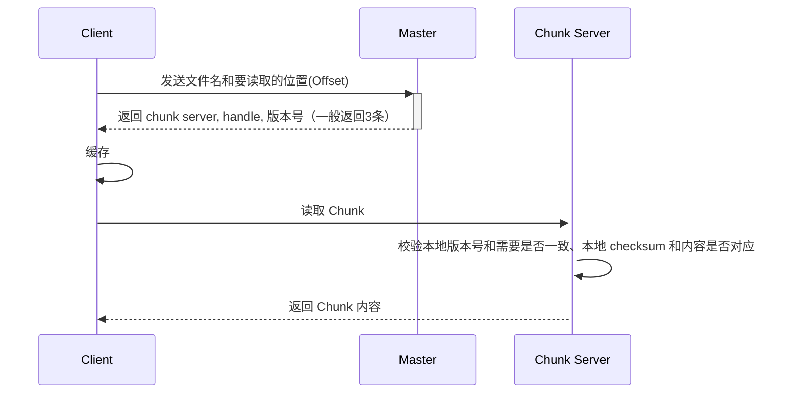
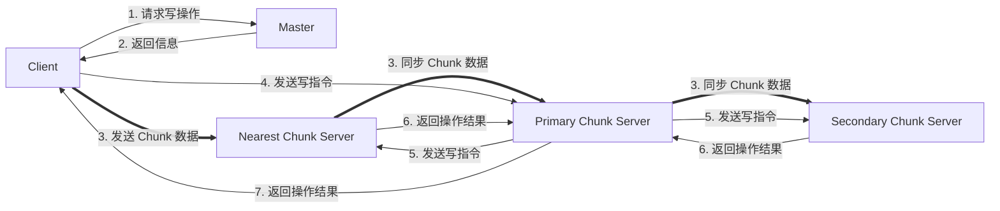
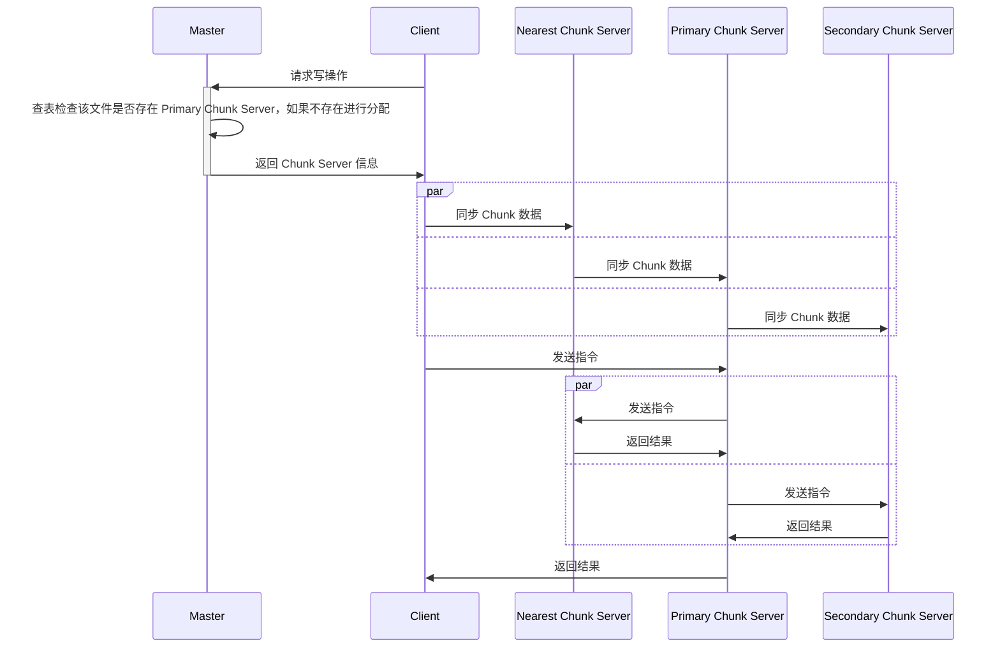

GFS （Google File System） 是一种可拓展的分布式文件系统，主要用于大型分布式数据密集型应用。它在廉价的普通硬件上提供了运行时的容错，并为大量客户机提供了聚合性能

在论文中，Google 介绍了支持分布式应用程序的拓展文件系统接口，并讨论了 GFS 设计，基准测试和实际表现的种种方面

## 介绍

GFS 和传统的分布式文件系统在性能，拓展性，稳定性和可用性上有同样的目标，但是传统的分布式文件系统目前存在以下缺点：

1. 组成部分的故障是一个常见的现象。由大量机器组成的系统实际上使的系统的部分故障会是一个非常常见的现象，因此文件系统中必须集成有持续监控，错误检测，容错机制和自动恢复功能
2. 在传统意义上分布式文件系统上存储的文件一般很大，因此对于 IO操作的设想和块大小需要重新考虑
3. 大多数文件的操作不是覆写，而是在原有的基础上进行追加。随机写文件在实际操作中也不存在。通常一个文件在被写入后，只会被顺序的反复读取。考虑以上特点，在原子性保证和性能方面应着重考虑文件追加操作。而客户机的缓存数据块没有任何优点
4. 在设计文件系统的 API 时增加系统的灵活性，可以使的整个系统受益。Google 通过放宽一致性模型极大的简化的文件系统，也不会给应用程序带来沉重的负担

## 设计一览

### 设想

- 系统运行在常见的商用机上。它必须能**自我监控和检测**，并在常规基础上检测、容忍组件故障，并迅速从组件故障中恢复。
- **系统存储大文件**。以 GB 为单位的文件是一种常见情况，应该被高效的管理，而小文件不需要优化。
- 工作负载主要由两部分组成：**大量的读取流**和少量的随机读。在读取流中，每次通常读取 $1 MiB +$。同一客户机上的读取通常是一段连续的区域。随机读通常只有几KB，并且每次偏移一定值。故注重性能的应用程序通常对它们的小读取进行批处理和排序，以便在文件中稳定地前进，而不是来回移动。
- 工作负载也包含追加文件时的**大量的连续写操作。**通常写的大小和读的大小相似。文件一经写入，很少进行修改。少量的写操作会有，但不需要优化
- 系统需要对多客户端并发追加同一个文件具备良好高效的语义定义。文件系统中的文件常作为生产-消费模型中的队列，或者是用于数据合并。运行在不同主机上的生产者可能会同时写一个文件，同时文件可能会同时或稍后被读取，因此需要在少量开销下保证原子性。
- 高带宽比低延迟重要。大多数目标应用程序都重视以高速率批量处理数据，而很少有对单个读或写有严格的响应时间要求

### 接口

GFS 提供了一些常见的文件系统接口。此外，具有**快照**和**追加**操作。快照以较低的成本创建文件或目录树的副本。追加允许多个客户端并发地向同一个文件追加数据，同时保证每个客户端追加的原子性。它对于实现多路合并结果和生产者-消费者队列非常有用，许多客户机可以同时追加到这些队列，而无需额外的锁定。我们发现这些类型的文件在构建大型分布式应用程序时是无价的。

### 架构

GFS 集群包含可以被客户端访问到的一个 master 的复数个 Chunk Servers。每个都是一个 Linux 主机运行的用户级的程序。

每个文件被拆分成多个 Chunk，每个 Chunk 一般为 64 MiB 存储在不同的 Chunk Server 中。

## 维护内容

### 元信息

在 master 中维护有以下内容：

1. 文件名与 chunk handle 数组的对应关系
2. chunk handle 和 chunk 版本号的对应关系
3. chunk handle 和 chunk server 地址、primary chunk server、租约的对应关系
4. 日志
5. 检查点

除第三点外，所有数据均需要进行持久化存储

Master 不存储 chunk handle 和 chunk server 的对应关系，这些信息只保存在内存当中。Chunk server 会定期通过心跳的方式通知 master 其含有的所有 chunk。Master 根据目前内存中已有的 chunk server 的数量采取相应的行动（复制，删除等）。因为 master 不存储 chunk 中的内容（即 master 不决定 chunk），chunk server 的宕机、数据错误、离线等都需要 master 进行相应的修改，而 master 可能止一个，master 进行主动的修改可能会导致一致性问题，因此 master 不持久化维护对应关系，而是由 chunk server 决定这些内容

而 chunk 到版本号的关系必须持久化。由于 chunk server 可能会掉线，从而错过某次更新，所以 chunk server 所存储的版本号不一定正确。 master 存储版本号，以需要区分哪一个 chunk server 中的信息是过时的，而哪一个是最新的。

所有信息的修改均通过操作日志的方式实现。在收到RPC指令后，Master 会将所有的操作记录在日志中，并将日志同步到备份 Master 上，当操作、记录与同步均完成后 Master 才会对 Client 进行回复，任意一个过程的失败均标志着全过程的失败。Master 在重启中恢复时，会通过重放 Log 的方式恢复数据，为了减少重放的负担，Master 会定期对数据建立检查点，每次回放时只需要从最近的检查点开始回放。

### 锁

为了保证数据的一致性，确保在并发操作中文件名不会冲突，需要对文件和路径进行加锁，每个文件和目录均有一个读写锁。GFS 会对每个文件和所属目录从根目录开始逐级加锁。

## 读文件

如果在读取 Chunk 时，Client 未能正常连接 Chunk Server，或者 Chunk Server 校验失败，那么 Client 会去请求另一个 Chunk Server。

在读取过程中，如果请求的 Chunk Server 是 Primary，那么数据就是一致的。否则数据有可能就旧的。

客户端的实现逻辑一般是请求最近的 Chunk Server

## 删除文件

GFS 删除文件为惰性删除：当收到删除命令时， Master 会将该文件名后追加时间戳（即变为隐藏文件）。Master 会定期遍利所有的文件名和所有的 Chunk，在遍历文件名时若发现文件已经被标记一段时间后，会从删除自身存储的对应关系; 而在遍历 Chunk 时， 若发现该 Chunk 为孤儿 Chunk（即不存在它的对应关系），那么会对这个 Chunk 进行真正的删除操作

## 写文件

在写文件时，Master 会通过租约的方式保证数据一致，并通过流水线技术保证写速度。

当 Client 试图写文件时，会首先向 Master 请求对应的位置。Master会检查此时该文件是否存在 Primary Chunk Server，它的组约是否过期，如果存在且未过期则返回 Primary Chunk Server 对应的信息和操作标识以及Secondary Chunk Server，否则则进行Primary Chunk Server的分配。Client 拿到信息后，会通过流水线(pipeline) 向服务器发送文件，并在发送完成时向 Primary Chunk Server 发送控制命令，Primary Chunk Server 再分别对所有 Chunk Server 进行操作，所有操作结束后才会对 Client 进行回应。

其过程如下图

在操作3中，Chunk 数据的发送与同步并不是等待文件全部接受后再向下一个服务器进行同步，而是一遍接受一遍发送。每个 Chunk Server向其最新的 Chunk Server 发送数据

## 追加

追加在 GFS 中是一个常用的操作。GFS 中的追加不是在文件末尾进行追加，而是在文件后添加一个新的 Chunk。如果原本文件的最后一个 Chunk 未满也不会在后面追加。每次文件的追加都是在写一个全新的 Chunk，GFS 通过这种方式保证了数据的正确

在一致性模型中，只有追加是定义但不一致的：其原因是如果有 Chunk Server 在追加过程中失败，Client 会重试此操作，在最终成功之前可能会有多次追加操作，会产生很多不一致的数据，但这些数据是无用且不影响的

## 文件快照

GFS 通过类似 COW 的方式建立文件的快照，以减少文件的复制操作。其过程如下

当 Master接收到一个文件快照命令之后，找到该文件包含的所有 chunk，取消所有 Chunk 的租约。之后在元数据中建立新的对应关系，其对应的 chunk 仍为原本的 Chunk。在记录日志之后，所有操作结束

在后续修改 Chunk 时，Master 会先要求 Chunk Server 建立原 Chunk 的副本，再选择 Primary Chunk Server 进行操作。

取消租约的原因是防止建立文件快照的过程中对原 Chunk 进行修改，导致快照内容并不是原本的内容

## Chunk 大小 64MiB?

64 MiB 是实验室数据，它是一个平衡点。

作为一个较大的 Chunk， 其优势是：

1. 减少了客户端与master的交互，即减少了客户端请求master获取filename与chunkserver的对应关系。
2. 减少了网络开销，因为一个chunk很大，客户端的一次读写可以更加集中在少量的chunkserver上，复用TCP连接。
3. 减少master管理的元信息的大小。

但也有劣势

1.  可能会形成热点，导致大量的客户端请求集中在某几个chunkserver上。（可以通过客户端请求的次数和频率加副本减缓）
