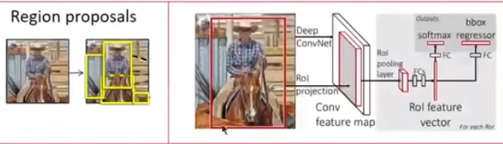
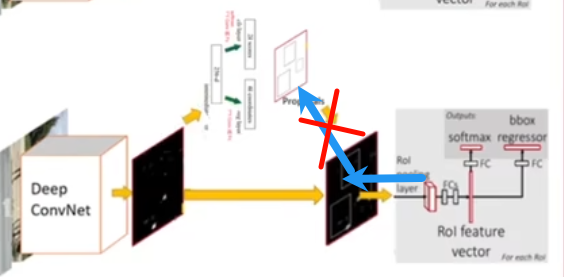
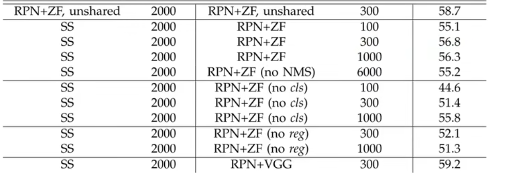

论文原标题: _Faster R-CNN: Towards Real-Time Object Detection with Region Proposal Network_

本人对此方向什么都不会，边读边学，读个大概。

---

该论文从 Fast R-CNN[^1]的基础上进一步加速得来。论文提出使用 CNN 实现 Region proposals 的过程，并起名为 Region Proposal Networks(RPNs)。同时它可以与 Fast R-CNN 共享卷积层，避免了对特征的重复提取。


## RPNs

RPNs 将图片作为输出，输出矩形选择框(即 Region proposals)。为了产生 region proposals，作者在卷积层的输出上**滑动**一个小的网络，它的输入是在特征图上的 $n\times n$ 的空间窗口。


该网络将输入映射到一个低维的特征上，并传给两个并行的全连接层，一个用于框回归(box-regression)，另一个用于分类(box-classification)。

RPN产生的位置不一定精确，所以需要 box-regression 的分支计算包含结果的概率。

## Anchor

即参考框。从区域中产生的候选框不是凭空产生的，所以预先定义了$k$ 个参考框，每个框负责预测与其形状相似候选框。anchor 的最后输出的是每个参考框的偏移量。在每一个位置，作者采用了 3 种尺度（$128^2$, $256^2$, $512^2$），每个尺度3种比例（$1:1$, $1:2$, $2:1$），共9种大小的 Anchor。这 9 个 Anchor 一般足以覆盖常见的预测目标[^2]。

Anchor 的大小与目标候选框的大小越匹配，最终结果就越好[^3]。像这样使用多个 Anchor 进行滑动的方法又称为多尺度(multi-scale)、平移不变(translation-invariant) 的 Anchor。

[^1]: 接受一整张图片，通过卷积操作得到一整张图片的特征图。然后通过 Roi 投影获得候选区域的特征图，再通过 Roi 池化层，将特征图转化为特征大小，再利用候选区域特征识别类别和精确坐标。 Fast R-CNN 实现了**几乎**实时（忽略了 Region proposals)。实际上 Region proposals 采用 Selective Search 或 EdgeBoxes 操作，该操作相当耗时

[^2]: 在 COCO 数据集上，由于预测目标较小，作者又额外引入了 $64^2$ 尺度的 Anchor

[^3]: 值得一提的是，YOLO 系列并不是事先确认的候选框，而是在模型训练前事先统计好所有标注框的大小。然后通过 cluster 计算出最合适的 anchor 大小

## RPN Loss 函数

损失函数一般是用来计算训练过程中目标值和预测值的偏差。Anchor 网络输出的值即预测值。目标值的定义如下：

所有的 Anchor 与标注框都会有一定的重叠，这个重叠用 Intersection-over-Union(IoU) 表示。

在训练 RPNs 时，作者对每个 anchor 分配正负标签。对以下两种情况分配正标签（positive label）:

- 与标注框的 IoU 最大的 anchor，此举保证至少有一个正标签
- 与标注框的 IoU 大于 $0.7$ 的 IoU 的 anchor

由于以上分配策略，一个标注框可能分配正标签给多个 Anchor。

若一个 anchor 对于所有的候选框的 IoU 都低于 $0.3$，分配负标签。

有了以上定义，作者确认了 RPN 网络的损失函数如下

$$
L(\{p_i\},\{t_i\})=\frac{1}{N_{cls}}\sum_i L_{cls}(p_i, p_i^*) \\
+\lambda\frac{1}{N{reg}}\sum_i p_i^*L_{reg}(t_i,t_i^*)
$$

该损失函数由两部分构成：

- 分类损失
- 回归损失

每次传入的是一个 mini-batch，这里的 $i$ 就是每个 mini-batch 的索引，$p_i$ 表示第 $i$ 个 anchor 是一个候选目标的概率值，$p_i^*$ 表示第 $i$ 个 anchor 上是否为正标签，若是正标签，则为 $1$;若为负标签则为 $0$。

同理，对于**正标签的**回归损失同样计算损失函数，如果是负标签则直接为 0。计算结果后通过 $\frac{1}{N_{reg}}$ 进行归一化，通过 $\lambda$ 平衡权重。

## 训练 RPNs

使用随机梯度下降法 (SGD)、图片中心采样。对于每个 mini-batch，先挑选单张图片。由于单个图片中包含多个正负样本的 anchor，所以只需要用一张图片就能（随机）采集到 256 个样本用于训练。由于在图片中，大多数是负样本，所以在采样时要保证正负样本的比例为 $1:1$。

在训练时，有 3 种方式:交替训练、近似联合训练和非近似联合训练

### 交替训练 Alternating training

在此方案中，作者首先训练了一个 RPN，然后使用它产生的 proposals 来训练 Fast R-CNN 网络。Fast R-CNN 产生的权重又能拿来训练 RPN。重复迭代此过程完成训练

#### 4 步交替训练 4-Step Alternating training

此文章采用该方式完成训练。在该中方式中分为四步（粉色代表未固定的网络）:

- 首先训练一个 RPN 网络。

  ```mermaid
  flowchart LR

  Input@{shape: lin-cyl}-->CNN1["Deep ConvNet"]-->CNNRPN["ConvNet(Proposal)"]-->Pro@{shape: dbl-circ, label: 'Proposals'}
  style CNN1 fill:#f9f
  style CNNRPN fill:#f9f
  ```

- 由于这个 RPN 能产生候选区域，在接下来使用 RPN 训练 Fast R-CNN 网络。

  ```mermaid
  flowchart LR

  Input@{shape: lin-cyl}-->CNN1["Deep ConvNet"]-->|Features Map|CNNRPN["ConvNet(Proposal)"]
  CNNRPN-->|"Proposals"|CNNCLS
  Input-->CNN2["Deep ConvNet v2"]-->|Features Map|CNNCLS["ConvNet(Box Classification)"]-->Result@{shape: dbl-circ}
  CNNRPN-->|Proposals|CNNREG["ConvNet(Box Regression)"]-->Result
  CNN2-->|Features Map|CNNREG
  style CNN2 fill:#f9f
  style CNNCLS fill:#f9f
  style CNNREG fill:#f9f
  ```

- 随后使用 Fast R-CNN 网络来初始化 RPN 训练，在此过程中固定了共享的卷积层，只微调 RPN

  ```mermaid
  flowchart LR

  Input@{shape: lin-cyl}-->CNN1["Deep ConvNet v2"]-->CNNRPN["ConvNet(Proposal)"]-->Pro@{shape: dbl-circ, label: 'Proposals'}
  style CNNRPN fill:#f9f
  ```

- 冻结共享的卷积层，只微调 Fast R-CNN

  ```mermaid
  flowchart LR

  Input@{shape: lin-cyl}-->CNN2["Deep ConvNet"]-->|Features Map|CNNRPN["ConvNet(Proposal)"]
  CNNRPN-->|"Proposals"|CNNCLS
  CNN2["Deep ConvNet v2"]-->|Features Map|CNNCLS["ConvNet(Box Classification)"]-->Result@{shape: dbl-circ}
  CNNRPN-->|Proposals|CNNREG["ConvNet(Box Regression)"]-->Result
  CNN2-->|Features Map|CNNREG
  style CNNCLS fill:#f9f
  style CNNREG fill:#f9f
  ```

### 近似联合训练 Approximate joint training

在训练的一开始就是训练整张网络，在训练时会有两个损失，直接反向传播回去。

作者后来发现近似联合训练能产生相似的结果，同时训练时间减少了 $25-50%$。

但是这个方式忽略了一个问题：候选框的偏导数。即RPN得到了坐标后传给分类网络使用，获得损失后无法传回。[^4]

### 非近似联合训练 Non-approximate joint training

解决了方法2中无法求偏导的问题。添加了 ROI-wrap。

## VOC 上实验

该论文最重要的是使用 RPNs 替换了 Region Proposal。估此处首先判断 RPNs 和传统的 Selective Search/EdgeBoxes 的对比


可以看到，虽然 proposals 的数量变少了，但是最终精度却边高了。



在删除 REG 后，精度也有所下降。原因是 anchor 只是大概位置，它并不是很准确。以此证明回归分支也很重要。
