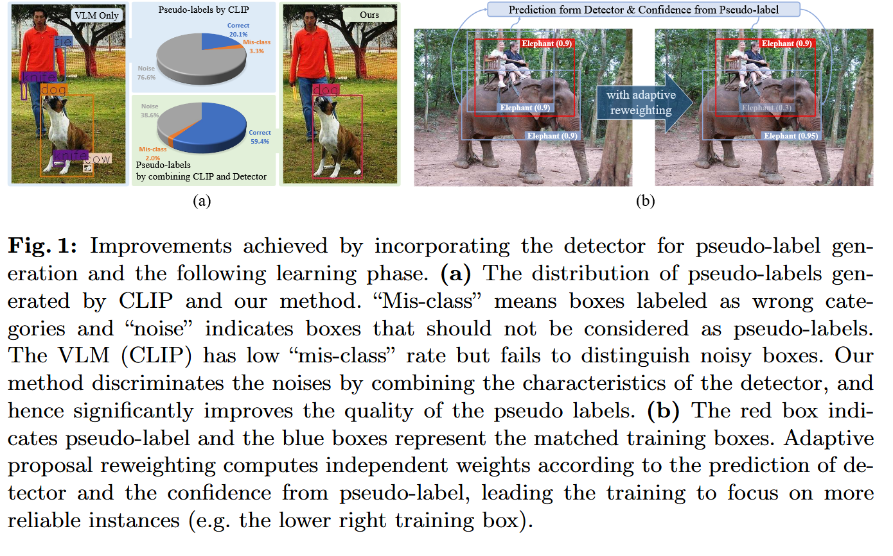
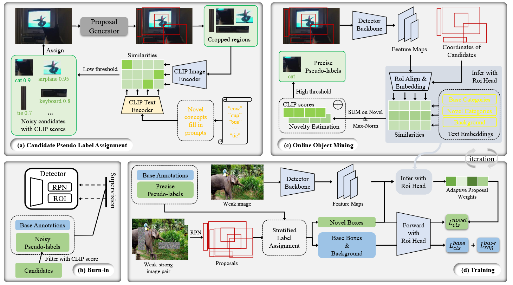
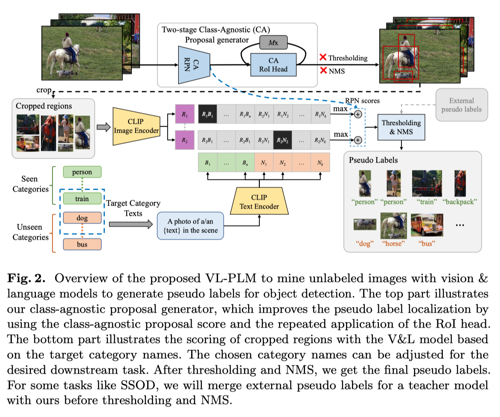

论文原标题：*MarvelOVD: Marrying Object Recognition and Vision-Language Models for Robust Open-Vocabulary Object Detection*

该文章为个人阅读笔记。由于我对人工智能几乎是零基础，其内容可能缺乏细节，亦有可能存在错误。

实际上，我的人工智能学习是从这篇文章开始 DFS。

---

### 摘要

从 VLMs 生成的 pseudo-labels 中进行学习是一种十分可行的辅助 open vocabulary detection（OVD）[^1]的解决方法。

然而由于 VLM 和视觉检测任务之间的 domain gap，VLMs 产生的 pseudo-labels 可能存在噪声，同时 detector 的训练设计进一步放大了偏差。

该文章调查了 VLMs 在 OVD 的上下文下产生偏差的原因，并提出了一个简单高效的范式: MarvelOVD，可以生成更好的训练目标，并通过在融合 detector 和 VLM 的方式，以在线方式[^2]优化学习过程。文章核心观点：**detector 本身就可以作为强大的辅助指导，用来适应 VLM 无法理解图像的 "背景" 和目的的上下文。** 基于该观点，文章作者进行了以下行为来减少了 pseudo 的噪音：

- 通过 Online Mining 和 Adaptive Reweighting 有效的抑制了没有和目标对象对齐的存在 bias 的训练框。
- 找到了一个被忽略的 "base-novel-conflict" 问题，并引入 stratified label assignments 来解决此问题。

这个方法在 COCO 和 LVIS 数据集上的实验展示出了比其他 SOTA 更加显著的优势。

## Intro

Intro 部分开头首先简要介绍了 OVD[^5]。接着指出为了增强 OVD detector 的泛用性，人们开始将 VLMs 与 OVD detector 结合使用用来改善现有的 OVD pipeline，这种方式被证实具有极佳的 zero-shot 识别能力。

识别已知新概念(known novel concepts)[^3]的 OVD 任务常见做法是使用 VLM(例如 CLIP) 以离线的方式生成 pseudo-label[^4]。这种方式主要有两个问题: 错误分类(mis-class) 和噪音(noisy)。虽说如此，基于 VLM 的方式产生的错误分类概率非常低，但是噪音却相当多(error rate 76.6%)。

作者认为 VLMs 难以识别噪音的原因有两点：

1. 缺少对裁剪后图片的上下文信息：比如将人的胳膊单独裁剪成一张图片，模型就可能将其误判成“领带”而不是连接到人身上的一部分。
2. 无法感知“背景”元素，但即使输入内容与任何目标类别无关，CLIP 模型仍必须提供预测。

但是 detectors 中的 RoI align 技术却可以从局部区域中提供丰富的上下文信息。检测器能够在推理过程中理解“背景”的概念。因此， VLMs 中难以处理的噪声问题可以被 detector 轻易区分为“背景”。进而作者提出了 MarvelOVD，它通过结合目标检测器和VLMs的优点，可以产生高质量的 pseudo-labels，同时拥有出色的性能。

对于伪标签生成来说，预测类别的置信度是基于 detector 和 VLM 输出的加权和。为了加速训练，作者采用预训练的 VLM 预测所有的候选框，同时在每次迭代时在 detector 的指导下动态挖掘可信的 pseudo-labels。即使是在训练早期，探测器和 VLM 能力的互补显著也能提高了 pseudo-labels 的准确性。此外，在 detector 在训练期间不断改善，新生成的 pseudo-labels 的质量也会随之提高。

**传统的目标检测训练方式平等的将每一个 proposal 与一个训练的目标相匹配，这种设计不适用于从 pseudo-labels 中学习。** 具体来说，就是生成的 box 可能和真实的物体的边界相差很大，导致训练框与实际上真实的物体存在较大的差异。为了修复这个问题，作者提出 proposal 所产生的训练框不应该对最终的 loss 有相同的贡献，即使是对同一个 pseudo-label 的训练框也不应当相同。为了达成这个目的，作者没有对 pseudo-labels 进行加权[^6]，而是自适应的为每个伪标签匹配的训练框计算个体权重。通过这种方式使位置不准确的训练框受到更小的权重。注意训练框是由 stratified label assignment 策略产生，它可以去除 pseudo-labels 和 base annotations 的冲突，因此可以阻止 pseudo-label噪声的负面影响。

## Preliminaries

OVD 的目的是利用数据集 $D=\{x_i, y_i\}^n_{i=1}$ 和辅助弱监督数据（即图文对, VMLs 等）。这里的 $x_i$ 表示图像而 $y_i$ 则是图像中检测目标的对应的位置和种类信息。不同于传统的检测任务中图像的标注在这里只覆盖了 base categories $C^B$，OVD 任务要求 detector在测试期间额外探测 novel categories $C^N$。这里的 $C^B \cap C^N = \emptyset$，并且 $C^N$ 在训练期间已知。

为了实现这个任务，detector 中的 classification head 被设计为比较区域内图像 embedding 和文字 embeddings 的相似度（即 传统 OVD 的做法） 。区域 embeddings $R=\{r_i\}^{N_r}_{i=1}$ 是通过 RoI 对齐和后续的特征提取中获得的，这里的 $N_r$ 是图片中区域框的数量。文字 embedding 由 $C=\{c_{bg}\}\cup\{c_i\}^{N_c}_{i=1}$ 组合，此处的 $c_i$ 是将分类名通过 prompts 工程，再喂到预训练好的 text encoder 中获得，而 $N_c$ 是分类数量。$c_{bg}$ 被初始化为一个可学习的 embedding。通过图像区域和文本的学习，区域 $r_i$ 被分类为类别$c_j$ 的概率为
$$
p_{i,j} = \frac{\exp(r_i \cdot c_j)}{\exp(r_i \cdot c_{bg}) + \sum^{N_c}_{k=1}\exp(r_i\cdot c_k)}
$$

> 这个长的好像 Softmax，不知道有什么关联

比较区域与文本嵌入之间的相似性使得检测器能够在无穷的标签空间中识别对象。

## MarvelOVD

为了便于学习与开集类别相关的语义，现有的方法通常是使用预训练的 VLMs 来发现潜在的新对象，并生成 pseudo-labels 以用于后续训练。

典型的训练过程涉及使用 base annotations 训练一个 proposal generator 用来区分可能包含新物体的局部区域，随后使用 VLM 的推理结果在这些裁剪后的区域中生成 pseudo-labels。然而由于 VLM 是在一整张大图片上进行的预训，在局部区域使用时不免产生噪声 pseudo-labels，从而导致学习新类别的过程中断。为了增强学习新物体概念的能力，作者提出了 MarvelOVD，它动态地将 detector 的能力整合到 pseudo-label 的生成过程中，同时又能优化后续的学习。下图对该框架进行了解释。

|                   |
| ------------------------------------------------------------ |
| 上图为方法的框架。该框架通过在训练期间动态的与 detector 配合优化了后续的学习过程，提升了 pseudo-labels 的质量。 作者首先使用 CLIP 和 proposal  generator将候选框指定到图像上，然后通过 CLIP 的打分选择噪声 pseudo-labels调整 detector **图(a),图(b)**。 在调整之后，detector 拥有了识别新概念物体的能力。基于此，作者动态地评估了每个候选框的“新颖性”，并将其与 CLIP 的预测相结合，以选择精确的 pseudo-labels。作者采用了 stratified label assignment 来生成训练框，此时新训练框的损失权重是基于 detector 的预测独立计算的。 |

### 候选 Pseudo-Label 分配

MarvelOVD 在每次迭代训练中，能够在 detector 和预训练好的 VLM 的知道下，动态地生成更好的 pseudo-labels。由于在训练时使用 VLMs 预测裁剪后的区域需要大量时间开销，这里在训练之前交替地为每个图像分配 pseudo-labels，然后在从中选择精确的标签训练检测器。

作者首先使用 basa annotation 训练一个无类别的 proposal generator，用来给图像生成区域框。接下来根据区域对图像进行裁剪，并将对应区域喂给 CLIP 以获得对应的 regional-visual-embeddings。同时利用 CLIP text-encoder 获得每个新类别的 embedding。在这之后将通过点积计算相似度矩阵(similarity matrix)用来表述图像 embedding 和文字 embedding 之间的相似性。最后，应用 softmax 获得每个区域中新类型的分布。基于此，传统方法中在正式处理之后处理这些框，并选择高置信度的 pseudo-labels 来训练检测器。问题在于 domain gap 很容易让 CLIP 在噪声区域产生高置信度的预测，这极大的限制了已有方法的性能。作为对比，作者记录了 CLIP 的预测，并使用较低的阀值将候选框分配给图像，并在  detector 的指导下从候选框中选择精确的 pseudo-labels。更多细节下面讲

### 在线 Pseudo-label 挖掘

候选 pseudo-labels 可分为两类

- ground-truth boxes: 紧密靠近实际对象的 box
- noisy boxes: 不应该被指定为对象的 box

任务的主要目标是消除 noisy，同时保留 ground-truth boxes 作为可信的 pseudo-labels 作为训练。Detector 和 CLIP 最关键的区别在他们对局部区域上的上下文和“背景”概念的推断上。由 Detector 引入的 ROI Align 机制在框中提取上下信息的表现非常出色，这种能力是单纯根据坐标裁剪图像时无法比拟的。此外，检测器引入了一个特定的任务类型，称为“背景”，它是 CLIP 在推断局部区域时未能意识到的。不能识别”背景“以及上下文的缺乏是 CLIP 模型生成生成 noisy boxes 的根本原因。不过虽然 CLIP 在处理噪声上存在困难，但是它对 ground-truth boxes 的处理非常准确。利用这一见解，作者提出：**利用 Detector 对候选框进行推理，判断是否包含新物体。随后结合 CLIP 分类的结果，选择高质量的 pseudo-labels**

#### Burn-in

为了推理候选框的新颖性，detector 首先需要学习什么是“新颖”。为了达成这个目标，作者采用了 top-1 CLIP score[^7] 和一个固定的阈值 0.8 来初始化选择 pseudo-labels 来让 detector 在 $\omega$ 步内完成 detector 的 burn-in。在 burn-in 阶段之后，模型将初步获得区分基目标，新目标和背景的能力。

#### Online Object Mining

Online Object Mining 在 burn-in 阶段之后正式开始。作者从半监督学习中借鉴了思想，通过生成弱-强图像对，增强 pseudo-labels 的学习能力。

首先在弱增强特征上使用 detector 预测候选框，为每个候选框计算新颖性得分
$$
z_i = \frac{\sum_{k\in C^N} \exp(r_i\cdot c_k)}{\sum_{j\in C^B\cup C^N\cup\{C_{bg}\}}\exp(r_i\cdot c_j)}
$$
这里的 $r$ 是由 detector 给出的图像 embedding，$c$ 是文字 embedding。 $C^B$ 和 $C^N$ 是基类和新类的集合。新颖评分 $z_i$ 相对的评估了候选框对于基类和背景的新颖性。然而，它的值在不同收敛程度下变化非常剧烈。为了解决这个问题，作者进一步使用了对新颖性得分使用 max-norm 来获取稳定的结果
$$
s_i^{det}=\frac{z_i}{\max\{z_1, z_2,\cdots,z_{N_r}\}}
$$
这里的 $N_r$ 表示候选的数量。得益于探测的上下文推理能力和背景的感知，detector所计算的新颖度估计 $s^{det}$ 能够更精准的区分 ground-truth/noise 候选框。结合 CLIP 模型生成的准确分类预测，最终每个候选框的置信度如下：
$$
s_i = \lambda s_i^{\text{CLIP}}+(1-\lambda)s_i^\text{det}
$$
在上述的等试中， $S_i^\text{CLIP}$ 为 top-1 CLIP score, $\lambda \in [0,1]$ 是一个标量，控制两个模型的关系（平衡）。作者利用固定的阈值 $δ$ 选择高质量的 pseudo-labels。训练是基于弱增强和强增强图像进行的。

检测器的引入显著降低了噪声候选者的置信度，极大提高了所选伪标签的准确性，即使在初始训练阶段也是如此。此外，随着模型在训练中逐渐收敛，新颖性估计$s^\text{det}$将变得更加准确，从而产生更高质量的伪标签，最终提升模型在新类别上的检测性能。

### 训练

在该部分作者表述了对 detector 传统训练方式的改进。在这部分中提出的所有方法在 burn-in 阶段和 online-object-mining 阶段都有使用。

#### Stratified Label Assignment

学习新的目标不应当影响模型在识别基目标的性能。然而，一个比较容易忽略的现象是当训练新类的 pseudo-labels 时，base categories 的 mAP(means average precise) 将会下降。原因是新的 pseudo-labels 可能会覆盖 base annotation，在基于 IoU 标签分配[^8]上造成 base-novel-conflicts。stratified label assignment 正是为了解决这个问题：它首先通过 IoU-matching 为 proposals 分配 base annotation。被标记为背景的box，稍后将再与 pseudo-labels 进行二次匹配。实验表明，分层标签分配有助于在不妨碍基础类别估计性能的情况下，实现对新颖物体高准确率的检测。

#### Adaptive Proposal Reweighting

由于 pseudo-label 的定位质量有限，box的中心可能离 ground-truth 重心很远。结果，训练框可能与错误定位的 pseudo-label 匹配，它与 ground-truth 对象的重叠极度不平衡。然而传统的 detectors 训练方法平等的在这些不平衡的 box 上计算 loss，这阻碍了学习过程。为了解决这个问题，作者提出了 adaptive proposal reweighting 来为每个匹配 pseudo-label 的 training box 独立的分配 loss 权重。

训练 detector 的带有 adaptive proposal reweighting 的 loss 函数如下
$$
\mathcal{L}=
\frac{1}{N}
(\sum^{n^{base}}_{i=1} l (b_i^{base}, \cal G^{base}) + \gamma\sum^{n^{novel}}_{i=1}w_i\cdot l(b_i^{novel}, \cal G^{novel}))
$$
这里的 $N = n^{base} + n^{novel}$($n^{base}$ 包含背景框) 是训练框的总数量， $\gamma$ 是对新概念学习的总权重， $w_i$ 表示每个新训练框独立的权重。结合每个候选框的置信度得分公式，每个独立的权重 $w_i$ 为
$$
w_i = \lambda' s_i + (1-\lambda')r_i
$$
在上面的公式中， $s_i$ 表示对应 pseudo-label 的置信度， $r_i$ 为每个训练框的可靠性。$r_i$ 的计算在训练过程中十分关键，作者通过实践了解在弱增强图像上预测的背景的分数与物体的分数保持负相关，估定义 $r_i = 1-b_i$，这里的 $b_i$ 是通过根据公式 $p_{i,j} = \frac{\exp(r_i \cdot c_j)}{\exp(r_i \cdot c_{bg}) + \sum^{N_c}_{k=1}\exp(r_i\cdot c_k)}$ （本文公式第一个公式）预测的背景得分。通过自适应重加权，与真实新颖物体重叠度较高的训练框将获得更大的权重。这将消除学习过程中对新概念的偏差，并进一步提高性能。

[^1]: OVD 是一种目标检测技术。不同于传统的目标检测，OVD检测的对象不一定会出现在训练集中，而是可能在推理时给出。推理可以是 zero-shot。它从 CLIP 基础上发展而来。 
[^2]: [机器学习：在线学习和离线学习的区别](https://zhuanlan.zhihu.com/p/269454065)：在线学习指一次输入一条数据而不是一个 batch，训练完后直接更新权重，一个一个按顺序处理数据。优点为**不需要一开始就提供完整的训练数据集，随着更多实时数据进入模型，模型会在操作中不断被更新。强调学习具有实时性，避免离线学习需要重新生成模型的问题**

[^3]: 新概念是指**训练阶段没有标注数据**的类别，已知指新类别的**名称是预先提供**。例如训练数据为 `[牛, 马]`，测试时检测 `[火车, 人]`。这里的 `[火车, 人]` 就是已知新概念，可用 VLM 生成。
[^4]:  [Exploiting Unlabeled Data with Vision and Language Models for Object Detection](https://ac.nowcoder.com/discuss/1021946) ↩其中 生成 pseudo-labels 的流水线：
[^5]: OVD 常见架构
[^6]: 加权同样在 *Exploiting Unlabeled Data with Vision and Language Models for Object Detection* 中提出。
[^7]: top-1 CLIP score 是指使用 CLIP 的 image-encoder 和 text-encoder 所预测的分布的最高 score。 ~~不过这是什么？~~
[^8]: 对比学习 RPNs 的 proposals 模型时，为每个 anchor 分配正负标签。当 IoU 大于某个值时分配正标签，小于某个值时负标签。IoU 指预测框和真实框之间重叠的差距。