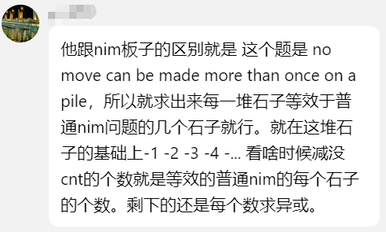

## CF1844A. Subtraction Game

> 输入两个数组 $a,b$
> 
> 两个玩家将一摞$n$个石子堆上进行游戏，玩家一轮可以从石堆中移除 $a$ 个石子或 $b$ 个石子，不能行动的玩家输。
> 
> 寻找石子堆的石子数量 $n$，使得无论第一个玩家如何行动，第二个玩家总能获胜

`*800`

只要一共有 $a+b$ 个石子，那么先手必输

```cpp
void solve() {
  i32 a, b;
  read(a, b);
  std::cout << a+b;
}
```

## CF1842A. Tenzing and Tsondu

> Tsondu 和 Tenzing 正在玩纸牌游戏。Tsondu 有 $n$ 个能量为 $a_1, a_2, \ldots,a_n$ 怪物，Tenzing 有 $m$ 个能量为 $b_1, b_2, \ldots, b_m$的怪物
> 
> Tsondu 和 Tenzing 轮流行动，Tsondu 先手。当能量为 $x$ 的怪物选择攻击能量为 $y$ 的怪物时，两个怪物的能量变为 $x-y$和$y-x$，当能量小于 0 时怪物死亡
> 
> 怪物全部死亡的一方输。问 Tsondu 和 Tenzing 在最优决策下谁获胜（或平局）

`*800`

考虑攻击时存在怪物死亡时会出现伤害溢出的情况，x和y的变化等价于 $x - \min(x,y)$， $y - min(x,y)$

所以只需要比较 $\sum a$ 和 $\sum b$ 即可

```cpp
void solve() {
  int n, m;
  read(n, m);
  std::vector<int> a(n), b(m);
  reads(all(a)); reads(all(b));

  int sa = std::accumulate(all(a), 0LL);
  int sb = std::accumulate(all(b), 0LL);

  if(sa > sb) std::cout << "Tsondu";
  else if(sa < sb) std::cout << "Tenzing";
  else std::cout << "Draw";
}
```

## CF1841A. Game with Board

> 黑板上有 $n$ 个数字 $1$，Alice 和 Bob 轮流从黑板上选择大于等于 $2$ 个元素进行合并（相加）
> 
> Alice 先手，双方轮流行动，不能行动的人输。假设两人行动最优，输出最终谁获胜

`*800`

当数量小于等于 $4$ 时，无论 Alice 如何行动， Bob 总能获胜

当数量大于等于 $5$ 时， Alice 总可以选择 $n-2$ 个元素合并，使 Bob 选择剩下的 $2$ 个元素。Alice 总能获胜

```haskell
import Control.Monad

calc :: Int -> String
calc x | x < 5 = "Bob"
       | otherwise = "Alice"

main :: IO()
main = (read <$> getLine) >>= ((flip replicateM_) solve)
  where
    solve = (calc . read <$> getLine) >>= putStrLn
```

## CF1834C. Game with Revesing

> Alice 和 Bob 正在玩游戏，他们共有两个长度为 $n$ 的由小写字母组成的字符串 $S$ 和 $T$。Alice 和 Bob 轮流行动。
> 
> - Alice 每回合选择 $i \in [1,n]$ 和一个字符串 $S$ 或 $T$  和一个小写字母 $c$，并将选择的字符串中第 $i$ 个符号替换成 $c$
> 
> - Bob 选择一个字符串 $S$ 或 $T$，并将其反转
> 
> 游戏将进行到  $S = T$为止。
> 
> 定义游戏的持续时间为 Alice 和 Bob 行动的总次数。Alice 想最小化游戏时间，但 Bob 要最大化时间。当双方都最优行动时，游戏将在多少回合后结束

`*1200`

对于 Bob而言，他的反转操作几乎无用，无论反转谁反转两次操作都等于没有反转，而 Alice 可以将 c 变为 c 来跳过1回合来让 Bob 使字符串反转

分别统计在开始反转和没反转下 Alice 需要操作的次数（即 Alice 第一回合是否跳过），最后算出操作次数取 min 即可。

如果 Alice 第一回合没有跳过，那么游戏一共进行了 $cnt + cnt - (cnt \mod 2)$ 次

如果跳过了第一回合，那么一共进行了 $cnt + cnt - (1 - cnt \mod 2)$（加上跳过一回合的操作）

```cpp
void solve() {
  int n;
  std::cin >> n;
  std::string s, t1, t2;
  std::cin >> s >> t1;
  t2 = t1;
  std::reverse(all(t2));
  if (s == t1) {
    std::cout << 0;
    return;
  } else if (s == t2) {
    std::cout << 2;
    return;
  }
  int diff1 = 0, diff2 = 0;
  for (int i = 0; i < n; i++) {
    diff1 += s[i] != t1[i];
    diff2 += s[i] != t2[i];
  }

  std::cout << std::min(diff1 * 2 - diff1 % 2, diff2 * 2 - (diff2 % 2 == 0));
}
```

## CF768E. Game of Stones

> Sam 教 Jon 打游戏。游戏规则如下：
> 
> - 游戏从 $n$ 推石子堆开始，编号 $1$ 到 $n$。第 $i$ 堆石子包含 $s_i$ 个石子
> 
> - 玩家轮流行动。每次行动必须从石子中移除到一些石子($>0$)
> 
> - 不能行动的人输
> 
> - 在每堆石子上移除的石子数量不能重复
> 
> Sam 先手。请判断如果双方都最优决策，Jon 是否可以获胜

`SG`  `Nim-Game` `*2100`

SG 函数为 `0 1 1 2 2 2 3 3 3 3...`

鉴定为找规律后组合游戏求和

```haskell
import Data.Bits
import Control.Monad

mex:: Integer -> Integer
mex 0 = 0
mex x = iter x 1 2 1
    where
        iter i l r row | l <= i && i <= r = row
                       | otherwise = iter i (r + 1) (r + 2 + (r - l)) (row + 1)


solve:: [Integer] -> Bool
solve = (==) 0 . foldl1 xor . map mex 

main = do
    n <- read <$> getLine
    nums <- replicateM n (read <$> getLine)
    answer $ solve nums
    where
        answer True = putStrLn "YES"
        answer False = putStrLn "NO"
```

另外 [LionelMessiYoung10](https://github.com/LionelMessiYoung10)指出



```cpp
#include<bits/stdc++.h>

int main(){
  std::cin.tie(0)->sync_with_stdio(false);
  int n;
  std::cin >> n;
  int sg = 0;
  for(int i = 0; i < n; i++){
    int x;
    std::cin >> x;
    for(int j = 1; ; j++){
      x -= j;
      if(x - (j+1) < 0){
        sg ^= j;
        break;
      }
    }
  }
  if(sg == 0){
    std::cout << "YES";
  }else{
    std::cout << "NO";
  }
}
```

## CF197A. Plate Games

> 两个玩家在一个长 $a$ 宽 $b$ 的桌子上轮流摆放半径为 $r$ 的盘子。盘子之间不能重叠，不能超过桌子边界。不能行动的人输
> 
> 回答先手获胜或者后手获胜

`对称博弈` `*1600`

当先手能放置盘子时放在中间，后手无论选择哪个位置，下一次行动先手总能在对称位置放置盘子，直到后手不能放置

即当先手能行动时，先手必胜

```haskell
main :: IO()
main = do
  [a, b, r] <- map read <$> words <$> getLne
  if 2 * r > min a b
  then putStr "Second"
  else putStr "First"
```

## ACM-ICPC 2017 Asia Nanning Rake It In

`对抗搜索`

注意到 $1 \le k \le 3$ ，直接暴搜

要卡常，注意常数

```cpp
void solve() {
  int k;

  V<V<int>> m(4, V<int>(4));
  auto query = [&m](int i, int j) -> int {
    assert(i < 4 && j < 4);
    return m[i][j] + m[i + 1][j] + m[i][j + 1] + m[i + 1][j + 1];
  };
  
  auto fwd = [&m](int i, int j) {
    assert(i < 3 && j < 3);
    int tmp =m[i][j];
    m[i][j] = m[i][j+1];
    m[i][j+1] = m[i + 1][j + 1];
    m[i + 1][j + 1] = m[i+1][j];
    m[i+1][j] = tmp;
  };
  
  auto bck = [&m](int i, int j){
    int tmp = m[i][j];
    m[i][j] = m[i+1][j];
    m[i+1][j] = m[i+1][j+1];
    m[i+1][j+1] = m[i][j+1];
    m[i][j+1] = tmp;
  };

  std::function<int(int)> dfs =
      [&](int cnt) -> int {
    if (cnt > 2 * k) return 0;
    if (cnt % 2 == 1) {
      // Alice
      int ans = 0;
      rep(i, 3) {
        rep(j, 3) {
          fwd(i, j);
          ans = mmax(ans, query(i, j) + dfs(cnt + 1));
          bck(i, j);
        }
      }
      return ans;
    } else {
      // Bob
      int ans = maxnum(int);
      rep(i, 3) {
        rep(j, 3) {
          fwd(i, j);
          ans = mmin(ans, query(i, j) + dfs(cnt + 1));
          bck(i, j);
        }
      }
      return ans;
    }
  };

  read(k);
  rep(i, 4) {
    rep(j, 4) { read(m[i][j]); }
  }
  std::cout << dfs(1);
}

```
