## 第一关

### 剩余量&消耗量

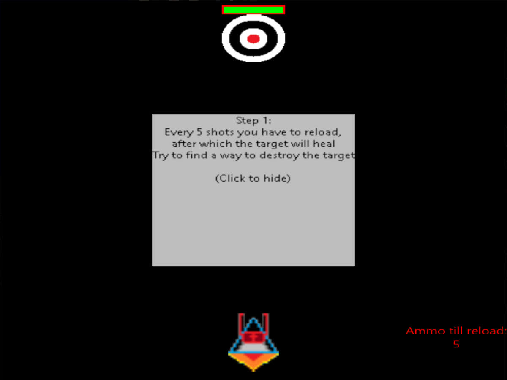

有时候，内存中的数据可能并不是存储的显示的值，而是使用的值。例如第一关中的弹药：

如果直接搜索弹药的剩余量，什么也发现不了。实际上第一关中内存中记录的是弹药的使用量

## 第二关

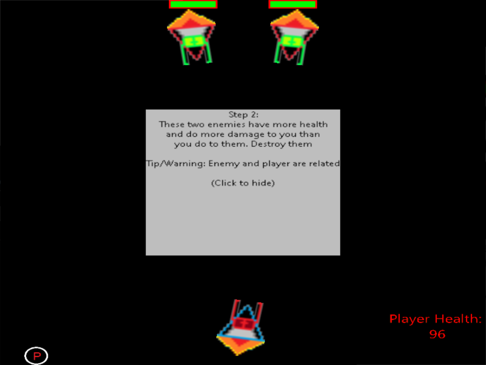

### 秒杀 & 提高伤害

每当玩家射出一发子弹后，每个敌人各会打出一发子弹。很显然我们需要让自己的血量冻结，以获得射出更多子弹的机会。血量可以很容易地使用扫描器找到。


同理，我们可以找到敌人的血量内存：使用内存扫描器扫描未知的初始值，并反复使用“减少的值”寻找值。由于每个子弹打到玩家身上会造成2点伤害，那么我们可以大胆猜测，玩家的每一个子弹也会对敌人造成 2 点伤害。~~但是这里并不是~~。反复使用“未变化的值”找到内存地址，并使用 “Find out what writes to this address”找到修改该地址的代码。

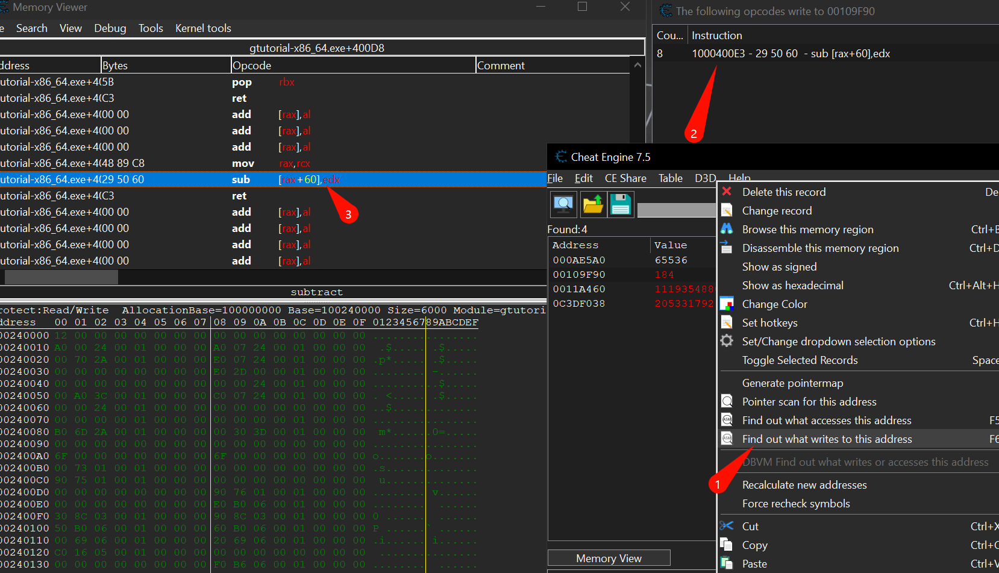

可以看到这段代码是 $(RAX+60) \leftarrow (RAX+60) - EDX$。向上寻找代码，没有找到 $edx$ 寄存器的值的来源，估计是函数调用过来的。在此处打个断点，观察其值的来源。

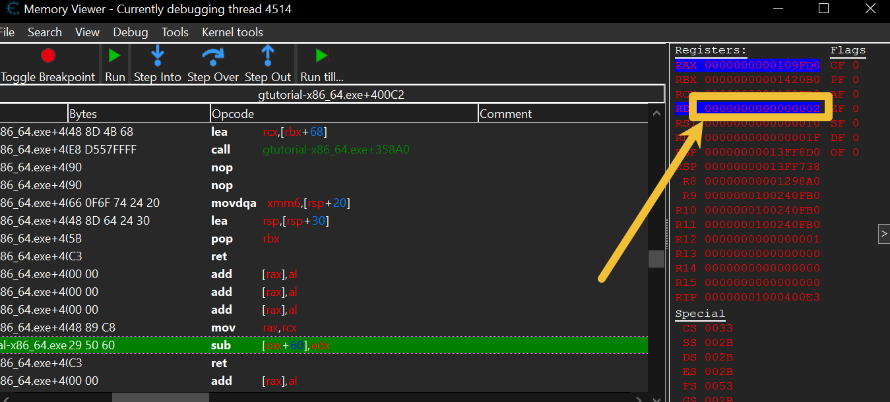

注意到当敌人打到玩家的时候，这段代码同样被执行到了，此时$RDX=2$，证明存在代码复用。因此不能简单的将 $(RAX+60)$的值修改为 0 ，否则会导致敌人秒杀玩家。

通过扫描器找到敌人和玩家的血量，然后再通过工具对比内存

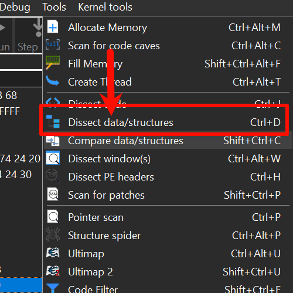

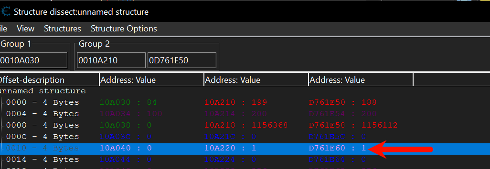

发现在血量偏移$0010$的位置有一个疑似 bool 的字段，玩家是 0 ，敌人是 1。通过自动汇编判断该内存，使得当该字段为 1 时将 $(RAX+60)$ 修改为 0 ，否则不做修改。


```assembly
[ENABLE]
// 该选项被启用时执行
alloc(newmem,2048,"gtutorial-x86_64.exe"+400E3)  //申请一块新内存
label(returnhere) // 注册 3 个 label（类似于汇编中的 label）
label(originalcode)
label(exit)

newmem: 
cmp [rax+60+10],0
je exit
// 如果 [rax + 60 + 10] 等于 0， 跳转到 exit。否则继续向下执行 originalcode

originalcode:
mov [rax+60],0 // 将疑似血量的值置为 0

exit:
// 返回原位置
ret
add [rax],al
jmp returnhere

"gtutorial-x86_64.exe"+400E3: // 修改该内存区域（原 sub 指令地址）
jmp newmem // 跳转到 newmem 标签
nop
returnhere:


[DISABLE]
// 当该选项被禁用时，释放申请的内存，并将修改的指令回复。
dealloc(newmem)
"gtutorial-x86_64.exe"+400E3:
db 29 50 60 C3 00 00
```


### 冻结血量 vs 删除扣血代码

冻结血量和删除扣血代码的效果其实完全不同。在上文中，我们在扣除敌人血量的过程中顺手删除了玩家扣血的代码。如果我们保留这段代码，仍使用冻结功能的话。当我们杀掉一个敌人后，另一敌人会射出一发足以秒杀玩家的子弹，这时候玩家就会被敌人秒杀。

我们可以通过通过下述代码进行实验：

```assembly
[ENABLE]
alloc(newmem,2048,"gtutorial-x86_64.exe"+400E3)
label(returnhere)
label(originalcode)
label(exit)

newmem: 
sub [rax+60],edx
cmp [rax+60+10],0
je exit


originalcode:
mov [rax+60],0


exit:
ret
add [rax],al
jmp returnhere

"gtutorial-x86_64.exe"+400E3:
jmp newmem
nop
returnhere:


[DISABLE]
dealloc(newmem)
"gtutorial-x86_64.exe"+400E3:
db 29 50 60 C3 00 00
```

在该代码中，我们保留了玩家的扣血代码。重新启动游戏并应用自动汇编，冻结玩家血量。


在我们杀掉一个敌人后，玩家仍会被另一发伤害足够高的子弹秒杀。


因此我们可以得知，所谓的“冻结功能”只是快速的向该内存写入固定的值，并不能实现无敌的效果。当受到足够高的伤害时，玩家仍会判定为死亡。

## 第三关


### 传送敌人
使用扫描器，寻找敌人的坐标

> [!tip]
>
> 合理利用游戏赠送的暂停功能


通过 `What writes this memory`  发现有3个指令写了这个地址。


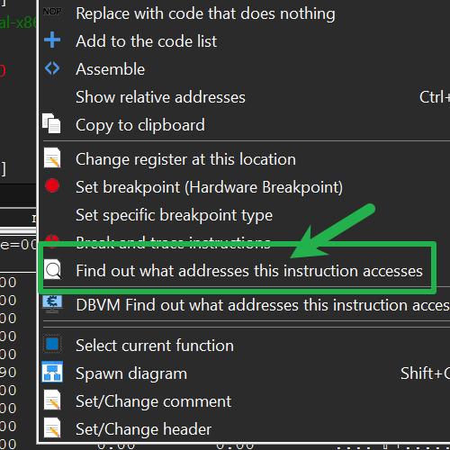

通过 `Find out what addresses this instruction accesses`，查看这个指令访问了哪些地址：

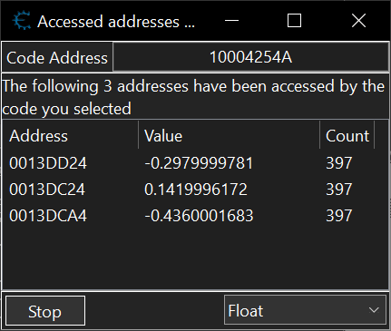

移动玩家，这里的地址数不会增加。看起来这3个就是3个敌人的值了。

> [!tip]
>
> 找到敌人的一个x坐标后，通过肉眼观测法发现 另外两个敌人的坐标。除此之外还有一个疑似移动方向的值。这个范围内的值肯定都和这个敌人有关。有时候我们可以通过这种方式摸鱼。
>
> 

同理，对于玩家，我们同样使用扫描器扫描，找到相应的坐标：


> [!tip]
>
> 一般来说，程序员在声明坐标的时候会将 x 和 y 的声明放在一起。因此我们在找到其中一个值的时候可以浏览内存来快速找到另一个坐标值。

获得玩家的坐标后，我们可以知道 $x$ 后面的就是 $y$ 坐标。不过我们在传送敌人时不使用玩家的坐标


在内存浏览器中直接将敌人 y 值修改到地图外


地图中的敌人就消失了

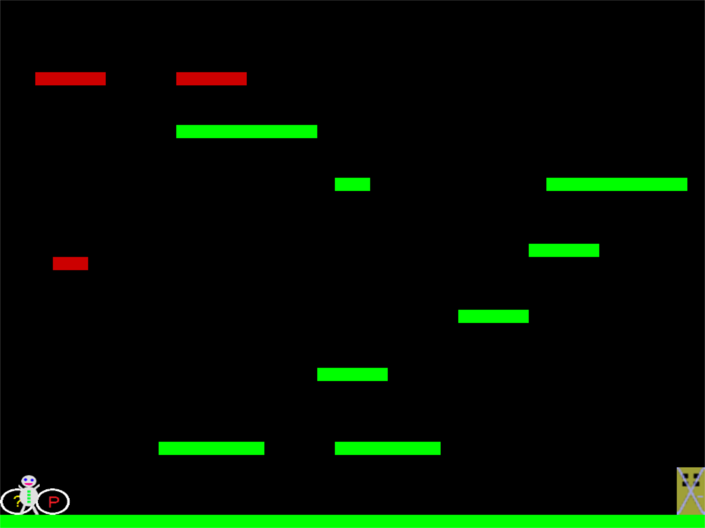

### 飞行

~~删除敌人后，发现还是有点难跳，让我们试着做一下飞行~~

首先先找到模拟重力的代码


在跳跃时，下面的 `movss [rax+28],xmm1` 不再被执行。而在平时站立时，上一条代码的执行次数大概就是下一条的两倍。

为什么在跳跃时下一条代码不执行呢？大胆猜测下一条代码本身的功能是下降。让我们使用 `nop` 填充这个指令。

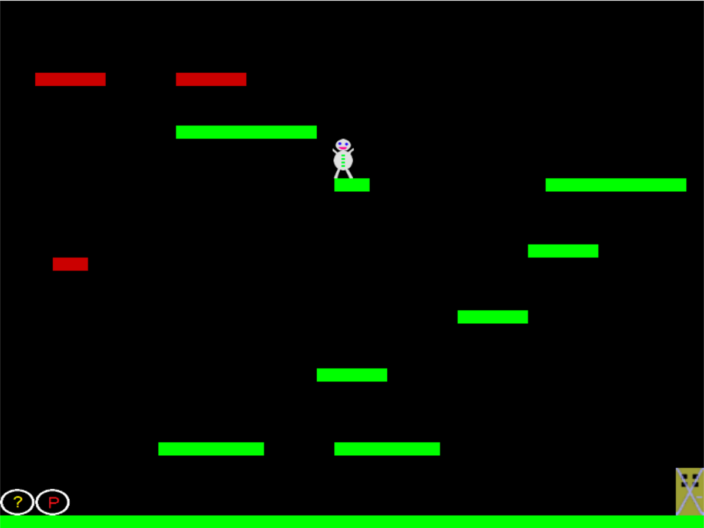

~~我不好说，原来是碰撞检测（后来发现并不简单是的碰撞后的排斥）。~~让我们试着把另一条指令填充 `nop`


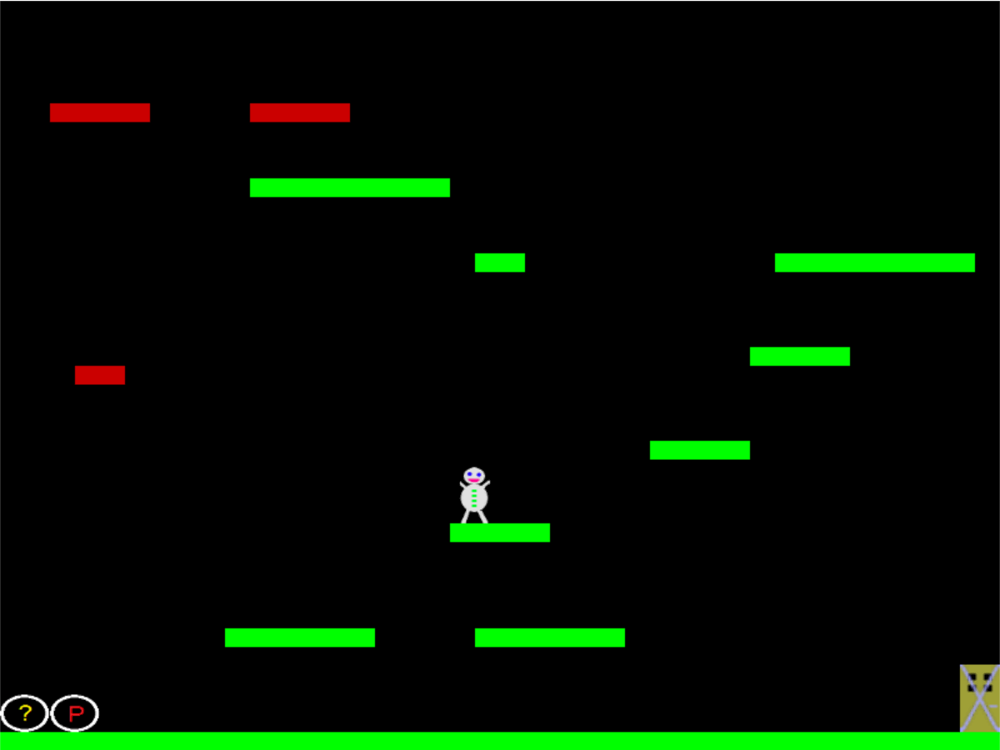

确实不下降了，但是也不能跳跃，还有瞬移现象。使用调试工具发现是第二条指令导致瞬移的，

因此将这两条全部填充为 nop 可以删除重力。有关这两条代码究竟是怎么搭配的，还希望有了解的人讲解一下。因此现在我们有一种飞行思路：


```assembly
[ENABLE]
"gtutorial-x86_64.exe"+410FE:
db 90 90 90 90 90

gtutorial-x86_64.exe+40F39:
db 90 90 90 90 90 90
[DISABLE]
"gtutorial-x86_64.exe"+410FE:
movss [rax+28],xmm1

gtutorial-x86_64.exe+40F39:
movss [rax+28],xmm9
```

直接将这两段代码填充 `nop`，并给 y 添加 hotkey


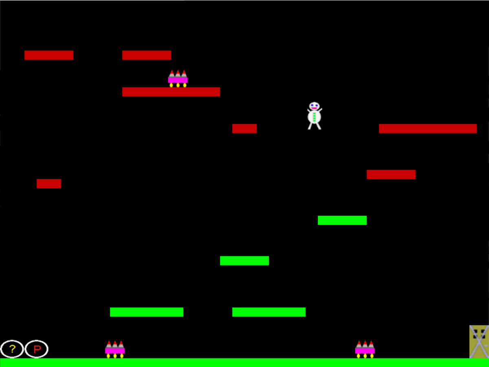


