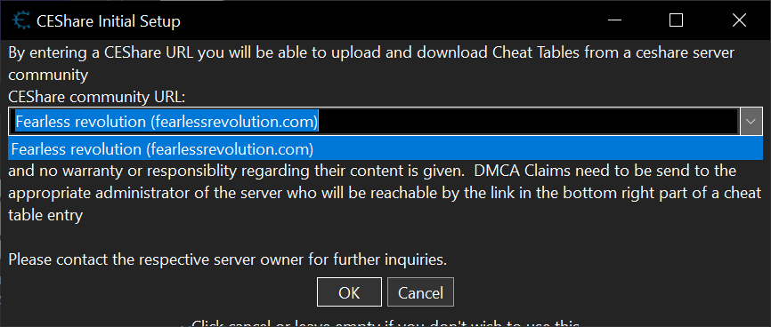
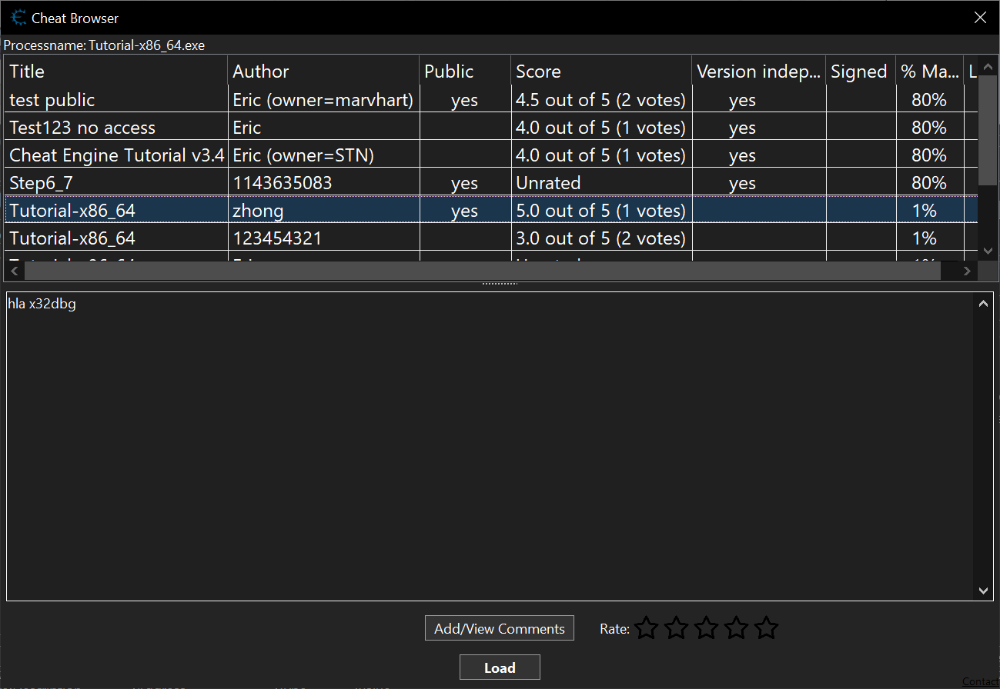
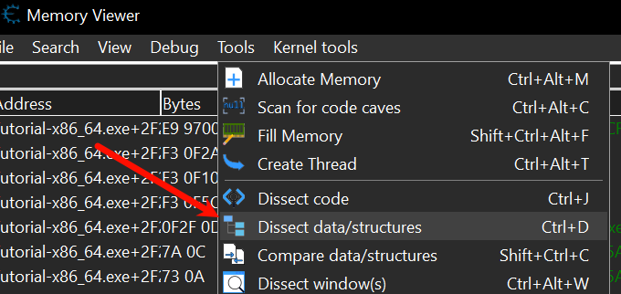
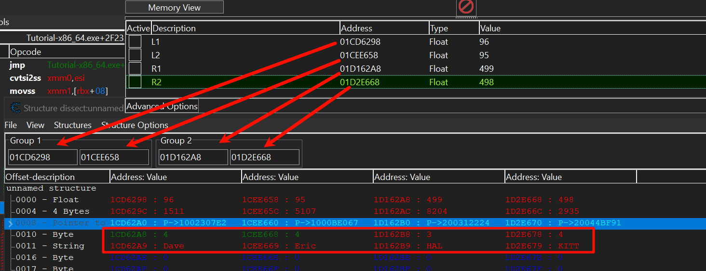
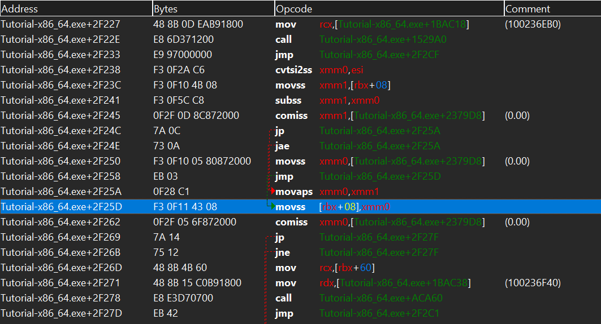
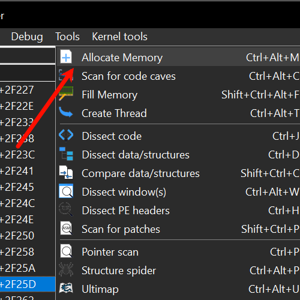
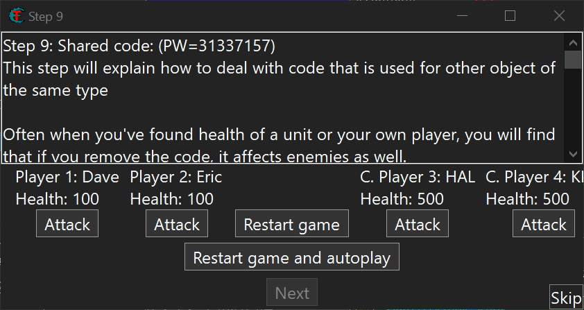
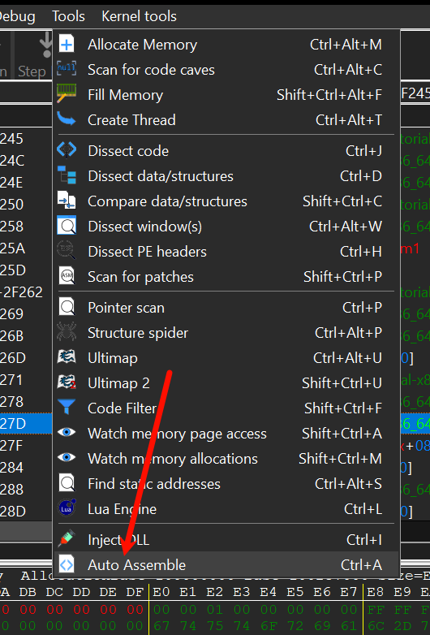
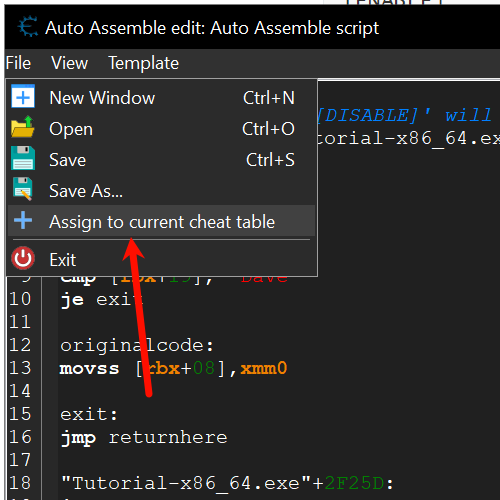

此文又称《只有开发者能看懂的CE教程》

~~CheatEngine 想必大家懂的都懂。但 CheatEngine  是怎么回事呢？ CheatEngine 相信大家都很熟悉，但是 CheatEngine  是怎么回事呢，下面就让小编带大家一起了解吧~~


## 捆绑软件警告

在安装过程中，不要无脑下一步，小心被老外来一个中国式**捆绑软件**震撼（如下图）。


如果你无脑点了接受，那么恭喜你了兄弟，去控制面板找到 RAV 杀毒并卸载吧。


Cheat Engine 通过提供安装广告软件的选项来实现这一点，目前（7.5）也只在安装向导里安装广告软件，还算可以接受吧。

此称为永远不要进行自动安装或盲目安装任何东西的教训。

## 使用 CEShare




CEShare 是一个 CheatEngineTable 分享接口。通过 CEShare，用户可以直接从 CheatEngine 中通过进程名来检索其他用户分享的 CheatEngineTable（如下图）。



不过其实对于大多数游戏来说都找不到。此外如果需要现成的修改器，为什么不使用风灵月隐呢？

用 CE 还是自己动手的时候比较多。


## 值扫描

所有操作均需要从 CE 中打开进程。

通过点击主界面左上角的图标，即可轻松打开对应进程。


在右侧面板中，可以通过值扫描对应的变量地址，该过程称为值扫描。

值扫描可以指定扫描的方式，在第一次扫描时可以是

-  `确定值`

- ``大于x`

- `小于x`

- `在两数之间`

-  `未知初始值`

之后的扫描中可以是

- `确定值`

- `大于x`

- `小于x`

- `在两数之间`

- `增加的数`

- `增加x的数`

- `减少的数`

- `减少x的数`

- `未变化的值`

- `变化的值`


用户可以进行多次扫描以确定变量的地址。在扫描时可以情况不同选择不同的方式进行扫描。例如游戏中有一个血条，玩家并不知道血条的具体数值，此时可以采用后4种方式来进行扫描。比如说先进行 `大于0`、`小于25565`、`未变化的值`，然后想办法让血量下降，并重新扫描 `减少 x 的数`（或者减少的数）。多次重复一般即可找到对应地址。

如果要扫描的值在扫描过程中可能会发生变化，可以勾选 `Memory Scan Options` 中的 `Pause the game while scanning`。该选项会再扫描时将对应进程挂起。


## 内存模型

在 Windows 系统中，内存是被虚拟化的。应用程序不能直接访问内存地址，这使得 windows 可以移动物理内存，或者将内存块与虚拟存储器交换。

对于应用程序的开发者而言， Windows 提供的是一种平面内存模型。内存地址从 0 开始增长，对于应用程序来说，内存是连续的。应用程序可以选择对自己的内存进行分段。但实际上这些内存在存储器中的分布是离散的，这一点可以通过 [Memory dump](https://en.wikipedia.org/w/index.php?title=Memory_dump&redirect=no) 文件来知晓。同时，一个进程不能去访问另一个进程的内存，这会引发 Segment Fault。实际上对于不同的应用程序来说，因为 Windows 虚拟化内存的原因，一个相同的内存地址对于不同的应用程序对应的其实是不同的物理内存地址，双方是不能互相访问的。如果需要相互访问，则需要通过系统提供的其他API进行显式的修改，而不能简单的通过裸指针，这也是为什么 CE 需要打开进程的原因。对于访问其他进程的进程来说，这段空间也并不是连续的。

更多有关内容可以查看[Memory Management](https://learn.microsoft.com/en-us/windows/win32/memory/memory-management)

## 官方教程


## 第 2 关：确定值扫描（PW=090453）

*TIP：你可以通过输入标题中的 PW 来跳转到对应的关卡*


> 目标：将血量修改到 1000


一切的开始。

很简单的一关，只需要扫描当前血量，减少血量。重复一轮即可。

在拿到想要的内存地址后，可以通过双击将该条目加入到下面的列表中，或者之间通过右键修改。

## 第 3 关：未知值扫描（PW=419482）


> 目标：将血量修改到 5000

因为下面有个血条，可以猜测这个值是大于0，且不是很大。

我们可以上来猜测这个血量在 0-1000 之间（实际上这个血量在 0-500 之间），然后再通过`减少了x`来找到血量。


## 第 4 关：浮点数（PW=089124）


> 目标：将血量和弹药修改到 5000

同上，甚至因为浮点数位比较长，比上面都好找。

注意这里的浮点数并不是说小数，而是 IEEE 754 标准浮点数。如果游戏中的浮点数并不是 IEEE 754 标准，那么该扫描并不能找到对应的值。

## 第 5 关：代码查找器（PW=888899）


> 目标：每次点击 Change Value 都会改变值，现需要将其更改为点击 `Change Value` 后值不变


思路：找到修改值的汇编代码，用空指令填充


在教程中，可以很容易的利用 CheatEngine 找到修改数值的代码


将该指令替换为 `nop` 即可


替换结束后，`rax` 寄存器所指向的内存地址将不再被修改为 `edx`中的值。此时点击 Change Value 按钮，数值将不再更新


> [!tip]
>
> 此处可以使用
>
> 
>
> 在自动汇编器中加入以下代码：
>
> ```assembly
>[ENABLE]
> //code from here till the end of the code will be used to disable the cheat
> "Tutorial-x86_64.exe"+2CB88:
> nop
> nop
> 
> [DISABLE]
> "Tutorial-x86_64.exe"+2CB88:
> mov [rax],edx
> ```
> 即在 `Enanble` 时将 `2CB88` 地址替换为两个 `nop`，`Disable` 时同理。
> 修改之后将其添加到 Table 中，即可通过选择框快速修改相应代码
> 
> | Enable | Disable                                                  |
> | ------ | -------------------------------------------------------- |
> |        |  |
> 


## 第 6 关：指针（PW=098712）

> 目标：将值修改为 5000，冻结此值后修改指针，使值不会发生变化。

当点击修改指针后，原本的数值所在的内存位置会发生移动，而对应的指针也会被修改，因此简单的记录这个值所在的内存地址不可行。

幸好，大多数情况下这种移动都是有迹可寻的。如果一个变量在代码中是静态的，那么它的内存空间是固定不变的。如果这个变量在函数的调用栈中，或者是在运行时被 `new` 出来的，那么它的地址则会在程序重启，甚至是运行时发生变化。但是程序总是需要找到这些动态的变量，那么此时就会存在一个指针，可能是二级，也可能更多级的指针，指向这个变量。我们可以通过从一个静态的地址出发，通过访问指针来找到所需的地址。

> [!tip]
>
> 该过程类似于“间接寻址”

首先还是通过扫描器找到值的地址：


可以看到，这是一个动态的地址（静态地址在CE中以绿色字体显示）。我们需要找到从静态区域指向它这指针，使用 Cheat Engine 的 Pointer scan 可以偷懒找到这个区域


在漫长的扫描后，我们可以得到这样的一串指向制定地址的指针：


但是这些指针并不都是正确的，我们还需要多扫描几次来找到真正的正确指针。

点击 Change pointer 更改指针，然后在现有基础上再重新进行一次扫描


更改后值为7，我们在重扫描时使用值扫描7而不是地址扫描


之后我们就拿到了一串更可信的指针


重复上述过程，有可能还需要重启程序，找到无论进行什么操作都始终正确的指针即可。

将正确的指针加入 Table 中，修改值为 5000 并进行冻结，即可过关。


> [!tip]
>
> 上述过程也可通过汇编器手动进行。
>
> 方法为：
>
> 1. 通过值扫描器找到值地址
> 2. 找到谁修改了这个地址
> 3. 分析得知上级地址可能值 
> 4. 使用值扫描器寻找地址
> 5. 寻找谁访问了这个地址
> 6. 重复过程 4 和 5，直到找到静态地址区域
>
> **注意**：过程4中可能有多个地址指向这个目标地址，这些地址不一定都正确
>
> 找到地址后，将基值和偏移值输入 Cheat Engine 即可
>
> 

## 第 7 关：代码注入（PW=013370）


>  目标：使每次遭到攻击时，血量+2

先通过值扫描器找到修改这个地址的指令


可以看到，使血量减少的代码是 `sub dword ptr [rsi+000007E0],01`，即将 32 位的 rsi+7E0 指向的内存区域的值减1。


我们将代码修改为减去-2，或者将减法指令替换为加法指令，均可过关。此处将减法指令修改为加法指令

```assembly
add dword ptr [rsi+000007E0],02
```

## 第 8 关：多级指针（PW=525927）

过关方式同第6关，略。


## 第 9 关：共享代码（PW=31337157）


> 目标：正常情况下，Player1 和 Player2 会输掉这场比赛。
>
> 
>
> 不使用冻结，使 Player 所在的队伍赢得比赛。

很容易想到，这关最简单的思路还是锁血，即删除扣除玩家血量的代码。

首先使用第7关的方式找到修改血量的代码


首先尝试将 `2F` 处的代码替换为 `nop`


结果敌人也不扣血，证明敌我双方共用了相同的代码（如下图）


这种情况下，为了区分不同的玩家，一定会有其他字段用于区分不同的血量。结合反汇编器的代码上下存在判断代码，我们大胆猜测它的代码中有以下结构体和函数：

```rust
struct Player{
    id: i32,
    // 有可能是 is_cpu: bool
    // 甚至有可能是 name: String 或者 name: &str
   	health: f32
}
impl Player{
    fn attack(&mut self, atk: f32){
        // unknown code
        self.health -= atk;
        
        if self.health < 0 {
            self.die();
        }
        // somethings else
    }
}
```

我们的目标就是在扣血之前判断身份，如果是电脑则正常执行扣血指令，否则什么也不做。也就是说我们需要修改添加一个判断语句。

首先我们寻找如何判定是玩家。如果像是上图的结构，那么玩家的标识一定就在血量旁边，稍微偏移一点就能找到身份标识。

我们使用 Memory Viewer 中的 `Dissect data/s



将血量的地址填入，结果可以在下面发现了一串字符串可以用于判断。另外这里甚至还有一个字符用来表示字符串的长度。



道理上，我们可以通过判断字符串来通过此关（如果不追求重启重开的可复现，甚至可以拿偏移 `0004` 地址的数字做判断）。但是比较字符串比较复杂，我们还是往上找一找有没有简单的判断方式。

向上偏移 128 位看看有没有可以利用的字段


好吧，没找到。那就只能去判断字符串了，如果只是通过此关的话只需要判断第一个字母的 ascii 码即可，但是对于其他游戏可能需要全部判断一次（可以利用C语言标准库）

在 `2F25D` 位置，血量的内存被修改。也就是说 `rbx+08` 位置为血量的内存地址，而再偏移11位，即`rbx+19` 位置为字符串的首字母。



明确了判断目标，我们需要一块新内存来存放我们的代码。使用 Tools-Allocate Memory 来申请一块新内存来存放我们的代码。



在新开辟的内存处输入

```assembly
cmp [rbx+19], 65766144 # Dave 按位表示为 HEX
je 02E60010
movss [rbx+08], xmm0
jmp 10002F262
```

将原 `movss [rbx+08], xmm0` 修改为 `jmp 02E60000`，形成以下代码


这样即可过关



### 自动汇编

一行一行手操汇编太麻烦了？

其实CheatEngine 提供了自动汇编功能



```assembly
[ENABLE]
//code from here to '[DISABLE]' will be used to enable the cheat
alloc(newmem,2048,"Tutorial-x86_64.exe"+2F25D) 
label(returnhere)
label(originalcode)
label(exit)

newmem:
cmp [rbx+19], 'Dave'
je exit

originalcode:
movss [rbx+08],xmm0

exit:
jmp returnhere

"Tutorial-x86_64.exe"+2F25D:
jmp newmem
returnhere:

[DISABLE]
//code from here till the end of the code will be used to disable the cheat
dealloc(newmem)
"Tutorial-x86_64.exe"+2F25D:
db F3 0F 11 43 08
//movss [rbx+08],xmm0
```



将其加入 Table，即可实现快速修改。

通过自动汇编，可以使用 label 来进行跳转，不需要纠结 nop 对齐，也不需要考虑跳转的内存地址。CheatEngine 会自动处理这些行为。
