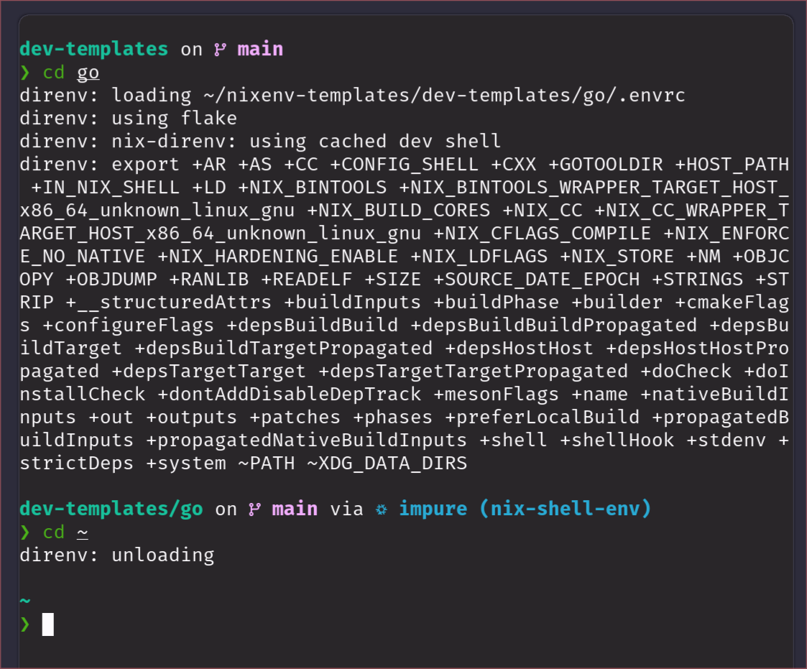
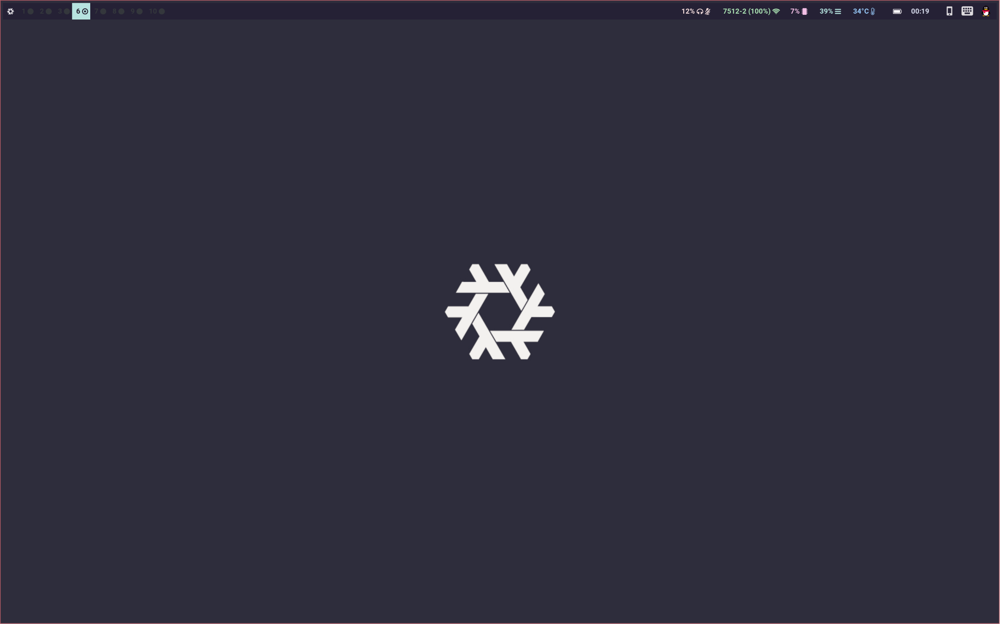

用了几天时间折腾 NixOS，现在大概是能满足日常日常使用了，几天使用下来体验还算不错。这也不是我第一次使用 Linux 发行版了，但如果不是因为事先了解，初次使用肯定也是发愣的。

不同于其他 Linux 发行版，NixOS 并没有遵守 FHS 标准，也就是说其他发行版的经验很难在 NixOS 同用。在刚安装时最明显的特点有两个：

- 系统配置目录（`/etc`）下在文件都是只读的
- `/bin/sh` 目录只有 `sh`

NixOS 几乎将所有的文件存储在 `/nix/store` 下，而后通过链接的方式放到对应的文件夹下，而 `/nix/store` 又是通过 `/etc/nixos/configuration.nix` 配置获得的。用户也是通过修改 `configuration.nix` 文件来修改系统配置甚至是单个用户的配置，在修改后使用 `nixos-rebuild switch` 命令应用新配置。这条命令实际上重新“构建“了一个新生代的系统，但之前的老年代并不会删除，用户仍然可以随时切换到之前配置的系统。因此 NixOS 也被称为滚不挂的系统（不作死的情况）。

实际上 NixOS 经常被人诟病占用硬盘，上手难度高，软件打包困难等。这些问题确实存在，可能这也是 NixOS 使用人数少的原因。另一方面 NixOS 的配置非常依赖于查阅文档，但官方 Wiki 的部分条目其实是过时的，有时候不得不去一些论坛或者 Issue 去找解决方案。

NixOS 的优点主要就是集中在可重复性和软件隔离上。可重复性即如果 `configuratoin.nix` 中的内容是相同的且为 pure 的，那么同一份配置文件会产生完全一样的系统。而软件隔离则是因为 NixOS 将几乎所有的软件都存放在 `/etc/nixos`中，这些软件可能是同一个程序的不同版本，他们可以在系统中同时存在，同时选择地依赖其他软件的某个特定版本，不会像其他系统一样发生冲突。

## Nix

配置 NixOS 使用的是 Nix 语言，这是一个函数式脚本语言，NixOS 上手难度高的原因主要来自于此。

就我个人的感觉来说，Nix 语言更像是围绕 attributes set 的一种配置文件，只是这种配置文件可以以代码的方式执行

它的画风大部分是这样：

```nix
imports =
    [
      # Include the results of the hardware scan.
      ../../modules/system.nix
      ./hardware.nix
    ];

  # for Nvidia GPU
  services.xserver.videoDrivers = [ "nvidia" ];
  hardware.opengl.enable = true;
  hardware.nvidia = {
    package = config.boot.kernelPackages.nvidiaPackages.stable;
    modesetting.enable = true;
  };

```

有时候是这样:

```nix
args:
# execute and import all overlay files in the current directory with the given args
builtins.map
  (f: (import (./. + "/${f}") args)) # execute and import the overlay file
  (builtins.filter # find all overlay files in the current directory
    (f:
    f != "default.nix" # ignore default.nix
      && f != "README.md"  # ignore README.md
    )
    (builtins.attrNames (builtins.readDir ./.)))

```

除了学习成本较高和社区较小之外，书写体验还算不错，这里留下一个比较不错的学习资料: [This cute world](https://thiscute.world/posts/nixos-and-flake-basics/)

## nixpkgs

~~原来一个软件库可以这么复杂~~

这个是 NixOS 的官方软件库，除此之外还有由用户维护的类似 AUR 的 NUR。这个软件库的设计比较 magic。

nixpkgs 的实现依赖 Nix 中的 derivation，在安装软件的时候可以很方便的在配置中进行安装，或者通过 override 来替换某个软件的依赖项。这是因为 nixpkgs 中的软件包实际上是一个返回 derivation 的函数，那么只需要修改这个 derivation 就可以对软件包进行魔改了。

值得一提的是，由于 NixOS 并没有遵守 FHS，其他发行版中的软件要通过 patchelf 才能正常的运行，一般来说我们会通过打包的方式来进行自动安装和 patch。不过在进行本地构建时，全过程默认是运行在沙箱中，不能连接到互联网，也就是说在打包前需要将所有需要的文件全部准备好。

以下是 typora 的 derivation

```nix
{stdenv,
 dpkg,
 wrapGAppsHook,
 fetchurl,

 lib,
 glib,
 electron,
 gsettings-desktop-schemas,
 makeWrapper,
 gtk3,
 withPandoc ? true,
 pandoc}:
let
  version = "1.7.4";
in stdenv.mkDerivation  {
  name = "typora-${version}";
  system = "x86_64-linux";

  nativeBuildInputs = [
    wrapGAppsHook
    dpkg
  ];
  src = fetchurl {
    url = "https://download.typora.io/linux/typora_1.7.4_amd64.deb";
    hash = "sha256-ugBRijuXh4YHQeoPxGx0OrmsaoK7kAKKCKRNrvi63tc=";
  };
  buildInputs = [
    makeWrapper
    glib
    gsettings-desktop-schemas
    gtk3
  ];
  unpackPhase = ''
    ar x $src
    tar xf data.tar.xz
  '';

  # Extract and copy executable in $out/bin
  installPhase = ''
    runHook preInstall
    mkdir -p $out/bin $out/share
    {
      cd usr
      mv share/typora/resources $out/share/typora
      mv share/{applications,icons,doc} $out/share/
    }
    runHook postInstall
  '';

  postFixup = ''
    makeWrapper ${electron}/bin/electron $out/bin/typora \
        --add-flags $out/share/typora/app.asar \
        "''${gappsWrapperArgs[@]}" \
        ${lib.optionalString withPandoc ''--prefix PATH : "${lib.makeBinPath [ pandoc ]}"''} \
        --prefix LD_LIBRARY_PATH : "${lib.makeLibraryPath [ stdenv.cc.cc ]}"
  '';

  meta = with lib; {
    description = "Typora";
    homepage = https://typora.io;
    # license = licenses.unfree;
    maintainers = with stdenv.lib.maintainers; [ ];
    platforms = [ "x86_64-linux" ];
  };
}

```

## nix-shell

这是一种类似 Python 的 virtualenv 的沙箱，但它做的更彻底一点。nix-shell 会将环境需要的软件和 native library 放在 `/nix/store/` 中，然后通过 `PATH` 等方式指过去。由于 `/nix/store` 本身是只读，所以不同的环境之间是不会相互影响。同时由于 nix-shell 会管理所有的依赖，而不是像 virtualenv 一样只隔离 python，这使的它的环境更加的稳定。

如果借助 direnv，就可以在 shell 进入目录时自动应用环境。

以隔离的 GO 语言环境为例， 在 `.direnv` 写入

```bash
use flake
```

`flake.nix` 文件:

```nix
{
  description = "A Nix-flake-based Go 1.17 development environment";
  inputs.nixpkgs.url = "github:NixOS/nixpkgs/nixpkgs-unstable";
  outputs = { self, nixpkgs }:
    let
      goVersion = 20; # Change this to update the whole stack
      overlays = [ (final: prev: { go = prev."go_1_${toString goVersion}"; }) ];
      supportedSystems = [ "x86_64-linux" "aarch64-linux" "x86_64-darwin" "aarch64-darwin" ];
      forEachSupportedSystem = f: nixpkgs.lib.genAttrs supportedSystems (system: f {
        pkgs = import nixpkgs { inherit overlays system; };
      });
    in
    {
      devShells = forEachSupportedSystem ({ pkgs }: {
        default = pkgs.mkShell {
          packages = with pkgs; [
            # go 1.20 (specified by overlay)
            go
            # goimports, godoc, etc.
            gotools
            # https://github.com/golangci/golangci-lint
            golangci-lint
          ];
        };
      });
    };
}

```

每次在进入这个环境时都会自动应用 go1.20 的环境，而退出时会自动卸载环境，全过程十分的方便



---

我的个人电脑的桌面环境是使用了 Hyprland + Waybar，配置借助了 Flake 和 Homemanager。目前所有的配置文件进行了一些模块化，但稍微有点野路子的味道，可能以后会参考 [Misterio77/nix-starter-configs](https://github.com/Misterio77/nix-starter-configs) 重构一下代码

配置文件在这: [mslxl/.dotfile](https://github.com/mslxl/.dotfile)



配置过程时，软件的主要从 [NixOS Package Search](https://nixos.org/nixos/packages.html?channel=nixos-20.03) 中查询，部分与系统关系比较密切的通过 [Option](https://search.nixos.org/options) 开启

使用中 NixOS 还是比较舒爽的，以安装 atuin 为例，如果是其他发行版安装可能还需要手动修改 `.zshrc` 文件，而 nix 只需要简单的添加 4 行配置，其他过程由 nix 自动完成。

```nix
 programs.atuin = {
    enable = true;
    enableBashIntegration = true;
    enableZshIntegration = true;
  };
```

先说这些，如果以后在使用时需要什么问题再做补充
