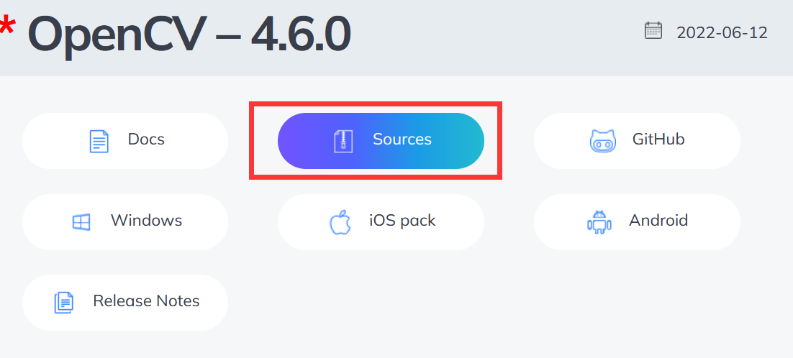
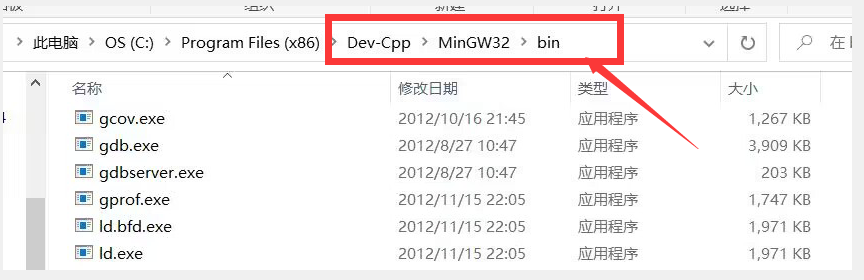
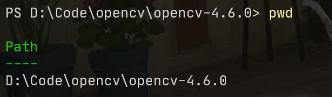
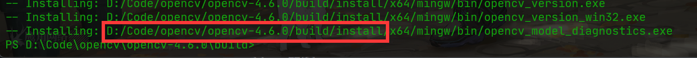
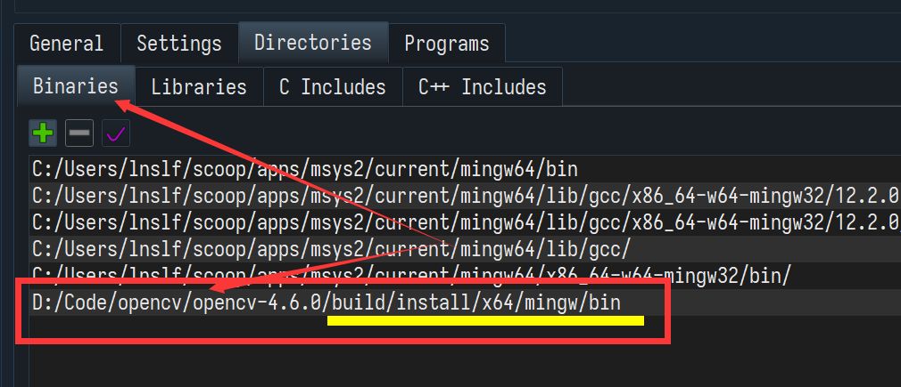
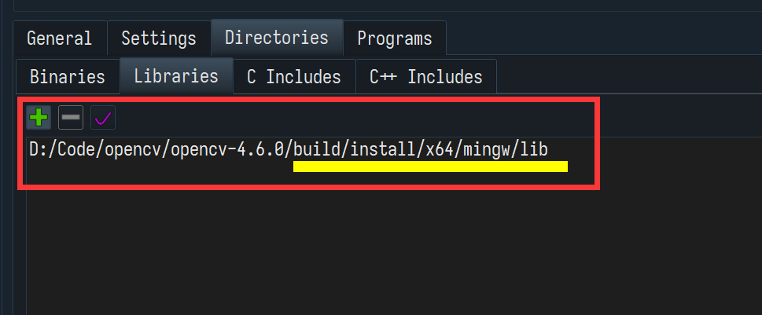
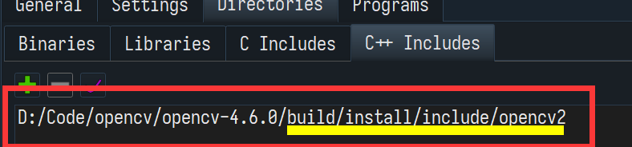
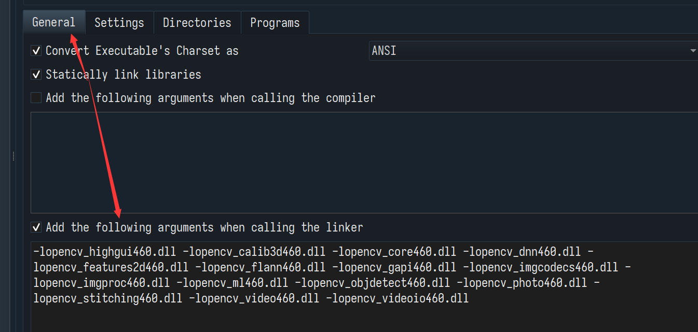
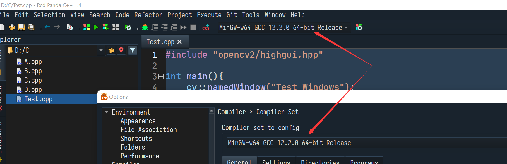
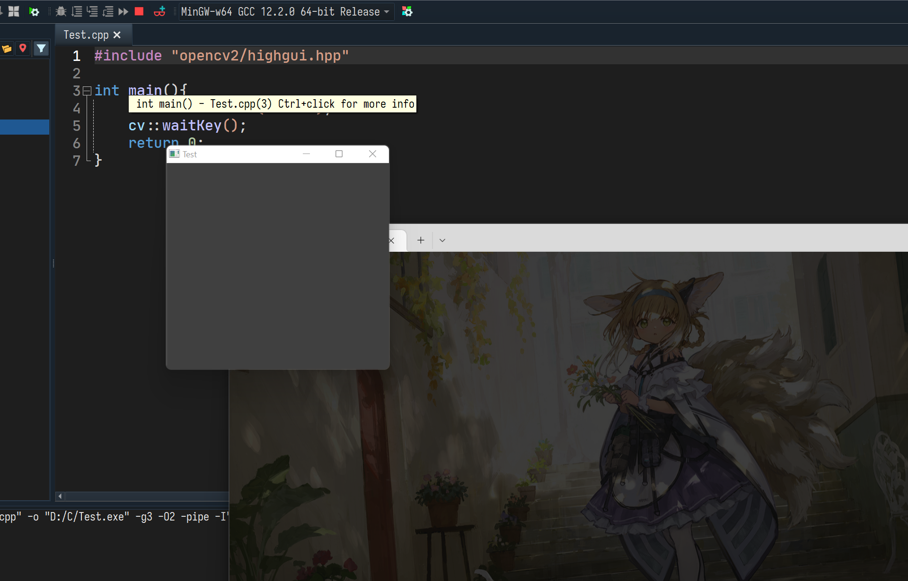

> 该文章写于 2022 年十月，部分内容可能已经过时
> 此文目的为实验室同学参考，个人还是推荐尽早换下 Dev

用 CodeBlock(MinGW-make) 理论上配置差别不大，可以参考下。

用 Visual Studio 的话网上全是教程，直接百度就行。

## 需要准备的软件

- Dev-C++ 或 RedPanda C++
- MinGW 或 msys2-mingw32 (一般安装 Dev-C++ 时会同时安装)
- [OpenCV Source](https://opencv.org/releases)
- [CMake](https://cmake.org/download/)

## 步骤

1. 下载 OpenCV 源代码

由于新版的 OpenCV 不提供 gcc 的编译，而 Dev-C++ 只能使用 gcc 编译器，所以我们需要自行使用 gcc 编译 OpenCV

从 [OpenCV Releases Page](https://opencv.org/releases/) 下载源代码，注意选择 Source



下载完成后进行解压（这里解压到 `D:\Code\opencv\opencv-4.6.0` )

2. 配置 OpenCV 编译环境

在 `Dev-C++` 的安装目录找到 `MinGW` 目录



将 `MinGW\bin` 添加到 Path 环境变量中（具体方法参考百度）

3. 编译 OpenCV

打开命令行，进入 opencv 的代码文件夹



依次执行下列命令

```pwsh
mkdir build #创建 build 文件夹
cd build #进入 build 文件夹
cmake -G "MinGW Makefiles" .. #生成 makefile
mingw32-make #根据 makefile 编译
mingw32-make install
```

在执行 cmake 的时候可能会下载其他依赖，这个过程比较慢，~~有科技手段的话可以用点科技手段~~
执行 `mingw-make` 时可以使用 `-j` 参数指定进程数量

最终编译后的文件将保存在代码目录下的 `build/install` 下



4. 配置 IDE

在 Dev-C++ 中编译器配置里

- 如果你是RedPanda，那么编译器配置在`菜单栏-Tools-Options-Compiler-Compiler Set` 中
- 如果你是Dev-C++，那么编译器配置在 `菜单栏-Tools-Compiler Tools` 中

打开编译器配置，在 `Binary` 中添加 `build\install\x64\mingw\bin` 目录



在 `Library` 中添加 `build\install\x64\mingw\lib` 目录



在 `C++ Include` 中添加 `build\install\include` 目录



在 Linker 参数中加入以下链接库

```raw
-lopencv_highgui460.dll -lopencv_calib3d460.dll -lopencv_core460.dll -lopencv_dnn460.dll -lopencv_features2d460.dll -lopencv_flann460.dll -lopencv_gapi460.dll -lopencv_imgcodecs460.dll -lopencv_imgproc460.dll -lopencv_ml460.dll -lopencv_objdetect460.dll -lopencv_photo460.dll -lopencv_stitching460.dll -lopencv_video460.dll -lopencv_videoio460.dll
```



至此，OpenCV 环境配置完成

**需注意**，以上配置应对同一组编译器配置，而且使用的编译器配置应当和设置的编译器配置一致。



5. 测试

```raw
#include "opencv2/highgui.hpp"
int main(){
	cv::namedWindow("Test Windows");
	cv::waitKey();
	return 0;
}
```

试试这个段代码，这段代码将会创建一个空白窗口


