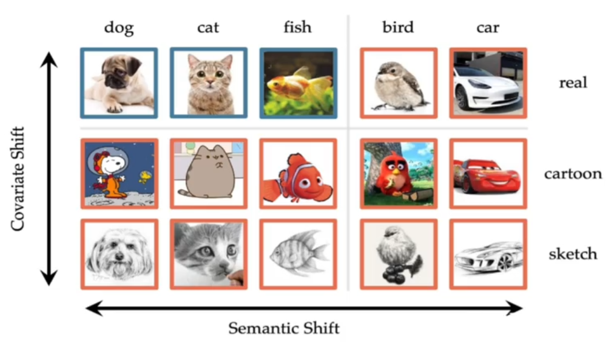
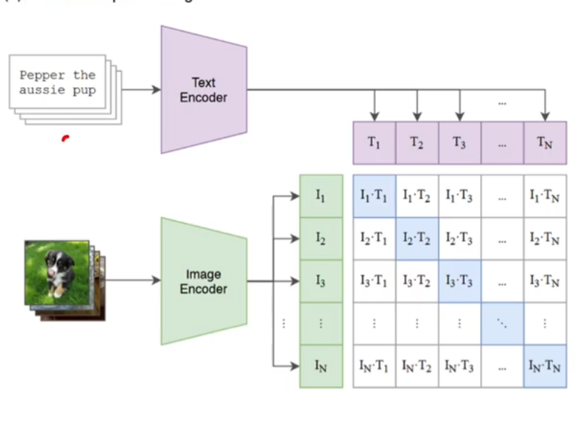
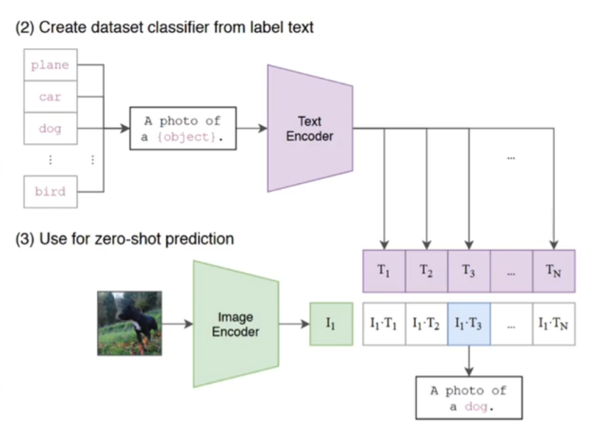
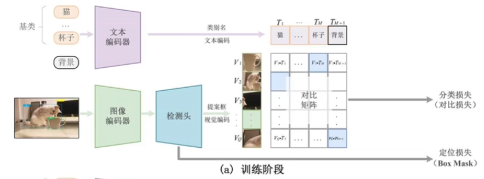
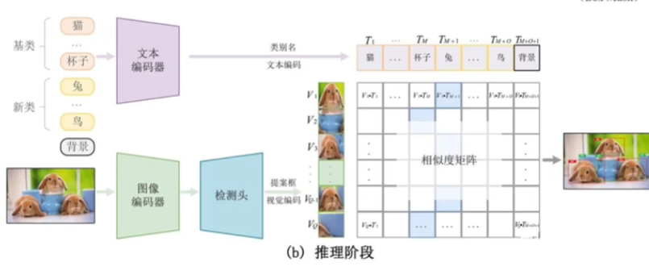
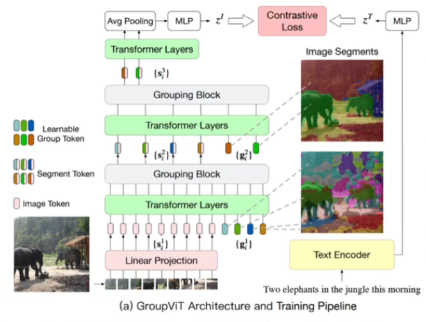
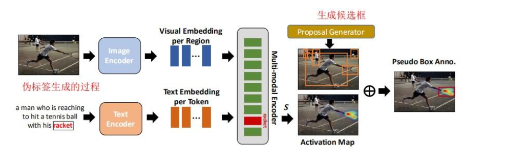

## 简介

在目标检测的发展历程中，存在以下几种方案的目标检测：

- Two-Stage: 两阶段的目标检测，向模型喂一张图。首先通过 Region Proposal 生成多个候选区域，接下来再进行筛选、检测获取目标。
- One-Stage：一阶段的目标检测。端到端的形式，将图片输入到 backbone 中，直接输出检测框。最出色的即 YoLo 系列
- Anchor-Based
- Anchor-Free
- Transformer

不同于上面的方案，OVD 的目标是利用文本的语义信息和图片的语义信息结合起来，它关注图像的偏移，尤其是统计偏移。

图像的偏移有两种形式：

- 统计偏移（纵坐标）
- 语义偏移（横坐标）

OVD 可以识别超过预定义的类别，借助弱监督信号（如图文对或 VLMs）。现有的大多数 OVD 方法都是基于 VLM（如 CLIP）。

不同于传统的分类任务，此处的对比学习将分配任务转换成了匹配任务。

传统的分配框架往往是先进行特征提取，随后加入 FC 进行分配，分类的结果是一个概率向量。

匹配任务采用对比学习中不仅提取了图片的特征，还将文本的特征同样提取了出来。随后将图像特征与文本特征进行匹配，概率最高的即为结果。

对比学习一个经典的例子即为 CLIP。它将 Text Embedding 与 Image Embedding 进行匹配，将符合结果的标记为正样本，其他为负样本。将两个 Encoder 生成的数据在表达相同结果时在同空间中最近。

CLIP 的推理相当简单，而且是 one-shot[^1]的

## 框架

OVD 很类似 Two-Stage，它同样需要 RPN 进行 Region Proposal。

如上图，在训练阶段给出的数据包含图片、检测框和文本。通过图像编码器和检测头后对 Region 进行检测，然后再从文本中得到相应的类别的 embedding。再通过对比训练，计算分类 loss 和定位 loss。

## OVD 发展方向

- 区域感知训练(region-aware training): 利用图文对，例如 group VIT
- 伪标签方法(pseudo-labeling)：利用图文对，在模型未完成训练时利用模型进行推理，推理的结果再重复训练
- 知识蒸馏(knowledge distillation): 大量使用 VLMs-IE
- 迁移学习(transfer learning)：大量利用 VLMs-IE

### 区域感知训练

此方法并没有用到 VLM，而是利用文本对齐的方法。上图是个语义分割的例子：图像经过一系列的语义提取变为 embedding $z^I$，文本同理获得 $z_T$。最终进行对比

区域感知其实就是将 CLIP 的思想运用到下游任务中，利用对比学习实现图像文本匹配。但是 CLIP 是整张图片与文本对齐，而区域感知训练则是图片中1个局部区域与N 个单词对齐。

### 伪标签方法

该方法在 _Open Vocabulary Object Detection with Pseudo Bounding-Box Labels_ 中提出，该文职提出能否利用现有的大规模的目标物体自动生成边界标签，利用这些生成的边界框提升 OVD 性能。

上图中左侧为传统的学习方法，其训练成本很高。而右侧为伪标签方法。伪标签方法利用自己生成的标签训练自己。

#### 伪标签的生成

该工作使用 VLM 生成伪标签。首先通过输入图文对分别提取特征，获得特征向量，然后利用图文交互的 cross-attention 机制获得多模态特征，计算图像区域和文本单词的注意力权重，再利用 Grad-CAM 对注意力权重进行可视化，得到目标的 Activation Map 区域，该局域即为 RPN 网络的目标 ROI。该ROI 构成该目标名称的伪边界框标签。

### 检测模型训练

通过伪标签数据即可训练 OVD 的检测。将图像数据根据伪标签获得 ROI，然后经过编码器得到特征向量，文本直接经过文本编码器得到向量。之后经过计算跨模态 embedding 的相似度，根据伪标签计算交叉熵。

## 其他详细资料

[面向开放词汇的目标检测Open-Vocabulary Object Detection（OVD）的介绍](https://zhuanlan.zhihu.com/p/610639148)

[Open-Vocabulary Object Detection 工作调研](https://zhuanlan.zhihu.com/p/595169030)

[^1]: 指模型的泛化能力。Zero-Shot 指给出一张未出现在训练集中的数据，模型仍能给出结果。除此之外还有 One-Shot 和 Few-Shot。 One-Shot 指只需要一张图片进行 fine-tune（人脸识别就是一个常见场景），而 Few-Shot 只每个类别只有少量样本
