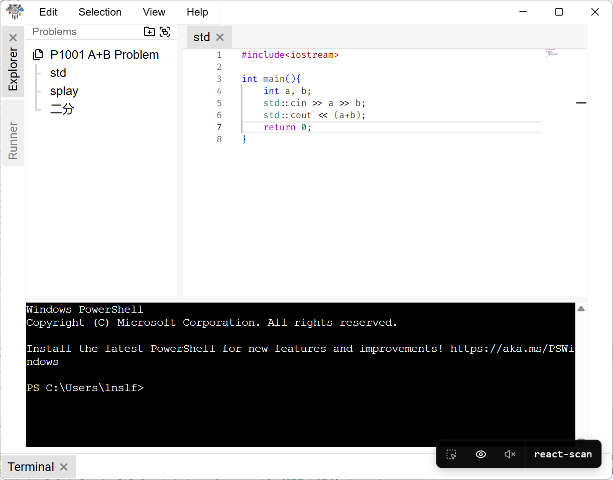
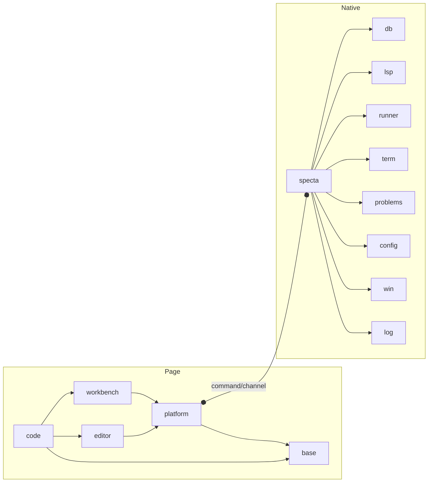
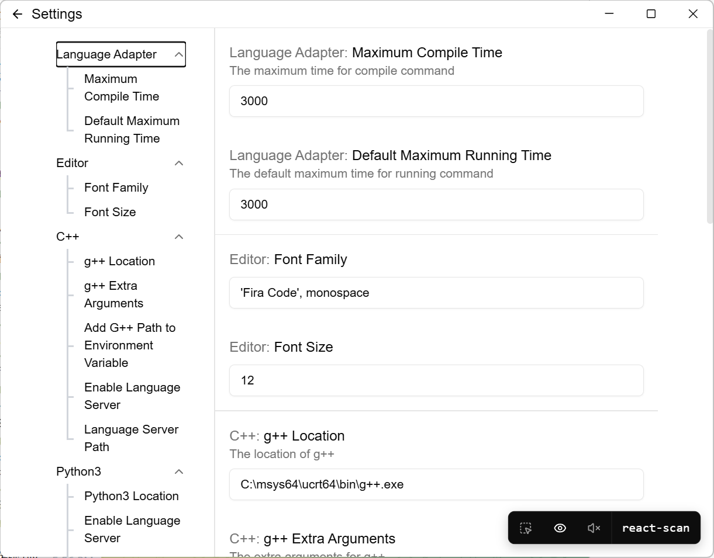
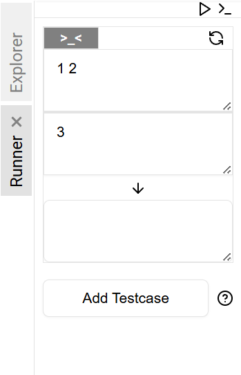

## 我在写什么？

### Maljuna Revo

Maljuna Revo 实际上应该是表示过去的白日梦（世界语），最初这个软件只是用来纪念我碌碌无为的算法竞赛生涯，而后来变成了毕业设计。

Revo 是一个由 Tauri 开发的单文件代码编辑器，主体部分采用 React 开发。

说实话这个项目从1月就已经开始写了，经过了忙忙碌碌的1月，过了春节后不知从哪里生出一股厌烦，一直停摆到现在。不过本地编辑器已经完成大部分功能了。

~~其实工作量还是页面仔~~

在架构设计上，Revo 模仿了 VSCode。将代码分为了四部分

- base: 通用的公共方法和组件
- platform: 依赖 Rust 接口，可被依赖注入的服务
- editor: 编辑器
- workbench: 各类拓展功能视图框架
- code: 应用程序入口，组织上述模块

更多有关实现的内容就不在这里提了，反正你们也不关心

简单贴几张图吧

## 我在玩什么

### Darkest Dungeon

最近在玩这个 [Darkest Dungeon](https://neodb.social/game/6xaHyfmH9tRpNaURiYTLe8)。
刚开始玩的时候没有加 mod，真真正正做到了 4 个人下地牢，疯了 5 个。怪我自己抗压能力太弱。

之前只在 Bilibili 上闻其名，机制流程复杂但是却挺有意思，难度对我而言可能稍微有点高。之后去打了几个
二次元 mod 来感受二次元的强度了。

|                                      |                                        |
| :----------------------------------: | :------------------------------------: |
|  |  |

绘师長門ちゃん画的这两小只真可爱啊

~~然而最终还是被老祖送走两个~~
