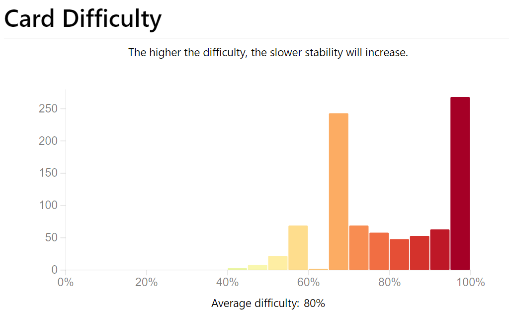

为了记录我的精神状态，我决定从今天开始写周报了。虽然说是周报，但不一定每周都写，有可能数个月才写一次。

换句话说，等我精神不稳定的时候才会来写周报。

---

## 日语

再见了，多邻国。


大概是3年前，我开始使用多邻国学习日语和世界语。后来渐渐的将世界语丢掉只学日语了，到现在世界语也只能算个 komencanto。
而日语却一直坚持了下来，到现在连续打卡已经有 627 天了。这1000余天我通过多邻国学到了什么？其实我觉得我什么也没有学到。
在老中的特色汉字 buff 下，我还勉强能看懂简单的句子，但却说不出、写不下简单的单词。在今天，我觉得是时候放下 Duolingo 转向其他正常的学习方式了。

多邻国有什么问题？首先它其中的题目有一些问题。比如在其中的听力中，有时会同时出现
「<span lang="jp">中村さん</span>」和 「<span lang="jp"> なかむらさん</span>」 两个选项，然而只有前者是被认为正确的。
再者，使用中文学习日语时不能完全对等的翻译。例如「<span lang="jp">この味噌汁は安いです</span>」的中文表达是 「这个味增汤很便宜」。
然而中文中的“很”并不表示程度，它只是一种语气词(?)。然而当你尝试翻译回去的时候，也许 「<span lang="jp">とても</span>」 就出现了，你就又错了一题。
同理，还有「はい，元気です」中文特色倒桩句「是，我好的很」。总之，在多邻国学习使用汉语学习其他语言可能并不是一个好选择。

此外，多邻国最大的问题就是——它不讲语法。所有的问题到要用户自己去悟，而多邻国只会简单的在 Guide 中提一下要出现的句子，此后便是不断的重复。
这很像 SRS（间隔重复）的学习方式，但是它却希望用户通过重复建立起语感。我个人觉得建立语感最重要的是环境，即大量的不同的句子重复出现。
显然多邻国给出的句子太少了，每种表达只有寥寥几句。到最后用户可能什么也没学到。

总而言之，如果要学习一种语言，多邻国并不是一个很好的选择。但要是作为一个能够复习的游戏来说，倒也勉强合格。它只能拿来复习，至于拿来学习——还是找本书更靠谱些。

<p style="font-size: 0.8em;">
10月21日追加: 有关 Duolingo 的算法可见墨墨背单词于 21 年的研究报告： <a href="https://github.com/maimemo/maimemo-memory-research">maimemo/maimemo-memory-research</a>
</p>

至于我抛开多邻国后去了哪？我将我的学习任务拆分成了单词和句子两部分。
单词现在依靠 Anki 搭配卡组 [5mdld/anki-jlpt-decks](https://github.com/5mdld/anki-jlpt-decks)，
而句子则通过《皆の日本語》这本知名教材来完成。

目前 Anki 的效果如下

|                                        |                                           |
| :------------------------------------: | :---------------------------------------: |
|  |  |

看上去并不是很乐观的样子，不过就算是这样虽然负担很大，能背过的单词也比多邻国多多了。
至于最终的成效，等我通过了 N2 后会回来报告的。

## ボクの理想の Python

回到大标题。

其实当我写下标题的时候，其实首先联想到的就是《ボクの理想の異世界生活》中的某个知名场面


我为什么要起这个标题呢？因为我现在突然想做一个语言，用来表达我对 Python 的不满。

Python 是个好语言，它简单易学，拥有丰富的生态，能轻松的完成大部分的自动化或者胶水工作。
但是我觉得相比其他语言仍存在一些不足。这些不足并不是指带语义的缩进，也不是指性能，可能只是一些微不足道，但是我又十分有用的功能。

当前，下面的内容到现在只是理想中的样子，具体是什么样子还要等实现。
受限于个人对类型系统掌握的能力不足，很多内容更像是一种幻想，一种 TODO List。也许我会在 Python 淘汰之前实现的吧

~~现在已经新建工程 Sidewinder了，等写差不多放出来~~

### 如何实现

Python 现在这个样子已经不是说改就改了，不如像 Kotlin 依赖 JVM 一样，依赖 Python VM 来创建一个新语言。

我们可以编译到 Python Bytecode 或者是 Pyhton。我们都可以做到很多的事情，同时不丢失 Python 的生态。

至于性能——我不会。~~都写 Python 了就别在意那点性能了~~

### 单脚本环境

现在 Python 的环境隔离依赖的是 Conda、Poetry 或 Venv 等方案，这些方案主要是针对项目提供的解决方法。
而对于单个文件的脚本来说，可能只是一个简单的任务，将依赖安装到全局会污染环境，而新建一个环境的话又会多出比脚本数量还多的文件。

Ammonite 的 Scala Script 提供了这样的方案：

```scala
import $ivy.`com.lihaoyi::scalatags:0.7.0 compat`, scalatags.Text.all._

val rendered = div("Moo").render
```

这里的 `import $ivy` 提供了一种从远程主机导入依赖的方式，那么我们是否也能模仿这种行为？例如加入语法

```python
import $pip.pandas."latest"
```

可以将依赖放在 `$HOME/.pycache/<name>/<version>`， 在启动前将对象的目录放在环境变量中。这并不是一个很难解决的问题。

### Trait/Typeclass

是的，越来越多的语言开始加入这一套机制了。这可能也是对我最大的挑战。
比其继承，通过 trait/typeclass 可以更好的表示数据所能支持的操作。

比如在 Haskell 中通过 typeclass，可以轻而易举的支持很多操作

```haskell
newtype Parser a = Parser
  { runParser :: String -> Maybe (String, a)
  }

instance Functor Parser where
  fmap f p = Parser $ \input -> do
    (input', a) <- runParser p input
    Just (input', f a)

instance Applicative Parser where
  pure x = Parser $ \input -> Just (input, x)
  (Parser f1) <*> (Parser f2) = Parser $ \input -> do
    (input', f) <- f1 input
    (input'', a) <- f2 input'
    Just (input'', f a)

instance Alternative Parser where
  empty = Parser $ const Nothing
  (Parser f1) <|> (Parser f2) = Parser $ \input -> f1 input <|> f2 input
```

通过为 Parser 类型实现了函子（Functor）、应用函子（Applicative）和替换函子（Alternative），我们可以组合Parser类型，
进而得到很多其他例如 `some`, `any`, `traverse`, `<*` 等操作。

```haskell
charP :: Char -> Parser Char
charP c = Parser f
  where
    f [] = Nothing
    f (y : ys)
      | y == c = Just (ys, c)
      | otherwise = Nothing

stringP :: String -> Parser String
stringP = traverse charP
```

我觉得这是传统的继承方式无法比拟的。

Note: Rust 的 nom 库也实现了类似的操作。

### Tagged Union

好像也是个很大的挑战。具体可以见 [Wiki: Tagged union](https://en.wikipedia.org/wiki/Tagged_union)。

2024 年，就连 Java 17 都已经支持了这种类型（称为 Sealing）。通过这种方式可以避免很多错误，我觉得大家应该都
品尝过 Rust 中的 `Option` 类型了，它就是一种 Tagged Union。

Python 作为动态类型语言，支持它是个很大的挑战。因为静态分析时类型信息很容易丢失——只需要不写 type hinting。

然而如果新建一个静态类型的语言，那这个问题自然存在解决方案。~~不过还是挺难的~~

### 更好的 Map, Reduce

现在 Python 中的 map-reduce 长这样

```python
from functools import reduce

reduce(lambda a,b: a+b, map(int, input().split()))

```

这里的 reduce 竟然需要导包才能实现，听说 Guido van Rossum 称 map, reduce 并不很 Pythonic，
因此拒绝将这些功能添加进 Python。
并且更推荐使用 `[int (x) for x in input().split()]` 这种方式。此外，匿名函数是依赖 lambda 表达式实现的，并不支持多行。我觉得这对表达能力是很强的限制。

这里可能并不设计谁对谁错，只是个人理念不同。但是我还是更喜欢 Kotlin/Rust 这种链式调用

```kt
readlint().split(" ")
  .map{ it.toInt() }
  .reduce { a, b -> a + b}
```

亦或是 Elixir 的管道

```elixir
IO.gets("")
  |> String.split()
  |> Enum.map(&String.to_integer/1)
  |> Enum.reduce(0, fn x, acc -> x + acc end)
```

无论如何，我觉得后两者都比 Python 的括号嵌套清楚多了。

我觉得这可以和前面的提到的 typeclass 结合，提供一个操作（类型 `Functor` 中的 `fmap`），即可支持相当多的操作。

### 惰性求值

可能是个很难，也没这么有用，也会对性能造成负担的地方。

它最主要的功能是能够支持无限长的列表，从而实现一些特殊的函数。比如 Haskell 官网的上展示的素数函数

```haskell
primes = filterPrime [2..] where
  filterPrime (p:xs) =
    p : filterPrime [x | x <- xs, x `mod` p /= 0]
```

不觉得这很 Cyberpunk 吗？

这大概可以利用 Python 中的异步机制实现，但要对原代码做很多变换。
实在写不出来的话就要参照虎书考虑携带一个大 Chunk 了。

---

我的幻想目前就是这样子。至于工期，我觉得要按年为单位了。毕竟现在开始逐渐没太有时间写 hobby project 了。

~~不过怎么越看越有 Lisp 方言 Hy 的样子了~~

Thanks to:

- [编程语言设计踩坑实录](https://lemonhx.moe/pldmd)
