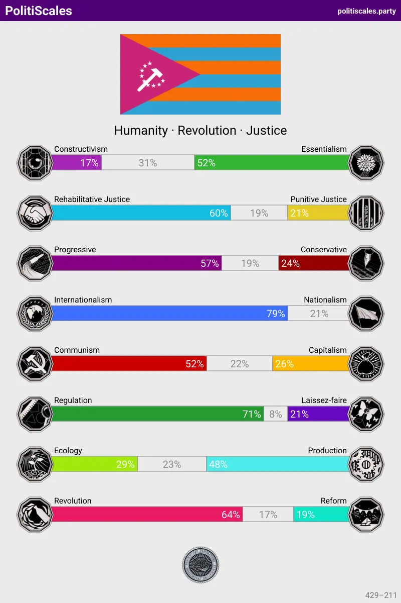

## Hi there 👋

{/*  */}

Hi! Here is Mslxl

Here, I will writing about programming, language learning notes, my weekly life, etc.
My name mslxl does not mean anything. It is just a random string that I swiped on my keyboard.

*Warning*: This user's words may include the following contents:
- Grammatical Confusion
- Spelling Mistakes
- Ancient Technology
- Compiled Language Fundamentalism
- Pigeon
- AnyScript & Clone everything
- Ugly Design
- Poor Code

中文 & English is ok.  日本語は本当下足です (レベルはあまり良くない) 

Eble esperantisto?

### Reach me

<table>
<tr>
<td>Fingerprint:</td>
<td>

`6D57 A10F DF8B 3C54 39FC  D3CF 7928 9225 D74A 382D`

</td>

</tr>
<tr>

<td>
Email: 
</td>

<td>

`(λx.λy.λz. y＠z.x) com i mslxl`

</td>
</tr>
</table>

### Other details

Me & My Life

Well, who am I? 

I do not know.

I am just a average guy who is trying to be a better person. 

I have no special talent, but I am always curious about everything. I am trying to be a better me, but sometimes I am lazy.

I am nothing good at, maybe coding? To myself, the term "tech geek" is an unattainable word. It's means I can create something that can be used by everyone, or something that used by no one.

I am searching for my future amidst the chaos and frog of the present. 

And I am get tired of the person with two faces.

I have a dream to be a cat, without worries or sorrows.

I hope to create a miracle that I will never forget in my life.

Recent Activity

8 Values Test

